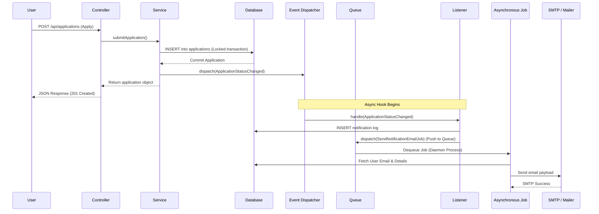

# PHASE 10: LARAVEL 12 ARCHITECTURE

## Smart University Internship Management System (SUIMS)

> **Document Version:** 1.0  
> **Date:** June 5, 2026  
> **Phase Dependency:** Phase 8 (Oracle PL/SQL Development)  
> **Backend Platform:** Laravel 12.x REST API  
> **PHP Version:** 8.2+ (Strict Types Enforced)

---

## 10.1 Folder Structure Blueprint

SUIMS enforces a strict separation of concerns through the **Service-Repository Design Pattern**. Below is the complete directory structure mapping for the backend source code:

```
sims-app/
├── app/
│   ├── Http/
│   │   ├── Controllers/
│   │   │   ├── API/
│   │   │   │   ├── AuthController.php
│   │   │   │   ├── CVController.php
│   │   │   │   ├── InternshipListingController.php
│   │   │   │   ├── ApplicationController.php
│   │   │   │   ├── WeeklyReportController.php
│   │   │   │   ├── EvaluationController.php
│   │   │   │   └── Admin/
│   │   │   │       └── SystemConfigController.php
│   │   │   └── Controller.php
│   │   ├── Middleware/
│   │   │   ├── AuthenticateJwt.php
│   │   │   └── EnsureUserRole.php
│   │   └── Requests/
│   │       ├── SubmitApplicationRequest.php
│   │       ├── SubmitWeeklyReportRequest.php
│   │       └── StoreCVRequest.php
│   ├── Models/
│   │   ├── User.php
│   │   ├── StudentProfile.php
│   │   ├── LecturerProfile.php
│   │   ├── CompanyProfile.php
│   │   ├── CV.php
│   │   ├── CVVersion.php
│   │   ├── CVSkill.php
│   │   ├── Skill.php
│   │   ├── SkillCategory.php
│   │   ├── InternshipListing.php
│   │   ├── RecommendationScore.php
│   │   ├── Application.php
│   │   ├── Internship.php
│   │   ├── WeeklyReport.php
│   │   ├── CompanyEvaluation.php
│   │   ├── LecturerGrade.php
│   │   └── FinalScore.php
│   ├── Repositories/
│   │   ├── Contracts/
│   │   │   ├── BaseRepositoryInterface.php
│   │   │   ├── UserRepositoryInterface.php
│   │   │   ├── CVRepositoryInterface.php
│   │   │   ├── ListingRepositoryInterface.php
│   │   │   ├── ApplicationRepositoryInterface.php
│   │   │   └── ReportRepositoryInterface.php
│   │   └── Eloquent/
│   │       ├── BaseRepository.php
│   │       ├── UserRepository.php
│   │       ├── CVRepository.php
│   │       ├── ListingRepository.php
│   │       ├── ApplicationRepository.php
│   │       └── ReportRepository.php
│   ├── Services/
│   │   ├── AuthService.php
│   │   ├── CVService.php
│   │   ├── RecommendationService.php
│   │   ├── ApplicationService.php
│   │   ├── ReportService.php
│   │   └── GradingService.php
│   ├── Policies/
│   │   ├── CVPolicy.php
│   │   ├── ListingPolicy.php
│   │   ├── ApplicationPolicy.php
│   │   ├── WeeklyReportPolicy.php
│   │   └── GradingPolicy.php
│   ├── Events/
│   │   ├── ApplicationStatusChanged.php
│   │   └── WeeklyReportSubmitted.php
│   ├── Listeners/
│   │   ├── LogStatusChangeInDatabase.php
│   │   └── SendStatusChangeNotification.php
│   ├── Jobs/
│   │   └── SendNotificationEmailJob.php
│   └── Providers/
│       ├── AppServiceProvider.php
│       └── RepositoryServiceProvider.php
└── routes/
    ├── api.php
    └── web.php
```

---

## 10.2 Eloquent Models & Database Configuration

To support Oracle Database primary key sequences, SUIMS models explicitly map their primary keys and sequences.

### 10.2.1 `User.php`
```php
<?php

namespace App\Models;

use Illuminate\Database\Eloquent\Factories\HasFactory;
use Illuminate\Foundation\Auth\User as Authenticatable;
use Illuminate\Notifications\Notifiable;
use Illuminate\Database\Eloquent\Relations\HasOne;
use Illuminate\Database\Eloquent\Relations\HasMany;

class User extends Authenticatable
{
    use HasFactory, Notifiable;

    protected $table = 'users';
    protected $primaryKey = 'user_id';
    public $incrementing = true;

    // Custom sequence mapping for Oracle DB
    protected $sequence = 'seq_users';

    protected $fillable = [
        'email',
        'password_hash',
        'full_name',
        'role',
        'status',
        'email_verified_at',
        'failed_login_attempts',
        'locked_until',
        'last_login_at',
        'profile_photo_path',
    ];

    protected $hidden = [
        'password_hash',
    ];

    protected $casts = [
        'email_verified_at' => 'datetime',
        'locked_until' => 'datetime',
        'last_login_at' => 'datetime',
    ];

    public function getAuthPassword(): string
    {
        return $this->password_hash;
    }

    // Relationships
    public function studentProfile(): HasOne
    {
        return $this->hasOne(StudentProfile::class, 'user_id', 'user_id');
    }

    public function lecturerProfile(): HasOne
    {
        return $this->hasOne(LecturerProfile::class, 'user_id', 'user_id');
    }

    public function companyProfile(): HasOne
    {
        return $this->hasOne(CompanyProfile::class, 'user_id', 'user_id');
    }

    public function cv(): HasOne
    {
        return $this->hasOne(CV::class, 'user_id', 'user_id');
    }

    public function applications(): HasMany
    {
        return $this->hasMany(Application::class, 'user_id', 'user_id');
    }

    public function notifications(): HasMany
    {
        return $this->hasMany(Notification::class, 'user_id', 'user_id');
    }
}
```

### 10.2.2 `Application.php`
```php
<?php

namespace App\Models;

use Illuminate\Database\Eloquent\Model;
use Illuminate\Database\Eloquent\Relations\BelongsTo;
use Illuminate\Database\Eloquent\Relations\HasOne;
use Illuminate\Database\Eloquent\Relations\HasMany;

class Application extends Model
{
    protected $table = 'applications';
    protected $primaryKey = 'application_id';
    protected $sequence = 'seq_applications';

    protected $fillable = [
        'user_id',
        'listing_id',
        'cv_version_id',
        'cover_letter',
        'match_score_at_apply',
        'status',
        'rejection_reason',
        'submitted_at',
        'reviewed_at',
        'decided_at',
        'confirmed_at',
    ];

    protected $casts = [
        'submitted_at' => 'datetime',
        'reviewed_at' => 'datetime',
        'decided_at' => 'datetime',
        'confirmed_at' => 'datetime',
        'match_score_at_apply' => 'decimal:2',
    ];

    // Relationships
    public function student(): BelongsTo
    {
        return $this->belongsTo(User::class, 'user_id', 'user_id');
    }

    public function listing(): BelongsTo
    {
        return $this->belongsTo(InternshipListing::class, 'listing_id', 'listing_id');
    }

    public function cvVersion(): BelongsTo
    {
        return $this->belongsTo(CVVersion::class, 'cv_version_id', 'cv_version_id');
    }

    public function internship(): HasOne
    {
        return $this->hasOne(Internship::class, 'application_id', 'application_id');
    }

    public function statusHistory(): HasMany
    {
        return $this->hasMany(ApplicationStatusHistory::class, 'application_id', 'application_id');
    }
}
```

### 10.2.3 `Internship.php`
```php
<?php

namespace App\Models;

use Illuminate\Database\Eloquent\Model;
use Illuminate\Database\Eloquent\Relations\BelongsTo;
use Illuminate\Database\Eloquent\Relations\HasMany;
use Illuminate\Database\Eloquent\Relations\HasOne;

class Internship extends Model
{
    protected $table = 'internships';
    protected $primaryKey = 'internship_id';
    protected $sequence = 'seq_internships';

    protected $fillable = [
        'application_id',
        'student_user_id',
        'company_user_id',
        'lecturer_user_id',
        'listing_id',
        'start_date',
        'end_date',
        'total_weeks',
        'status',
        'confirmed_by',
        'report_deadline_day',
    ];

    protected $casts = [
        'start_date' => 'date',
        'end_date' => 'date',
    ];

    // Relationships
    public function application(): BelongsTo
    {
        return $this->belongsTo(Application::class, 'application_id', 'application_id');
    }

    public function student(): BelongsTo
    {
        return $this->belongsTo(User::class, 'student_user_id', 'user_id');
    }

    public function company(): BelongsTo
    {
        return $this->belongsTo(User::class, 'company_user_id', 'user_id');
    }

    public function lecturer(): BelongsTo
    {
        return $this->belongsTo(User::class, 'lecturer_user_id', 'user_id');
    }

    public function weeklyReports(): HasMany
    {
        return $this->hasMany(WeeklyReport::class, 'internship_id', 'internship_id');
    }

    public function companyEvaluation(): HasOne
    {
        return $this->hasOne(CompanyEvaluation::class, 'internship_id', 'internship_id');
    }

    public function lecturerGrade(): HasOne
    {
        return $this->hasOne(LecturerGrade::class, 'internship_id', 'internship_id');
    }

    public function finalScore(): HasOne
    {
        return $this->hasOne(FinalScore::class, 'internship_id', 'internship_id');
    }
}
```

---

## 10.3 Repository Layer Design

The repository layer isolates Eloquent queries from high-level service logic.

### 10.3.1 `ApplicationRepositoryInterface.php`
```php
<?php

namespace App\Repositories\Contracts;

use App\Models\Application;
use Illuminate\Support\Collection;

interface ApplicationRepositoryInterface extends BaseRepositoryInterface
{
    public function getActiveApplicationsCount(int $userId): int;
    public function getApplicationsByListing(int $listingId, ?string $status = null): Collection;
    public function findWithDetails(int $applicationId): ?Application;
}
```

### 10.3.2 `EloquentApplicationRepository.php`
```php
<?php

namespace App\Repositories\Eloquent;

use App\Models\Application;
use App\Repositories\Contracts\ApplicationRepositoryInterface;
use Illuminate\Support\Collection;

class EloquentApplicationRepository extends BaseRepository implements ApplicationRepositoryInterface
{
    public function __construct(Application $model)
    {
        parent::__construct($model);
    }

    public function getActiveApplicationsCount(int $userId): int
    {
        return $this->model->where('user_id', $userId)
            ->whereIn('status', ['SUBMITTED', 'UNDER_REVIEW', 'SHORTLISTED', 'ACCEPTED'])
            ->count();
    }

    public function getApplicationsByListing(int $listingId, ?string $status = null): Collection
    {
        $query = $this->model->where('listing_id', $listingId)
            ->with(['student.studentProfile', 'cvVersion']);

        if ($status) {
            $query->where('status', $status);
        }

        return $query->get();
    }

    public function findWithDetails(int $applicationId): ?Application
    {
        return $this->model->with(['student.studentProfile', 'listing.companyProfile', 'cvVersion'])
            ->find($applicationId);
    }
}
```

---

## 10.4 Service Layer Design (Business Logic)

Services coordinate domain constraints and execute multi-step database transactions.

### 10.4.1 `ApplicationService.php`
```php
<?php

namespace App\Services;

use App\Repositories\Contracts\ApplicationRepositoryInterface;
use App\Repositories\Contracts\ListingRepositoryInterface;
use App\Repositories\Contracts\CVRepositoryInterface;
use App\Models\Application;
use App\Events\ApplicationStatusChanged;
use Illuminate\Support\Facades\DB;
use Illuminate\Validation\ValidationException;

class ApplicationService
{
    public function __construct(
        protected ApplicationRepositoryInterface $appRepo,
        protected ListingRepositoryInterface $listingRepo,
        protected CVRepositoryInterface $cvRepo
    ) {}

    /**
     * Submits a new student application to an internship listing
     */
    public function submitApplication(int $userId, int $listingId, ?string $coverLetter): Application
    {
        return DB::transaction(function () use ($userId, $listingId, $coverLetter) {
            
            // BR-11: Enforce maximum of 3 active (non-finalized) applications
            $activeCount = $this->appRepo->getActiveApplicationsCount($userId);
            if ($activeCount >= 3) {
                throw ValidationException::withMessages([
                    'limit' => 'A student may have a maximum of 3 active applications at any given time.'
                ]);
            }

            // BR-05: Student must have a complete CV
            $cv = $this->cvRepo->findByUserId($userId);
            if (!$cv || $cv->status !== 'COMPLETE') {
                throw ValidationException::withMessages([
                    'cv' => 'A complete CV with skills and education is required to apply.'
                ]);
            }

            // Fetch Listing
            $listing = $this->listingRepo->find($listingId);
            if (!$listing || $listing->status !== 'PUBLISHED') {
                throw ValidationException::withMessages([
                    'listing' => 'This internship position is not open for applications.'
                ]);
            }

            // Get current recommendation score
            $matchScore = DB::table('recommendation_scores')
                ->where('user_id', $userId)
                ->where('listing_id', $listingId)
                ->value('composite_score') ?? 0.00;

            // Fetch latest CV version snapshot
            $latestVersion = $cv->versions()->orderBy('version_number', 'desc')->first();
            if (!$latestVersion) {
                throw ValidationException::withMessages([
                    'cv' => 'Could not find a valid CV snapshot. Please republish your CV.'
                ]);
            }

            // Create Application
            $application = $this->appRepo->create([
                'user_id' => $userId,
                'listing_id' => $listingId,
                'cv_version_id' => $latestVersion->cv_version_id,
                'cover_letter' => $coverLetter,
                'match_score_at_apply' => $matchScore,
                'status' => 'SUBMITTED',
                'submitted_at' => now(),
            ]);

            event(new ApplicationStatusChanged($application, null, 'SUBMITTED', $userId));

            return $application;
        });
    }

    /**
     * Changes application status (e.g. ACCEPTED, REJECTED)
     */
    public function updateStatus(int $applicationId, string $newStatus, int $actorId, ?string $reason = null): Application
    {
        return DB::transaction(function () use ($applicationId, $newStatus, $actorId, $reason) {
            $application = $this->appRepo->find($applicationId);
            if (!$application) {
                throw new \InvalidArgumentException('Application not found.');
            }

            $oldStatus = $application->status;

            // DR-12: Enforce state machine transitions
            $validTransitions = [
                'SUBMITTED' => ['UNDER_REVIEW', 'WITHDRAWN'],
                'UNDER_REVIEW' => ['SHORTLISTED', 'REJECTED', 'WITHDRAWN'],
                'SHORTLISTED' => ['ACCEPTED', 'REJECTED', 'WITHDRAWN'],
                'ACCEPTED' => ['CONFIRMED', 'REJECTED', 'WITHDRAWN'],
            ];

            if (!isset($validTransitions[$oldStatus]) || !in_array($newStatus, $validTransitions[$oldStatus])) {
                throw ValidationException::withMessages([
                    'status' => "Invalid transition from {$oldStatus} to {$newStatus}."
                ]);
            }

            // Update status
            $application->update([
                'status' => $newStatus,
                'updated_at' => now()
            ]);

            // Dispatch Event to trigger Notification and History log
            event(new ApplicationStatusChanged($application, $oldStatus, $newStatus, $actorId, $reason));

            return $application;
        });
    }
}
```

---

## 10.5 API Controllers & Requests

Controllers bind incoming requests to validation filters and return standardized envelopes.

### 10.5.1 `ApplicationController.php`
```php
<?php

namespace App\Http\Controllers\API;

use App\Http\Controllers\Controller;
use App\Http\Requests\SubmitApplicationRequest;
use App\Services\ApplicationService;
use App\Repositories\Contracts\ApplicationRepositoryInterface;
use Illuminate\Http\JsonResponse;
use Illuminate\Http\Request;

class ApplicationController extends Controller
{
    public function __construct(
        protected ApplicationService $appService,
        protected ApplicationRepositoryInterface $appRepo
    ) {}

    public function store(SubmitApplicationRequest $request): JsonResponse
    {
        $application = $this->appService->submitApplication(
            auth()->id(),
            $request->validated('listing_id'),
            $request->validated('cover_letter')
        );

        return response()->json([
            'success' => true,
            'message' => 'Application submitted successfully.',
            'data' => $application
        ], 201);
    }

    public function show(int $id): JsonResponse
    {
        $application = $this->appRepo->findWithDetails($id);
        
        $this->authorize('view', $application);

        return response()->json([
            'success' => true,
            'message' => 'Application details retrieved.',
            'data' => $application
        ]);
    }

    public function updateStatus(Request $request, int $id): JsonResponse
    {
        $request->validate([
            'status' => 'required|string|in:UNDER_REVIEW,SHORTLISTED,ACCEPTED,REJECTED,WITHDRAWN',
            'reason' => 'nullable|string|max:1000'
        ]);

        $application = $this->appRepo->find($id);
        
        $this->authorize('updateStatus', [$application, $request->status]);

        $updatedApp = $this->appService->updateStatus(
            $id,
            $request->status,
            auth()->id(),
            $request->reason
        );

        return response()->json([
            'success' => true,
            'message' => "Application status updated to {$request->status}.",
            'data' => $updatedApp
        ]);
    }
}
```

### 10.5.2 `SubmitApplicationRequest.php`
```php
<?php

namespace App\Http\Requests;

use Illuminate\Foundation\Http\FormRequest;

class SubmitApplicationRequest extends FormRequest
{
    public function authorize(): bool
    {
        return $this->user()->role === 'STUDENT';
    }

    public function rules(): array
    {
        return [
            'listing_id' => 'required|integer|exists:internship_listings,listing_id',
            'cover_letter' => 'nullable|string|max:2000',
        ];
    }
}
```

---

## 10.6 Security & Policy Access Controls

Polices secure resources based on authenticated roles and record relationships.

### 10.6.1 `ApplicationPolicy.php`
```php
<?php

namespace App\Policies;

use App\Models\User;
use App\Models\Application;

class ApplicationPolicy
{
    public function view(User $user, Application $application): bool
    {
        // Students can view their own applications
        if ($user->role === 'STUDENT') {
            return $application->user_id === $user->user_id;
        }

        // Company reps can view applications for their listings
        if ($user->role === 'COMPANY') {
            return $application->listing->company_user_id === $user->user_id;
        }

        // Admins can view all applications
        return $user->role === 'ADMIN';
    }

    public function updateStatus(User $user, Application $application, string $targetStatus): bool
    {
        if ($user->role === 'ADMIN') {
            return true;
        }

        // Students can withdraw their own applications
        if ($targetStatus === 'WITHDRAWN') {
            return $user->role === 'STUDENT' && $application->user_id === $user->user_id;
        }

        // Company reps manage reviews, shortlists, acceptances, and rejections
        if (in_array($targetStatus, ['UNDER_REVIEW', 'SHORTLISTED', 'ACCEPTED', 'REJECTED'])) {
            return $user->role === 'COMPANY' && $application->listing->company_user_id === $user->user_id;
        }

        return false;
    }
}
```

---

## 10.7 Asynchronous Events & Jobs Flow

To ensure high response speed, external notifications (like email delivery) are executed asynchronously.



### 10.7.1 `ApplicationStatusChanged.php` (Event)
```php
<?php

namespace App\Events;

use App\Models\Application;
use Illuminate\Foundation\Events\Dispatchable;
use Illuminate\Queue\SerializesModels;

class ApplicationStatusChanged
{
    use Dispatchable, SerializesModels;

    public function __construct(
        public Application $application,
        public ?string $oldStatus,
        public string $newStatus,
        public int $actorId,
        public ?string $reason = null
    ) {}
}
```

### 10.7.2 `SendStatusChangeNotification.php` (Listener)
```php
<?php

namespace App\Listeners;

use App\Events\ApplicationStatusChanged;
use App\Jobs\SendNotificationEmailJob;
use App\Models\Notification;
use Illuminate\Contracts\Queue\ShouldQueue;

class SendStatusChangeNotification
{
    public function handle(ApplicationStatusChanged $event): void
    {
        $application = $event->application;
        $student = $application->student;
        $title = 'Application Update';
        $message = "Your application for the position '{$application->listing->title}' has been updated to {$event->newStatus}.";

        if ($event->newStatus === 'REJECTED' && $event->reason) {
            $message .= " Reason: {$event->reason}";
        }

        // 1. Create In-App Notification (Database sync write)
        Notification::create([
            'user_id' => $student->user_id,
            'type' => 'APPLICATION_STATUS_UPDATE',
            'title' => $title,
            'message' => $message,
            'priority' => 'HIGH',
            'channel' => 'IN_APP_EMAIL',
            'reference_type' => 'application',
            'reference_id' => $application->application_id,
            'is_read' => 0,
        ]);

        // 2. Dispatch Email Notification Job (Async Queue dispatch)
        SendNotificationEmailJob::dispatch($student->email, $title, $message);
    }
}
```

### 10.7.3 `SendNotificationEmailJob.php` (Asynchronous Job)
```php
<?php

namespace App\Jobs;

use Illuminate\Bus\Queueable;
use Illuminate\Contracts\Queue\ShouldQueue;
use Illuminate\Foundation\Bus\Dispatchable;
use Illuminate\Queue\InteractsWithQueue;
use Illuminate\Queue\SerializesModels;
use Illuminate\Support\Facades\Mail;

class SendNotificationEmailJob implements ShouldQueue
{
    use Dispatchable, InteractsWithQueue, Queueable, SerializesModels;

    public int $tries = 3;
    public int $backoff = 60; // Wait 60 seconds before retrying

    public function __construct(
        protected string $recipientEmail,
        protected string $subject,
        protected string $bodyText
    ) {}

    public function handle(): void
    {
        Mail::raw($this->bodyText, function ($message) {
            $message->to($this->recipientEmail)
                ->subject("[SUIMS] " . $this->subject);
        });
    }
}
```

---

## 10.8 Phase 10 — State Summary

> [!IMPORTANT]
> **Critical Decisions Carried Forward to Subsequent Phases:**
> - **Service-Repository decoupling** separates high-level domain services (e.g. `ApplicationService`) from low-level Eloquent models (`Application`), establishing a modular and highly testable design system.
> - **Strict authorization guard checks** are enforced at the resource level via mapping Eloquent models to Laravel **Policies** (e.g. `ApplicationPolicy`).
> - **Stateless architecture** utilizes **JWT based tokens** handled by Http standard guards, with standard return envelopes: `{success, message, data}`.
> - **Asynchronous Queue Jobs** offload mail handling (`SendNotificationEmailJob`) from request threads, ensuring database notification logs are synchronized immediately while email pipelines execute asynchronously.

---

✅ **Phase 10 completed.** Reply **CONTINUE** to proceed to Phase 11 (React TypeScript Architecture), or provide feedback to revise this phase.
