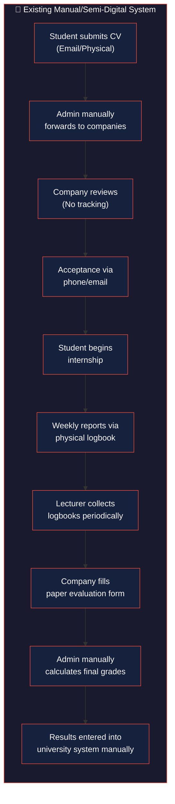
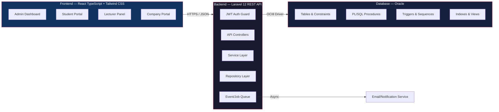
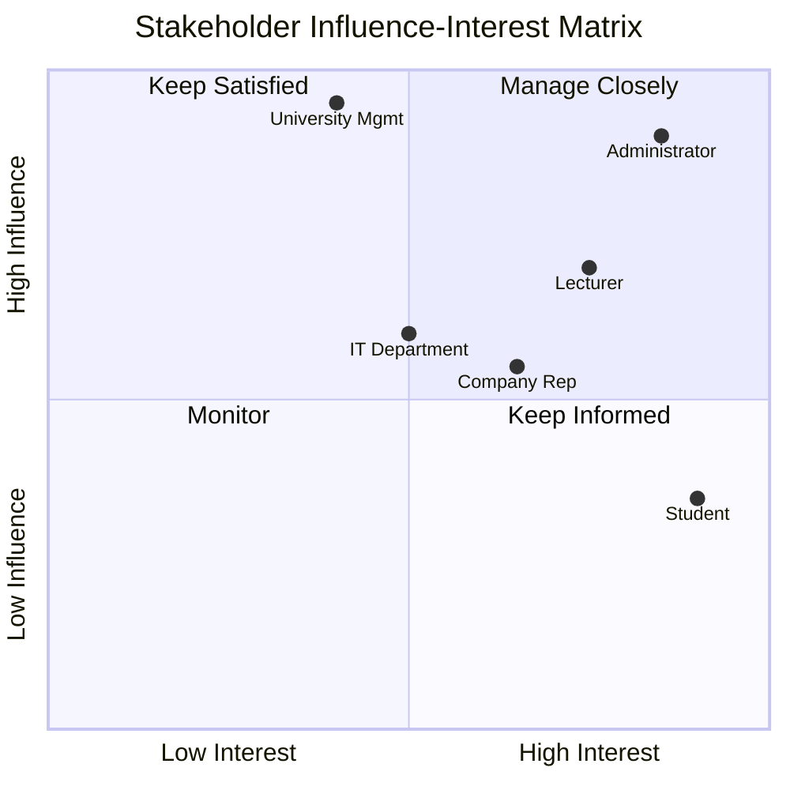
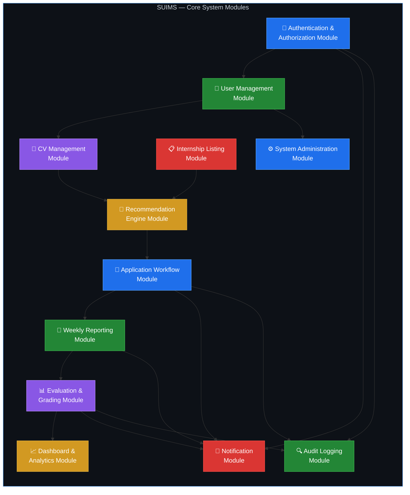

# PHASE 1: PROJECT DISCOVERY & SYSTEM ANALYSIS

## Smart University Internship Management System (SUIMS)

> **Document Version:** 1.0  
> **Date:** June 5, 2026  
> **Classification:** Thesis-Level Academic Project Documentation  
> **Technology Stack:** Oracle Database · Laravel 12 REST API · React TypeScript · Tailwind CSS · JWT Authentication

---

## 1.1 Executive Summary

The **Smart University Internship Management System (SUIMS)** is a comprehensive, web-based enterprise platform designed to digitize, automate, and optimize the end-to-end university internship lifecycle. The system addresses critical inefficiencies in traditional internship management — from student application and placement through weekly reporting, mentorship, evaluation, and final grading — by introducing a centralized digital ecosystem that connects four principal stakeholder groups: **Administrators**, **Students**, **Lecturers/Supervisors**, and **Company Representatives**.

SUIMS distinguishes itself from conventional internship portals through its **Internship Recommendation Engine**, an intelligent matching algorithm that analyzes student competency profiles against company requirements to produce ranked internship recommendations. This data-driven approach reduces placement friction, improves match quality, and ensures equitable distribution of internship opportunities.

The platform is architected on a modern, scalable technology stack: **Oracle Database** provides enterprise-grade relational data management with PL/SQL-driven business logic; **Laravel 12** implements a secure, RESTful API layer utilizing the Service/Repository design pattern; **React TypeScript** delivers a responsive, type-safe single-page application frontend; and **JWT-based authentication** ensures stateless, role-based access control across all system endpoints.

Key performance indicators targeted by SUIMS include:

| KPI | Current (Manual) | Target (SUIMS) |
|-----|------------------|-----------------|
| Average application processing time | 5–10 business days | < 24 hours |
| Weekly report submission compliance | ~60% | > 95% |
| Placement match satisfaction rate | Unmeasured | > 80% |
| Administrative overhead per cycle | 120+ staff-hours | < 30 staff-hours |

---

## 1.2 Problem Statement

University internship programs are a cornerstone of applied education, bridging the gap between academic theory and professional practice. However, the management of these programs at most institutions remains mired in manual, paper-based, or fragmented digital processes that result in significant operational inefficiencies and suboptimal outcomes for all stakeholders.

### 1.2.1 Core Problems Identified

**P1 — Fragmented Communication Channels:**  
Students, lecturers, and company supervisors communicate via disparate channels (email, messaging apps, physical meetings), leading to information silos, lost documents, and inconsistent record-keeping. There is no single source of truth for internship status, progress, or evaluations.

**P2 — Inefficient Placement Matching:**  
The traditional placement process relies on students manually browsing job boards or receiving ad-hoc recommendations. There is no systematic mechanism to match student skills, academic performance, and career interests with company requirements and available positions, resulting in mismatched placements and higher dropout rates.

**P3 — Manual Reporting and Tracking Burden:**  
Weekly progress reporting — a critical component of supervised internships — is typically handled through physical logbooks or unstructured email submissions. Lecturers must manually collect, review, and respond to each report, creating a bottleneck that delays feedback and reduces the pedagogical value of the reporting process.

**P4 — Opaque Evaluation Workflows:**  
The multi-stakeholder evaluation process (company evaluation + lecturer grading + attendance scoring) lacks transparency and standardization. Final scores are often calculated manually in spreadsheets, introducing computational errors and inconsistency across different supervisors.

**P5 — Administrative Overhead:**  
Program coordinators spend disproportionate time on administrative tasks — tracking application statuses, verifying documents, generating compliance reports, and managing user accounts — rather than on strategic program improvement.

**P6 — Lack of Data-Driven Decision Making:**  
Without centralized, structured data, institutions cannot perform meaningful analysis of placement trends, employer satisfaction, skill gap patterns, or program effectiveness over time.

---

## 1.3 Existing System vs. Proposed System

### 1.3.1 Existing System Analysis

### 1.3.2 Comparison Matrix

| Dimension | Existing System | Proposed System (SUIMS) |
|-----------|----------------|------------------------|
| **Application Process** | Paper forms, email attachments, no tracking | Digital portal with real-time status tracking, automated workflow |
| **CV Management** | Static document uploads (PDF/Word) | Structured digital CV builder with skill tagging, version control |
| **Placement Matching** | Manual/ad-hoc recommendations | AI-powered recommendation engine with weighted skill matching |
| **Weekly Reporting** | Physical logbooks, delayed collection | Digital submission with deadline enforcement, instant notifications |
| **Report Approval** | In-person or delayed email feedback | One-click approve/reject with inline comments, timestamped audit trail |
| **Company Evaluation** | Paper-based evaluation forms | Structured digital rubric with weighted criteria, auto-calculation |
| **Final Grading** | Manual spreadsheet calculation | Automated composite score with configurable weight formulas |
| **Notifications** | None / ad-hoc email | Real-time in-app notifications with event-driven triggers |
| **Audit Trail** | Non-existent | Comprehensive PL/SQL trigger-based logging of all state changes |
| **Analytics** | Manual compilation, if done at all | Role-based dashboards with charts, exportable reports |
| **Access Control** | Shared credentials or no system | JWT-based RBAC with granular permission policies |

### 1.3.3 Proposed System Architecture Overview

---

## 1.4 Project Objectives

### 1.4.1 Primary Objectives

| ID | Objective | Measurable Outcome |
|----|-----------|-------------------|
| **O1** | Digitize the complete internship lifecycle from application to final grading | 100% of workflow steps executable through the platform |
| **O2** | Implement an intelligent recommendation engine for internship matching | Matching algorithm producing ranked results with ≥ 80% relevance score |
| **O3** | Automate weekly reporting and multi-level approval workflows | Automated submission deadlines, approval chains with notification triggers |
| **O4** | Provide role-based dashboards with actionable analytics | Each role has a customized dashboard with ≥ 5 data visualizations |
| **O5** | Enforce evaluation standardization with automated scoring | Final grade calculation with zero manual spreadsheet intervention |

### 1.4.2 Secondary Objectives

| ID | Objective | Measurable Outcome |
|----|-----------|-------------------|
| **O6** | Create a structured digital CV builder with skill taxonomy | Students can build and tag CVs from a predefined skill ontology |
| **O7** | Establish a comprehensive audit trail for all system actions | 100% of state-changing operations logged via PL/SQL triggers |
| **O8** | Enable real-time notification delivery across all roles | Average notification delivery latency < 5 seconds |
| **O9** | Support exportable reporting for institutional compliance | PDF/Excel export available for all tabular data |
| **O10** | Design a scalable architecture supporting future module extensions | Modular codebase with < 3 hours to integrate a new feature module |

---

## 1.5 Project Scope

### 1.5.1 In-Scope

| Category | Items Included |
|----------|----------------|
| **User Management** | Registration, authentication (JWT), role assignment (Admin, Student, Lecturer, Company), profile management, account activation/deactivation |
| **CV Management** | Digital CV builder, skill tagging from taxonomy, education/experience sections, document uploads (certificates, transcripts), CV versioning |
| **Internship Listings** | Company-posted positions with requirements, skill tags, duration, quotas; admin approval workflow for listings |
| **Recommendation Engine** | Skill-based matching algorithm, weighted scoring, ranked results, configurable matching parameters |
| **Application Workflow** | Student applies → Company reviews → Accept/Reject → Admin confirms → Lecturer assigned |
| **Weekly Reporting** | Structured report submission (activities, challenges, learnings), file attachments, deadline enforcement, lecturer approval with feedback |
| **Evaluation & Grading** | Company evaluation rubric, lecturer grading form, attendance tracking, automated final score composite calculation |
| **Notifications** | In-app real-time notifications, email notifications for critical events, notification preferences |
| **Dashboards** | Role-specific dashboards with statistics, charts, pending action items, recent activity feeds |
| **Administration** | User CRUD, system configuration, batch operations, data export, audit log viewer |

### 1.5.2 Out-of-Scope

| Item | Rationale |
|------|-----------|
| Mobile native application (iOS/Android) | Responsive web design covers mobile access; native apps are a future enhancement |
| Video conferencing / virtual meetings | Integration with existing tools (Zoom/Teams) via links, not embedded functionality |
| Payment processing / stipend management | Financial systems require separate compliance; out of academic project scope |
| Integration with external university SIS/ERP | Requires institution-specific API contracts; designed for standalone operation |
| Multi-language / internationalization (i18n) | English-only for initial release; i18n architecture is extensible for future |
| Blockchain-based certificate verification | Over-engineering for current requirements; standard digital verification suffices |

### 1.5.3 Constraints

| Constraint Type | Description |
|-----------------|-------------|
| **Technical** | Must use Oracle Database (institutional requirement); OCI8 PHP extension required |
| **Time** | Academic semester timeline (~16 weeks for development and documentation) |
| **Resource** | Single development team; no dedicated DevOps or dedicated QA team |
| **Security** | Must comply with university data protection policies; HTTPS mandatory |
| **Performance** | Must support concurrent usage of up to 500 active users without degradation |

---

## 1.6 Stakeholder Analysis

### 1.6.1 Stakeholder Profiles

| Stakeholder | Role in System | Key Concerns | System Interaction Level |
|-------------|---------------|--------------|-------------------------|
| **Administrator** | System owner; manages users, configurations, approvals, and compliance reporting | Data integrity, system uptime, audit compliance, ease of bulk operations | **Very High** — daily operations |
| **Student** | Primary end-user; builds CV, receives recommendations, applies, submits reports | Ease of use, fast application processing, clear feedback, mobile responsiveness | **High** — daily/weekly during internship |
| **Lecturer/Supervisor** | Academic mentor; approves reports, grades students, monitors progress | Minimal administrative burden, clear student status overview, fair grading tools | **Medium-High** — weekly reviews |
| **Company Representative** | External partner; posts positions, reviews applications, evaluates interns | Simple onboarding, quality applicant matching, streamlined evaluation forms | **Medium** — periodic interactions |
| **University Management** | Strategic oversight; requires compliance reports and program metrics | Aggregate analytics, placement rates, employer satisfaction trends | **Low** — quarterly reporting |
| **IT Department** | Infrastructure and deployment support | System security, database maintenance, server resource allocation | **Low** — deployment and maintenance |

---

## 1.7 Functional Requirements

### 1.7.1 Authentication & Authorization Module (FR-AUTH)

| ID | Requirement | Priority | Actor(s) |
|----|------------|----------|----------|
| FR-AUTH-01 | The system shall allow users to register with email, full name, role selection, and password | **Must** | All |
| FR-AUTH-02 | The system shall authenticate users via JWT tokens with configurable expiry (default: 60 minutes) | **Must** | All |
| FR-AUTH-03 | The system shall support JWT refresh tokens to maintain sessions without re-authentication | **Must** | All |
| FR-AUTH-04 | The system shall enforce role-based access control (RBAC) with four roles: Admin, Student, Lecturer, Company | **Must** | All |
| FR-AUTH-05 | The system shall allow Administrators to activate, deactivate, and reassign user roles | **Must** | Admin |
| FR-AUTH-06 | The system shall enforce password complexity rules (min 8 chars, uppercase, lowercase, digit, special char) | **Must** | All |
| FR-AUTH-07 | The system shall lock accounts after 5 consecutive failed login attempts for 30 minutes | **Should** | All |
| FR-AUTH-08 | The system shall provide a secure password reset flow via email verification | **Should** | All |

### 1.7.2 CV Management Module (FR-CV)

| ID | Requirement | Priority | Actor(s) |
|----|------------|----------|----------|
| FR-CV-01 | The system shall provide a structured digital CV builder with sections: Personal Info, Education, Experience, Skills, Certifications | **Must** | Student |
| FR-CV-02 | The system shall allow students to tag skills from a predefined skill taxonomy maintained by Admin | **Must** | Student, Admin |
| FR-CV-03 | The system shall allow students to upload supporting documents (transcripts, certificates) in PDF format (max 5 MB each) | **Must** | Student |
| FR-CV-04 | The system shall maintain version history of CV updates with timestamps | **Should** | Student |
| FR-CV-05 | The system shall allow students to set their CV visibility (public to companies or private) | **Should** | Student |
| FR-CV-06 | The system shall allow company representatives to search and filter student CVs by skills, GPA, and department | **Should** | Company |

### 1.7.3 Internship Listing Module (FR-LIST)

| ID | Requirement | Priority | Actor(s) |
|----|------------|----------|----------|
| FR-LIST-01 | The system shall allow company representatives to create internship postings with: title, description, requirements, duration, quota, required skills, and location | **Must** | Company |
| FR-LIST-02 | The system shall require Admin approval before internship postings become visible to students | **Must** | Admin, Company |
| FR-LIST-03 | The system shall allow students to browse, search, and filter internship listings by skills, location, duration, and company | **Must** | Student |
| FR-LIST-04 | The system shall display the match score between a student's profile and each listing (from recommendation engine) | **Must** | Student |
| FR-LIST-05 | The system shall allow companies to set application deadlines and automatically close listings past the deadline | **Should** | Company |
| FR-LIST-06 | The system shall allow companies to edit or withdraw postings (with admin notification) | **Should** | Company |

### 1.7.4 Recommendation Engine Module (FR-REC)

| ID | Requirement | Priority | Actor(s) |
|----|------------|----------|----------|
| FR-REC-01 | The system shall compute a match score (0–100) between each student profile and each internship listing based on skill overlap, GPA alignment, and preference weighting | **Must** | System |
| FR-REC-02 | The system shall display top-N recommended internships to each student on their dashboard, ranked by match score | **Must** | Student |
| FR-REC-03 | The system shall allow Administrators to configure matching weights (e.g., skill weight: 60%, GPA weight: 20%, preference weight: 20%) | **Must** | Admin |
| FR-REC-04 | The system shall re-calculate recommendations when a student updates their CV or when new listings are published | **Should** | System |
| FR-REC-05 | The system shall allow companies to view recommended students for their postings | **Should** | Company |

### 1.7.5 Application Workflow Module (FR-APP)

| ID | Requirement | Priority | Actor(s) |
|----|------------|----------|----------|
| FR-APP-01 | The system shall allow students to apply to internship listings with an optional cover letter | **Must** | Student |
| FR-APP-02 | The system shall enforce a maximum of 3 active (pending) applications per student at any time | **Must** | Student |
| FR-APP-03 | The system shall allow company representatives to review, shortlist, accept, or reject applications | **Must** | Company |
| FR-APP-04 | The system shall transition application status through defined states: `Submitted → Under Review → Shortlisted → Accepted/Rejected` | **Must** | Company, System |
| FR-APP-05 | The system shall require Admin confirmation after a company accepts a student before the placement is finalized | **Must** | Admin |
| FR-APP-06 | The system shall automatically assign a supervising Lecturer to each confirmed placement | **Should** | Admin |
| FR-APP-07 | The system shall notify all relevant parties (student, company, lecturer) at each status transition | **Must** | System |

### 1.7.6 Weekly Reporting Module (FR-RPT)

| ID | Requirement | Priority | Actor(s) |
|----|------------|----------|----------|
| FR-RPT-01 | The system shall allow students to submit structured weekly reports containing: week number, activities performed, challenges encountered, learnings, and hours logged | **Must** | Student |
| FR-RPT-02 | The system shall enforce weekly submission deadlines (configurable by Admin, default: Sunday 23:59) | **Must** | System |
| FR-RPT-03 | The system shall allow students to attach files (images, documents) to weekly reports | **Should** | Student |
| FR-RPT-04 | The system shall allow Lecturers to approve, request revision, or reject weekly reports with comments | **Must** | Lecturer |
| FR-RPT-05 | The system shall track report submission status: `Draft → Submitted → Approved / Revision Requested / Rejected` | **Must** | System |
| FR-RPT-06 | The system shall send reminder notifications to students 24 hours before submission deadlines | **Should** | System |
| FR-RPT-07 | The system shall allow Lecturers to view a chronological timeline of all reports for each supervised student | **Must** | Lecturer |

### 1.7.7 Evaluation & Grading Module (FR-EVAL)

| ID | Requirement | Priority | Actor(s) |
|----|------------|----------|----------|
| FR-EVAL-01 | The system shall provide a structured evaluation form for Company Representatives to assess interns on predefined criteria (e.g., technical skills, communication, professionalism, initiative) | **Must** | Company |
| FR-EVAL-02 | The system shall provide a grading form for Lecturers to assess students based on: weekly report quality, final presentation, and overall engagement | **Must** | Lecturer |
| FR-EVAL-03 | The system shall automatically calculate a composite final score using configurable weights: Company Evaluation (40%) + Lecturer Grade (40%) + Attendance (20%) | **Must** | System |
| FR-EVAL-04 | The system shall convert the composite score to a letter grade based on a configurable grading scale | **Must** | System |
| FR-EVAL-05 | The system shall prevent duplicate evaluation submissions; once submitted, evaluations are final (Admin can unlock for re-evaluation in exceptional cases) | **Must** | System, Admin |
| FR-EVAL-06 | The system shall allow students to view their final score and grade breakdown after both evaluations are submitted | **Must** | Student |

### 1.7.8 Notification Module (FR-NOTIF)

| ID | Requirement | Priority | Actor(s) |
|----|------------|----------|----------|
| FR-NOTIF-01 | The system shall deliver real-time in-app notifications for all status changes (application, report, evaluation) | **Must** | All |
| FR-NOTIF-02 | The system shall send email notifications for critical events (application accepted/rejected, report deadline reminder, evaluation available) | **Must** | System |
| FR-NOTIF-03 | The system shall maintain a notification history viewable by each user | **Should** | All |
| FR-NOTIF-04 | The system shall allow users to mark notifications as read/unread | **Should** | All |
| FR-NOTIF-05 | The system shall display an unread notification count badge in the application header | **Should** | All |

### 1.7.9 Dashboard & Reporting Module (FR-DASH)

| ID | Requirement | Priority | Actor(s) |
|----|------------|----------|----------|
| FR-DASH-01 | The system shall provide an Admin dashboard showing: total users by role, active internships, pending approvals, application pipeline metrics, and system activity feed | **Must** | Admin |
| FR-DASH-02 | The system shall provide a Student dashboard showing: application statuses, recommendation scores, upcoming deadlines, report submission history, and final grade (when available) | **Must** | Student |
| FR-DASH-03 | The system shall provide a Lecturer dashboard showing: supervised students list, pending report reviews, evaluation status per student, and workload distribution | **Must** | Lecturer |
| FR-DASH-04 | The system shall provide a Company dashboard showing: active postings, application pipeline per posting, intern evaluation status, and talent pool metrics | **Must** | Company |
| FR-DASH-05 | The system shall support data export to PDF and Excel for all tabular views | **Should** | Admin, Lecturer |

---

## 1.8 Non-Functional Requirements

| ID | Category | Requirement | Target Metric |
|----|----------|-------------|---------------|
| NFR-01 | **Performance** | API response time for standard CRUD operations | < 500ms (95th percentile) |
| NFR-02 | **Performance** | Dashboard rendering time (including chart data) | < 2 seconds initial load |
| NFR-03 | **Performance** | Recommendation engine computation for a single student | < 3 seconds for up to 500 listings |
| NFR-04 | **Scalability** | Concurrent active users without performance degradation | ≥ 500 users |
| NFR-05 | **Scalability** | Total registered users in the system | ≥ 10,000 records |
| NFR-06 | **Availability** | System uptime during academic semester | ≥ 99.5% |
| NFR-07 | **Security** | All API communication encrypted | TLS 1.2+ (HTTPS) |
| NFR-08 | **Security** | Password storage | bcrypt hashing with cost factor ≥ 12 |
| NFR-09 | **Security** | JWT token expiry | Access: 60 min, Refresh: 7 days |
| NFR-10 | **Security** | SQL injection, XSS, CSRF protection | OWASP Top 10 compliance |
| NFR-11 | **Usability** | New user task completion without training | ≥ 85% success rate |
| NFR-12 | **Usability** | Responsive design breakpoints | Desktop (≥1024px), Tablet (768px), Mobile (≤480px) |
| NFR-13 | **Reliability** | Data backup frequency | Daily automated backups |
| NFR-14 | **Reliability** | Audit log retention period | ≥ 2 academic years |
| NFR-15 | **Maintainability** | Code test coverage | ≥ 80% for business logic (Services layer) |
| NFR-16 | **Maintainability** | API documentation standard | OpenAPI 3.0 (Swagger) specification |
| NFR-17 | **Compatibility** | Browser support | Chrome 90+, Firefox 88+, Safari 14+, Edge 90+ |
| NFR-18 | **Compliance** | Personal data handling | GDPR-aligned data minimization principles |

---

## 1.9 Business Rules

### 1.9.1 Registration & Access Rules

| ID | Business Rule |
|----|---------------|
| BR-01 | A user account must be associated with exactly one role. Role changes require Administrator action. |
| BR-02 | Student accounts must include: student ID number, department, enrollment year, and GPA to be considered complete. |
| BR-03 | Company representative accounts must include: company name, industry sector, and official contact email. Company profiles require Admin verification before the representative can post listings. |
| BR-04 | Lecturer accounts must include: staff ID, department, and specialization areas. |

### 1.9.2 CV & Profile Rules

| ID | Business Rule |
|----|---------------|
| BR-05 | A student must have a complete CV (minimum: 1 education entry + 3 skill tags) before being eligible to apply for internships. |
| BR-06 | Skill tags must be selected from the system-managed skill taxonomy. Free-text skills are not permitted (to ensure matching consistency). |
| BR-07 | Uploaded documents must not exceed 5 MB per file and must be in PDF format. |

### 1.9.3 Internship Listing Rules

| ID | Business Rule |
|----|---------------|
| BR-08 | All internship postings must be approved by an Administrator before becoming visible to students. |
| BR-09 | Each internship posting must specify at least 1 required skill tag, a valid duration (4–24 weeks), and a quota (≥ 1). |
| BR-10 | Once a posting's quota is filled (number of confirmed placements equals the quota), the listing is automatically closed to new applications. |

### 1.9.4 Application Rules

| ID | Business Rule |
|----|---------------|
| BR-11 | A student may have a maximum of 3 active (non-finalized) applications at any given time. |
| BR-12 | A student may not apply to the same internship listing more than once. |
| BR-13 | Once a student's application is accepted and confirmed for one placement, all other pending applications are automatically withdrawn. |
| BR-14 | Application status transitions must follow the defined state machine: `Submitted → Under Review → Shortlisted → Accepted/Rejected`. No skipping of states is permitted except for Admin override. |

### 1.9.5 Reporting Rules

| ID | Business Rule |
|----|---------------|
| BR-15 | Weekly reports must be submitted by the configured deadline (default: Sunday 23:59 of each week). Late submissions are marked as "Late" but still accepted. |
| BR-16 | A weekly report must contain at minimum: activities summary (≥ 50 characters) and hours logged (1–80 hours per week). |
| BR-17 | A Lecturer may request a report revision at most 2 times per report. After 2 revision requests, the report must be either approved or rejected. |
| BR-18 | Reports for past weeks cannot be submitted after the internship end date. |

### 1.9.6 Evaluation & Grading Rules

| ID | Business Rule |
|----|---------------|
| BR-19 | Company evaluation must be submitted within 2 weeks of the internship end date. Failure triggers an escalation notification to Admin. |
| BR-20 | Lecturer grading can only be submitted after the company evaluation is finalized. |
| BR-21 | Final score = (Company Evaluation Score × 0.40) + (Lecturer Grade × 0.40) + (Attendance Score × 0.20). Weights are configurable by Admin. |
| BR-22 | The grading scale follows the institutional standard: A (≥ 85), B+ (80–84), B (75–79), C+ (70–74), C (65–69), D (60–64), F (< 60). |
| BR-23 | Once an evaluation is submitted, it cannot be modified unless an Administrator explicitly unlocks it. |

### 1.9.7 Notification Rules

| ID | Business Rule |
|----|---------------|
| BR-24 | Notifications must be generated for: application status changes, report submission/review, evaluation completion, deadline reminders (24h before), and system announcements. |
| BR-25 | Email notifications are sent only for high-priority events (application accepted/rejected, evaluation available, deadline reminder). In-app notifications are sent for all events. |

---

## 1.10 Core System Modules

### 1.10.1 Module Descriptions

| # | Module | Description | Key Entities |
|---|--------|-------------|--------------|
| 1 | **Authentication & Authorization** | Handles user login, JWT token issuance/refresh, password management, and role-based access control enforcement via middleware/policies | User, Token, Role, Permission |
| 2 | **User Management** | CRUD operations for all user profiles; role assignment; account status management (active/inactive/locked) | User, StudentProfile, LecturerProfile, CompanyProfile |
| 3 | **CV Management** | Structured CV creation/editing for students; skill tagging; document uploads; version tracking; CV visibility settings | CV, Education, Experience, Skill, SkillTag, Document |
| 4 | **Internship Listing** | Company-facing module for creating, editing, and managing internship postings; Admin approval workflow; listing lifecycle management | InternshipListing, RequiredSkill, ListingStatus |
| 5 | **Recommendation Engine** | Core differentiating module; computes match scores between student profiles and listings using weighted multi-criteria analysis; serves personalized recommendations | MatchScore, MatchWeightConfig, RecommendationResult |
| 6 | **Application Workflow** | Manages the complete application lifecycle with defined state transitions; enforces business rules (max active applications, no duplicates); triggers notifications | Application, ApplicationStatus, StatusHistory |
| 7 | **Weekly Reporting** | Student report submission with structured content; deadline enforcement; lecturer review/approval workflow with feedback loop | WeeklyReport, ReportAttachment, ReportReview |
| 8 | **Evaluation & Grading** | Multi-stakeholder evaluation with company and lecturer forms; automated composite score calculation; letter grade assignment | CompanyEvaluation, LecturerGrade, FinalScore, EvaluationCriteria |
| 9 | **Notification** | Event-driven notification engine; in-app and email channels; notification preferences; read/unread tracking | Notification, NotificationTemplate, NotificationPreference |
| 10 | **Dashboard & Analytics** | Role-specific dashboard views with aggregated statistics, charts, and exportable reports | DashboardWidget, ReportExport |
| 11 | **System Administration** | Admin-only module for system configuration, skill taxonomy management, grading scale configuration, and batch operations | SystemConfig, SkillTaxonomy, GradingScale |
| 12 | **Audit Logging** | Cross-cutting module that records all state-changing operations via PL/SQL triggers; provides audit trail viewer for Admin | AuditLog |

---

## 1.11 Phase 1 — State Summary

> [!IMPORTANT]
> **Critical Decisions Carried Forward to Subsequent Phases:**

- **Four distinct user roles** have been defined (Admin, Student, Lecturer, Company) with clearly delineated responsibilities and access levels. All subsequent use cases, API endpoints, and UI views must be scoped to these four roles.
- **Twelve core modules** form the system architecture. The **Recommendation Engine** is the primary differentiator and requires structured skill taxonomy data, configurable weight parameters, and a composite scoring formula — these must be reflected in database design (Phase 4+).
- **Application state machine** follows a strict linear progression: `Submitted → Under Review → Shortlisted → Accepted/Rejected`, with a mandatory Admin confirmation step after company acceptance. This workflow governs database status fields, API transitions, and frontend state displays.
- **Final grading formula** is composite: `Company (40%) + Lecturer (40%) + Attendance (20%)` with Admin-configurable weights. The PL/SQL procedure `CalculateFinalScore` (Phase 8) must implement this with dynamic weight retrieval from a configuration table.

---

✅ **Phase 1 completed.** Reply **CONTINUE** to proceed to Phase 2 (Use Case Analysis), or provide feedback to revise this phase.
