# PHASE 2: USE CASE ANALYSIS

## Smart University Internship Management System (SUIMS)

> **Document Version:** 1.0  
> **Date:** June 5, 2026  
> **Phase Dependency:** Phase 1 — Project Discovery & System Analysis  
> **Artifact Type:** Use Case Specification (UML-Aligned)

---

## 2.1 Actor Identification & Responsibilities

### 2.1.1 Primary Actors

| Actor | Type | Description | Authentication |
|-------|------|-------------|----------------|
| **Administrator** | Primary, Internal | System super-user responsible for platform configuration, user lifecycle management, content moderation, and compliance oversight | JWT — Role: `ADMIN` |
| **Student** | Primary, Internal | University-enrolled student who builds a professional profile, receives internship recommendations, applies to positions, submits weekly reports, and receives evaluations | JWT — Role: `STUDENT` |
| **Lecturer/Supervisor** | Primary, Internal | Academic staff member assigned to mentor and supervise students during internships; reviews weekly reports, provides grading, and monitors student progress | JWT — Role: `LECTURER` |
| **Company Representative** | Primary, External | Authorized representative of a partner organization who posts internship opportunities, reviews applications, manages intern placements, and submits performance evaluations | JWT — Role: `COMPANY` |

### 2.1.2 Secondary Actors

| Actor | Type | Description |
|-------|------|-------------|
| **Email Service** | System, External | Outbound SMTP service (e.g., Mailgun, SendGrid) that delivers transactional emails triggered by system events |
| **Notification Engine** | System, Internal | Internal event-driven subsystem that generates and delivers in-app notifications based on business rule triggers |
| **Recommendation Engine** | System, Internal | Algorithmic subsystem that computes match scores between student profiles and internship listings |
| **Scheduler (Cron)** | System, Internal | Laravel task scheduler that triggers deadline enforcement, reminder notifications, and recommendation recalculations |

### 2.1.3 Actor Responsibility Matrix

| Responsibility | Admin | Student | Lecturer | Company |
|---------------|:-----:|:-------:|:--------:|:-------:|
| Register / Login | ✅ | ✅ | ✅ | ✅ |
| Manage own profile | ✅ | ✅ | ✅ | ✅ |
| Manage all user accounts | ✅ | ❌ | ❌ | ❌ |
| Manage skill taxonomy | ✅ | ❌ | ❌ | ❌ |
| Configure system settings | ✅ | ❌ | ❌ | ❌ |
| Build / edit CV | ❌ | ✅ | ❌ | ❌ |
| Tag skills on CV | ❌ | ✅ | ❌ | ❌ |
| View internship recommendations | ❌ | ✅ | ❌ | ❌ |
| Apply to internship | ❌ | ✅ | ❌ | ❌ |
| Track application status | ❌ | ✅ | ❌ | ❌ |
| Submit weekly report | ❌ | ✅ | ❌ | ❌ |
| Create internship posting | ❌ | ❌ | ❌ | ✅ |
| Approve internship posting | ✅ | ❌ | ❌ | ❌ |
| Review applications | ❌ | ❌ | ❌ | ✅ |
| Accept / Reject applications | ❌ | ❌ | ❌ | ✅ |
| Confirm student placement | ✅ | ❌ | ❌ | ❌ |
| Assign supervising lecturer | ✅ | ❌ | ❌ | ❌ |
| Review weekly reports | ❌ | ❌ | ✅ | ❌ |
| Approve / reject reports | ❌ | ❌ | ✅ | ❌ |
| Submit company evaluation | ❌ | ❌ | ❌ | ✅ |
| Submit lecturer grade | ❌ | ❌ | ✅ | ❌ |
| View final score | ❌ | ✅ | ✅ | ❌ |
| View dashboard analytics | ✅ | ✅ | ✅ | ✅ |
| Export reports | ✅ | ❌ | ✅ | ❌ |
| View audit logs | ✅ | ❌ | ❌ | ❌ |
| Receive notifications | ✅ | ✅ | ✅ | ✅ |

---

## 2.2 Use Case Diagram

```mermaid
flowchart TB
    subgraph SYSTEM["🏛️ SUIMS — Smart University Internship Management System"]
        direction TB

        subgraph AUTH_UC["Authentication"]
            UC01["UC-01: Register Account"]
            UC02["UC-02: Login / Authenticate"]
            UC03["UC-03: Reset Password"]
        end

        subgraph ADMIN_UC["Administration"]
            UC04["UC-04: Manage User Accounts"]
            UC05["UC-05: Approve Internship Posting"]
            UC06["UC-06: Confirm Student Placement"]
            UC07["UC-07: Configure System Settings"]
            UC08["UC-08: View Audit Logs"]
        end

        subgraph STUDENT_UC["Student Operations"]
            UC09["UC-09: Build / Edit CV"]
            UC10["UC-10: View Internship Recommendations"]
            UC11["UC-11: Apply to Internship"]
            UC12["UC-12: Submit Weekly Report"]
            UC13["UC-13: View Final Score"]
        end

        subgraph LECTURER_UC["Lecturer Operations"]
            UC14["UC-14: Review Weekly Report"]
            UC15["UC-15: Submit Lecturer Grade"]
            UC16["UC-16: Monitor Supervised Students"]
        end

        subgraph COMPANY_UC["Company Operations"]
            UC17["UC-17: Create Internship Posting"]
            UC18["UC-18: Review Applications"]
            UC19["UC-19: Submit Company Evaluation"]
        end

        subgraph SYSTEM_UC["System Operations"]
            UC20["UC-20: Compute Recommendations"]
            UC21["UC-21: Send Notifications"]
            UC22["UC-22: Calculate Final Score"]
            UC23["UC-23: Enforce Deadlines"]
        end
    end

    ADMIN(("👨‍💼 Administrator"))
    STUDENT(("👨‍🎓 Student"))
    LECTURER(("👨‍🏫 Lecturer"))
    COMPANY(("🏢 Company Rep"))
    EMAIL(("📧 Email Service"))
    SCHED(("⏰ Scheduler"))

    %% Admin associations
    ADMIN --> UC01
    ADMIN --> UC02
    ADMIN --> UC04
    ADMIN --> UC05
    ADMIN --> UC06
    ADMIN --> UC07
    ADMIN --> UC08

    %% Student associations
    STUDENT --> UC01
    STUDENT --> UC02
    STUDENT --> UC03
    STUDENT --> UC09
    STUDENT --> UC10
    STUDENT --> UC11
    STUDENT --> UC12
    STUDENT --> UC13

    %% Lecturer associations
    LECTURER --> UC01
    LECTURER --> UC02
    LECTURER --> UC14
    LECTURER --> UC15
    LECTURER --> UC16

    %% Company associations
    COMPANY --> UC01
    COMPANY --> UC02
    COMPANY --> UC17
    COMPANY --> UC18
    COMPANY --> UC19

    %% System actor associations
    UC21 --> EMAIL
    SCHED --> UC23
    SCHED --> UC20

    %% Include/Extend relationships
    UC11 -.->|"«includes»"| UC10
    UC06 -.->|"«includes»"| UC21
    UC14 -.->|"«includes»"| UC21
    UC22 -.->|"«includes»"| UC19
    UC22 -.->|"«includes»"| UC15

    style SYSTEM fill:#0d1117,stroke:#58a6ff,color:#c9d1d9
    style AUTH_UC fill:#161b22,stroke:#1f6feb,color:#c9d1d9
    style ADMIN_UC fill:#161b22,stroke:#238636,color:#c9d1d9
    style STUDENT_UC fill:#161b22,stroke:#8957e5,color:#c9d1d9
    style LECTURER_UC fill:#161b22,stroke:#d29922,color:#c9d1d9
    style COMPANY_UC fill:#161b22,stroke:#da3633,color:#c9d1d9
    style SYSTEM_UC fill:#161b22,stroke:#58a6ff,color:#c9d1d9
```

### 2.2.1 Use Case — Relationship Summary

| Relationship Type | From | To | Description |
|-------------------|------|-----|-------------|
| **«includes»** | UC-11 (Apply to Internship) | UC-10 (View Recommendations) | Applying to an internship includes viewing the match score from recommendations |
| **«includes»** | UC-06 (Confirm Placement) | UC-21 (Send Notifications) | Confirming a placement triggers notifications to student, company, and assigned lecturer |
| **«includes»** | UC-14 (Review Weekly Report) | UC-21 (Send Notifications) | Approving or requesting revision on a report triggers a notification to the student |
| **«includes»** | UC-22 (Calculate Final Score) | UC-19 + UC-15 | Final score computation requires both company evaluation and lecturer grade |
| **«extends»** | UC-03 (Reset Password) | UC-02 (Login) | Password reset extends the login flow when credentials are forgotten |

---

## 2.3 Detailed Use Case Specifications

---

### 🔷 ADMINISTRATOR USE CASES

---

#### UC-04: Manage User Accounts

| Field | Detail |
|-------|--------|
| **Use Case ID** | UC-04 |
| **Name** | Manage User Accounts |
| **Description** | The Administrator performs full lifecycle management of system user accounts, including viewing user lists, activating/deactivating accounts, modifying roles, and performing bulk operations. This is the central user governance function. |
| **Primary Actor** | Administrator |
| **Secondary Actors** | Notification Engine, Email Service |
| **Trigger** | Administrator navigates to the User Management section of the Admin Dashboard |
| **Preconditions** | 1. Administrator is authenticated with a valid JWT and has `ADMIN` role. 2. The User Management module is accessible. |

**Main Flow (Success Scenario):**

| Step | Actor | Action |
|------|-------|--------|
| 1 | Administrator | Navigates to **Admin Dashboard → User Management** |
| 2 | System | Retrieves and displays a paginated list of all users with columns: ID, Name, Email, Role, Status (Active/Inactive/Locked), Registration Date |
| 3 | Administrator | Uses search/filter controls to locate a specific user (by name, email, role, or status) |
| 4 | System | Returns filtered results in real-time |
| 5 | Administrator | Clicks on a user record to view full profile details |
| 6 | System | Displays the user's complete profile including: registration info, role, activity log, associated internship records (if Student), supervised students (if Lecturer), posted listings (if Company) |
| 7 | Administrator | Selects an action: **Activate**, **Deactivate**, **Change Role**, or **Delete** |
| 8 | System | Displays a confirmation dialog with the selected action and affected user |
| 9 | Administrator | Confirms the action |
| 10 | System | Executes the action, updates the database, logs the change in the audit trail, and sends a notification to the affected user |
| 11 | System | Refreshes the user list to reflect the updated status |

**Alternative Flows:**

| ID | Condition | Flow |
|----|-----------|------|
| AF-04.1 | Administrator selects **Bulk Action** (activate/deactivate multiple users) | 7a. Admin selects multiple users via checkboxes → 8a. System displays bulk confirmation with count → 9a. Admin confirms → 10a. System processes each user sequentially, logs all changes |
| AF-04.2 | Administrator selects **Change Role** | 7b. System displays role dropdown (Student, Lecturer, Company, Admin) → 8b. Admin selects new role → 9b. System validates role-specific profile requirements → 10b. If validation passes, role is updated and user is notified |
| AF-04.3 | Administrator exports user data | 3c. Admin clicks **Export** button → 4c. System generates CSV/Excel file with filtered user data → 5c. File is downloaded to Admin's browser |

**Exception Flows:**

| ID | Condition | Flow |
|----|-----------|------|
| EF-04.1 | Admin attempts to deactivate their own account | System rejects the action with error: "Cannot deactivate your own account. Contact another administrator." |
| EF-04.2 | Admin attempts to delete a user with active internship records | System rejects with error: "Cannot delete user with active internship associations. Deactivate instead." |
| EF-04.3 | Role change fails profile validation | System displays: "User profile is incomplete for the target role. Required fields: [list]. Action aborted." |
| EF-04.4 | JWT token expires during operation | System returns HTTP 401, frontend redirects to login with session-expired message |

**Postconditions:**
1. User account status is updated in the `users` table.
2. An audit log entry is created recording: action type, affected user ID, administrator ID, timestamp, previous state, and new state.
3. The affected user receives an in-app notification and (for deactivation/deletion) an email notification.

---

#### UC-05: Approve Internship Posting

| Field | Detail |
|-------|--------|
| **Use Case ID** | UC-05 |
| **Name** | Approve Internship Posting |
| **Description** | The Administrator reviews internship postings submitted by Company Representatives and either approves them for publication or rejects them with feedback. This gatekeeping function ensures that only legitimate, policy-compliant listings are visible to students. |
| **Primary Actor** | Administrator |
| **Secondary Actors** | Company Representative (notified), Notification Engine, Recommendation Engine |
| **Trigger** | A new internship posting is submitted by a Company Representative, or Admin navigates to the pending approvals queue |
| **Preconditions** | 1. Administrator is authenticated. 2. At least one internship posting exists with status `PENDING_APPROVAL`. |

**Main Flow (Success Scenario):**

| Step | Actor | Action |
|------|-------|--------|
| 1 | Administrator | Navigates to **Admin Dashboard → Pending Approvals → Internship Postings** |
| 2 | System | Displays a list of all postings with status `PENDING_APPROVAL`, ordered by submission date (oldest first). Each row shows: Company Name, Position Title, Submission Date, Required Skills count, Quota |
| 3 | Administrator | Clicks on a posting to review its full details |
| 4 | System | Displays complete posting details: title, description, requirements, required skill tags, duration, quota, location, application deadline, and the company's verification status |
| 5 | Administrator | Reviews the posting for policy compliance (valid skill tags, appropriate description, verified company) |
| 6 | Administrator | Clicks **Approve** |
| 7 | System | Updates posting status from `PENDING_APPROVAL` to `PUBLISHED` |
| 8 | System | Sets the `published_at` timestamp to the current date/time |
| 9 | System | Triggers the Recommendation Engine to recalculate match scores for all eligible students against this new listing |
| 10 | System | Sends a notification to the Company Representative: "Your internship posting '[Title]' has been approved and is now live." |
| 11 | System | Logs the approval action in the audit trail |

**Alternative Flows:**

| ID | Condition | Flow |
|----|-----------|------|
| AF-05.1 | Administrator rejects the posting | 6a. Admin clicks **Reject** → 7a. System displays a mandatory feedback/reason text field → 8a. Admin enters rejection reason (min 20 characters) → 9a. System updates status to `REJECTED`, stores reason → 10a. Notification sent to Company with rejection reason |
| AF-05.2 | Administrator requests modifications | 6b. Admin clicks **Request Changes** → 7b. System displays comment field → 8b. Admin enters required changes → 9b. Status updated to `CHANGES_REQUESTED` → 10b. Company receives notification with modification instructions |
| AF-05.3 | Company's profile is not yet verified | 5c. System displays a warning banner: "Company profile is UNVERIFIED" → 6c. Admin may choose to verify the company first, or reject the posting pending verification |

**Exception Flows:**

| ID | Condition | Flow |
|----|-----------|------|
| EF-05.1 | Posting has no required skill tags | System displays validation warning: "This posting has no required skill tags. Approval will limit recommendation engine effectiveness." Admin may proceed or request changes. |
| EF-05.2 | Posting deadline is in the past | System blocks approval with error: "Application deadline has already passed. Ask the company to update the deadline before approval." |
| EF-05.3 | Concurrent modification — posting edited by Company while Admin is reviewing | System detects version conflict, displays: "This posting was modified after you loaded it. Please refresh to see the latest version." |

**Postconditions:**
1. Posting status is updated to `PUBLISHED`, `REJECTED`, or `CHANGES_REQUESTED`.
2. For approved postings: listing becomes visible on student-facing internship browse/search pages.
3. Recommendation Engine is triggered for approved postings.
4. Company Representative is notified of the decision with any feedback.
5. Audit log entry created.

---

#### UC-06: Confirm Student Placement

| Field | Detail |
|-------|--------|
| **Use Case ID** | UC-06 |
| **Name** | Confirm Student Placement |
| **Description** | After a Company accepts a student's application, the Administrator performs the final confirmation step, assigns a supervising Lecturer, and formally activates the internship placement. This ensures institutional oversight of all placements. |
| **Primary Actor** | Administrator |
| **Secondary Actors** | Student, Lecturer, Company Representative, Notification Engine |
| **Trigger** | A company changes an application status to `ACCEPTED` |
| **Preconditions** | 1. Administrator is authenticated. 2. An application exists with status `ACCEPTED` (by company) but not yet `CONFIRMED` (by admin). 3. At least one Lecturer with matching department is available for assignment. |

**Main Flow (Success Scenario):**

| Step | Actor | Action |
|------|-------|--------|
| 1 | System | Generates a notification to Admin: "Application #[ID] accepted by [Company]. Awaiting your confirmation." |
| 2 | Administrator | Navigates to **Admin Dashboard → Pending Confirmations** |
| 3 | System | Displays accepted applications awaiting confirmation with: Student Name, Company Name, Position Title, Acceptance Date |
| 4 | Administrator | Clicks on a pending confirmation to review details |
| 5 | System | Displays: student profile summary, company details, position details, application timeline, and a Lecturer assignment dropdown (filtered by student's department) |
| 6 | Administrator | Reviews the placement details for institutional compliance |
| 7 | Administrator | Selects a supervising Lecturer from the dropdown |
| 8 | System | Displays the selected Lecturer's current supervision load (number of active supervised students) |
| 9 | Administrator | Clicks **Confirm Placement** |
| 10 | System | Updates application status to `CONFIRMED` |
| 11 | System | Creates an `internship` record linking the student, company, listing, and lecturer |
| 12 | System | Sets internship start date and calculates weekly report schedule |
| 13 | System | Automatically withdraws all other pending applications for this student (per BR-13) |
| 14 | System | Decrements the listing quota; if quota reaches 0, sets listing status to `CLOSED` |
| 15 | System | Sends notifications to: Student ("Your placement at [Company] is confirmed. Your supervisor is [Lecturer]."), Lecturer ("You have been assigned to supervise [Student] at [Company]."), Company ("Placement for [Student] is officially confirmed.") |
| 16 | System | Logs the confirmation and lecturer assignment in the audit trail |

**Alternative Flows:**

| ID | Condition | Flow |
|----|-----------|------|
| AF-06.1 | Admin rejects the placement | 9a. Admin clicks **Reject Placement** → 10a. System prompts for rejection reason → 11a. Status reverts to `UNDER_REVIEW` → 12a. Company and Student are notified |
| AF-06.2 | No lecturers available in the student's department | 7b. Dropdown shows "No lecturers available" → 8b. System allows Admin to select from other departments with a warning → 9b. Admin may also defer the confirmation until a lecturer becomes available |

**Exception Flows:**

| ID | Condition | Flow |
|----|-----------|------|
| EF-06.1 | Student has already been confirmed for another placement | System blocks with error: "Student [Name] already has an active confirmed placement. Cannot confirm a second placement." |
| EF-06.2 | Listing quota already filled | System blocks with error: "This listing's quota is already filled. Cannot confirm additional placements." |
| EF-06.3 | Selected Lecturer's supervision load exceeds limit (configurable, default: 10) | System displays warning: "Lecturer [Name] is at maximum capacity ([N] students). Proceed anyway?" Admin may override or select another lecturer. |

**Postconditions:**
1. Application status is `CONFIRMED`. An `internship` record is created with `ACTIVE` status.
2. Supervising Lecturer is assigned and linked to the internship record.
3. Student's other pending applications are automatically withdrawn.
4. Listing quota is decremented. If quota = 0, listing status changes to `CLOSED`.
5. All three stakeholders (Student, Lecturer, Company) receive confirmation notifications.
6. Weekly reporting schedule is initialized for the internship duration.

---

### 🟣 STUDENT USE CASES

---

#### UC-09: Build / Edit CV

| Field | Detail |
|-------|--------|
| **Use Case ID** | UC-09 |
| **Name** | Build / Edit CV |
| **Description** | The Student creates and maintains a structured digital CV within the platform. The CV includes personal information, education history, work experience, skills (tagged from taxonomy), and uploaded certifications. A complete CV is a prerequisite for applying to internships and enables the Recommendation Engine to compute accurate match scores. |
| **Primary Actor** | Student |
| **Secondary Actors** | Recommendation Engine (triggered on save) |
| **Trigger** | Student navigates to the CV Management section |
| **Preconditions** | 1. Student is authenticated. 2. Student profile (student ID, department, enrollment year, GPA) is complete. |

**Main Flow (Success Scenario):**

| Step | Actor | Action |
|------|-------|--------|
| 1 | Student | Navigates to **Student Dashboard → My CV** |
| 2 | System | Loads the existing CV (if any) or displays an empty CV builder with the following sections: Personal Information, Education, Work Experience, Skills, Certifications & Documents |
| 3 | Student | Fills in / edits **Personal Information**: full name (pre-filled from profile), phone number, address, LinkedIn URL (optional), personal summary |
| 4 | Student | Adds **Education** entries: institution name, degree, field of study, start date, end date (or "Present"), GPA |
| 5 | Student | Adds **Work Experience** entries: company name, position title, start date, end date, description of responsibilities |
| 6 | Student | Adds **Skills** by searching and selecting from the system skill taxonomy. Student selects proficiency level for each skill: `Beginner`, `Intermediate`, `Advanced` |
| 7 | System | Validates that at least 3 skill tags are selected (per BR-05) |
| 8 | Student | Uploads **Certifications/Documents**: selects PDF files (max 5 MB each), adds a label for each document |
| 9 | System | Validates file type (PDF only) and file size (≤ 5 MB). Stores documents securely. |
| 10 | Student | Reviews the complete CV in a preview mode |
| 11 | Student | Clicks **Save CV** |
| 12 | System | Saves all CV data, creates a version snapshot with timestamp |
| 13 | System | Marks the CV as `COMPLETE` if minimum requirements are met (≥ 1 education entry + ≥ 3 skill tags) |
| 14 | System | Triggers the Recommendation Engine to recalculate match scores based on updated skills and profile |
| 15 | System | Displays success message: "Your CV has been saved successfully. Version [N] created." |

**Alternative Flows:**

| ID | Condition | Flow |
|----|-----------|------|
| AF-09.1 | Student wants to view CV version history | 2a. Student clicks **Version History** tab → System displays a list of saved versions with timestamps → Student can view any previous version in read-only mode → Student may **Restore** a previous version |
| AF-09.2 | Student sets CV visibility | 11a. Before saving, Student toggles **CV Visibility**: "Public" (searchable by companies) or "Private" (only shared via applications) → System stores the preference |
| AF-09.3 | Skill not found in taxonomy | 6c. Student searches for a skill that doesn't exist → System shows "No matching skill found" with a suggestion: "Request this skill to be added" → Student submits a skill suggestion to Admin for review |

**Exception Flows:**

| ID | Condition | Flow |
|----|-----------|------|
| EF-09.1 | File upload exceeds 5 MB | System rejects upload with error: "File size exceeds the 5 MB limit. Please compress or select a smaller file." |
| EF-09.2 | File is not PDF format | System rejects with error: "Only PDF files are accepted. Please convert your document to PDF." |
| EF-09.3 | Student tries to save with < 3 skills | System shows warning: "Minimum 3 skill tags required for a complete CV. Your CV will be saved as INCOMPLETE and you will not be able to apply for internships." Student may save as incomplete or add more skills. |
| EF-09.4 | Network error during file upload | System displays: "Upload failed due to a network error. Please try again." Partial saves are preserved. |

**Postconditions:**
1. CV data is persisted in the database. A new version record is created.
2. CV completeness status is updated (`COMPLETE` or `INCOMPLETE`).
3. If CV is complete, student becomes eligible to apply for internships.
4. Recommendation Engine recalculates match scores for the student.

---

#### UC-11: Apply to Internship

| Field | Detail |
|-------|--------|
| **Use Case ID** | UC-11 |
| **Name** | Apply to Internship |
| **Description** | The Student submits an application to a published internship listing. The application includes the student's current CV and an optional cover letter. The system enforces business rules on maximum active applications and duplicate prevention. |
| **Primary Actor** | Student |
| **Secondary Actors** | Company Representative (notified), Notification Engine |
| **Trigger** | Student clicks "Apply" on an internship listing detail page |
| **Preconditions** | 1. Student is authenticated. 2. Student's CV is marked as `COMPLETE`. 3. The internship listing status is `PUBLISHED` and the application deadline has not passed. 4. Student has fewer than 3 active (non-finalized) applications. 5. Student has not previously applied to this specific listing. |

**Main Flow (Success Scenario):**

| Step | Actor | Action |
|------|-------|--------|
| 1 | Student | Browses internship listings via **Student Dashboard → Browse Internships** or **Recommended Internships** |
| 2 | System | Displays listings with match scores, filtered/sorted by relevance. Each listing shows: Title, Company, Location, Duration, Match Score (%), Required Skills, Application Deadline |
| 3 | Student | Clicks on a listing to view full details |
| 4 | System | Displays complete listing information including: detailed description, requirements, skill match breakdown (matched/unmatched skills highlighted), company profile summary, quota remaining |
| 5 | Student | Clicks **Apply Now** |
| 6 | System | Validates preconditions: CV completeness, active application count (< 3), no duplicate application, listing is open |
| 7 | System | Displays the application form with: CV preview (read-only, current version), Cover Letter text area (optional, max 2000 characters), and a confirmation checkbox |
| 8 | Student | Optionally writes a cover letter |
| 9 | Student | Checks the confirmation checkbox: "I confirm my CV is up to date and I wish to apply" |
| 10 | Student | Clicks **Submit Application** |
| 11 | System | Creates an `application` record with status `SUBMITTED` and timestamps |
| 12 | System | Snapshots the current CV version and links it to the application (so future CV edits don't affect submitted applications) |
| 13 | System | Sends notification to the Company Representative: "New application received for '[Position Title]' from [Student Name]" |
| 14 | System | Sends confirmation notification to Student: "Your application to '[Position Title]' at [Company] has been submitted successfully" |
| 15 | System | Updates the Student Dashboard to reflect the new application in the "My Applications" section |

**Alternative Flows:**

| ID | Condition | Flow |
|----|-----------|------|
| AF-11.1 | Student applies from the Recommendations page | 1a. Student views **Recommended Internships** → 2a. Listings are pre-sorted by match score → Flow continues from Step 3 |
| AF-11.2 | Student wants to update CV before applying | 5b. Student clicks **Update CV First** → System navigates to CV editor (UC-09) → After saving, student returns to the listing and resumes at Step 5 |
| AF-11.3 | Student withdraws application after submission | Post-submission: Student navigates to **My Applications** → Clicks **Withdraw** on a `SUBMITTED` or `UNDER_REVIEW` application → System confirms withdrawal → Status updated to `WITHDRAWN` → Company is notified |

**Exception Flows:**

| ID | Condition | Flow |
|----|-----------|------|
| EF-11.1 | Student has 3 active applications | System blocks with error: "You have reached the maximum of 3 active applications. Please withdraw an existing application before applying to a new one." |
| EF-11.2 | Student has already applied to this listing | System blocks with error: "You have already applied to this internship. You cannot submit a duplicate application." |
| EF-11.3 | CV is incomplete | System blocks with error: "Your CV is incomplete. Please complete your CV before applying." with a link to the CV editor. |
| EF-11.4 | Listing deadline has passed | System blocks with error: "The application deadline for this internship has passed." |
| EF-11.5 | Listing quota is filled | System blocks with error: "This internship position has been filled. No more applications are being accepted." |

**Postconditions:**
1. A new `application` record exists with status `SUBMITTED`.
2. The student's CV snapshot is linked to the application.
3. Student's active application count is incremented.
4. Company Representative is notified of the new application.
5. The application appears in the Student's "My Applications" tracker.

---

#### UC-12: Submit Weekly Report

| Field | Detail |
|-------|--------|
| **Use Case ID** | UC-12 |
| **Name** | Submit Weekly Report |
| **Description** | During an active internship, the Student submits a structured weekly progress report detailing activities, challenges, learnings, and hours logged. Reports must be submitted by a configurable weekly deadline and are subject to Lecturer review/approval. |
| **Primary Actor** | Student |
| **Secondary Actors** | Lecturer (notified for review), Notification Engine, Scheduler |
| **Trigger** | Student navigates to the Weekly Reports section, or a deadline reminder notification is received |
| **Preconditions** | 1. Student is authenticated. 2. Student has an active internship with status `ACTIVE`. 3. The current week falls within the internship duration. 4. No approved report exists for the current week number. |

**Main Flow (Success Scenario):**

| Step | Actor | Action |
|------|-------|--------|
| 1 | Student | Navigates to **Student Dashboard → Weekly Reports** |
| 2 | System | Displays a report timeline showing: all weeks of the internship, submission status for each week (`Not Started`, `Draft`, `Submitted`, `Approved`, `Revision Requested`, `Rejected`), and the current week highlighted |
| 3 | Student | Clicks **Create Report** for the current (or overdue) week |
| 4 | System | Displays the report form with fields: Week Number (auto-filled), Week Date Range (auto-calculated), Activities Performed (rich text, min 50 chars), Challenges Encountered (text), Key Learnings (text), Hours Logged (number, 1–80), Attachments (optional) |
| 5 | Student | Fills in all required fields |
| 6 | Student | Optionally attaches supporting files (screenshots, documents — max 3 files, 5 MB each) |
| 7 | Student | Clicks **Save as Draft** or **Submit Report** |
| 8a | (If Draft) | System saves the report with status `DRAFT`. Student can return to edit later. |
| 8b | (If Submit) | System validates all required fields are filled and minimum lengths met |
| 9 | System | Updates report status to `SUBMITTED`, records submission timestamp |
| 10 | System | Checks if the submission is past the weekly deadline; if so, marks the report as `LATE` |
| 11 | System | Sends notification to assigned Lecturer: "Weekly report (Week [N]) submitted by [Student Name] for review" |
| 12 | System | Displays confirmation: "Your Week [N] report has been submitted successfully." |

**Alternative Flows:**

| ID | Condition | Flow |
|----|-----------|------|
| AF-12.1 | Student edits a `DRAFT` report | 3a. Student clicks **Edit Draft** for a week with `DRAFT` status → System loads saved draft data → Student modifies and submits |
| AF-12.2 | Student revises a report after `REVISION_REQUESTED` | 3b. Student sees a week with `REVISION_REQUESTED` status and Lecturer comments → Clicks **Revise** → System loads the report with Lecturer's feedback displayed prominently → Student edits and re-submits → Status returns to `SUBMITTED` |
| AF-12.3 | Student submits a late report | 10c. System marks the report with a `LATE` flag but still accepts it → The late flag is visible to the Lecturer during review |

**Exception Flows:**

| ID | Condition | Flow |
|----|-----------|------|
| EF-12.1 | Activities field is below 50 characters | System displays validation error: "Activities Performed must be at least 50 characters." |
| EF-12.2 | Hours logged is outside 1–80 range | System displays validation error: "Hours logged must be between 1 and 80." |
| EF-12.3 | Report for this week already submitted and approved | System blocks with message: "A report for Week [N] has already been approved. No further submissions are allowed for this week." |
| EF-12.4 | Internship end date has passed | System blocks with message: "Your internship period has ended. Weekly report submissions are closed." |
| EF-12.5 | Attachment exceeds file limit | System rejects with error: "Maximum 3 attachments allowed, each up to 5 MB." |

**Postconditions:**
1. Weekly report record is created/updated in the database with the appropriate status.
2. If submitted, the assigned Lecturer is notified for review.
3. Late submissions are flagged but accepted.
4. Report version is tracked (original submission vs. revisions).
5. The report timeline on the Student Dashboard is updated.

---

### 🟡 LECTURER / SUPERVISOR USE CASES

---

#### UC-14: Review Weekly Report

| Field | Detail |
|-------|--------|
| **Use Case ID** | UC-14 |
| **Name** | Review Weekly Report |
| **Description** | The Lecturer reviews a weekly report submitted by a supervised student, provides qualitative feedback, and takes an action: Approve the report, Request a revision (with specific feedback), or Reject the report. This is a critical feedback loop in the internship mentorship process. |
| **Primary Actor** | Lecturer |
| **Secondary Actors** | Student (notified of decision), Notification Engine |
| **Trigger** | Lecturer receives a notification that a student has submitted a weekly report, or navigates to pending reviews |
| **Preconditions** | 1. Lecturer is authenticated. 2. Lecturer is assigned as supervisor for the student's internship. 3. A weekly report with status `SUBMITTED` exists for review. |

**Main Flow (Success Scenario):**

| Step | Actor | Action |
|------|-------|--------|
| 1 | Lecturer | Navigates to **Lecturer Dashboard → Pending Report Reviews** |
| 2 | System | Displays a queue of all pending reports across supervised students, sorted by submission date (oldest first). Each row shows: Student Name, Week Number, Submission Date, Late Flag (if applicable), Report Preview |
| 3 | Lecturer | Clicks on a report to review it |
| 4 | System | Displays the full report: Week Number, Date Range, Activities Performed, Challenges, Learnings, Hours Logged, Attachments (downloadable), Submission Timestamp, Late Status, and (if applicable) previous revision history |
| 5 | Lecturer | Reads the report content and reviews any attachments |
| 6 | Lecturer | Enters **Feedback Comments** in the review text area (optional for approval, mandatory for revision/rejection) |
| 7 | Lecturer | Clicks **Approve** |
| 8 | System | Updates report status to `APPROVED`, stores Lecturer's comments and review timestamp |
| 9 | System | Sends notification to Student: "Your Week [N] report has been approved by [Lecturer Name]." with any feedback comments |
| 10 | System | Updates the Lecturer's pending review count and dashboard statistics |

**Alternative Flows:**

| ID | Condition | Flow |
|----|-----------|------|
| AF-14.1 | Lecturer requests a revision | 7a. Lecturer clicks **Request Revision** → System requires mandatory feedback (min 20 chars) → Lecturer enters specific revision instructions → Status updated to `REVISION_REQUESTED` → Student notified with revision instructions → Revision count incremented |
| AF-14.2 | Lecturer rejects the report | 7b. Lecturer clicks **Reject** → System requires mandatory rejection reason → Status updated to `REJECTED` → Student notified → Rejected report is final for that week |
| AF-14.3 | Lecturer reviews a revised report | 4c. System highlights changes between the original submission and the revised version (diff view) → Lecturer reviews the changes in context → Flow continues from Step 5 |
| AF-14.4 | Lecturer views the student's full report timeline | 3d. Lecturer clicks on the student's name → System displays all weekly reports for that student chronologically → Lecturer can click any individual report to review |

**Exception Flows:**

| ID | Condition | Flow |
|----|-----------|------|
| EF-14.1 | Revision requested for a 3rd time (exceeds BR-17 limit of 2) | System disables the "Request Revision" button and displays: "Maximum revision requests (2) reached for this report. You must either Approve or Reject." |
| EF-14.2 | Report has already been reviewed by another Lecturer (edge case — concurrent reviews) | System blocks with: "This report has already been reviewed. Refresh to see the current status." |
| EF-14.3 | Lecturer attempts to review a report for a student they don't supervise | System returns HTTP 403: "You are not authorized to review this student's reports." |

**Postconditions:**
1. Report status is updated to `APPROVED`, `REVISION_REQUESTED`, or `REJECTED`.
2. Lecturer's feedback is stored and linked to the report.
3. Student is notified of the decision with feedback.
4. Lecturer's review activity is logged for workload tracking.
5. If revision is requested, the revision counter is incremented.

---

#### UC-15: Submit Lecturer Grade

| Field | Detail |
|-------|--------|
| **Use Case ID** | UC-15 |
| **Name** | Submit Lecturer Grade |
| **Description** | At the end of the internship period, the Lecturer submits a formal academic grade for the supervised student. The grade is based on structured criteria including weekly report quality, final presentation, and overall engagement. This grade constitutes 40% of the student's final composite score. |
| **Primary Actor** | Lecturer |
| **Secondary Actors** | System (triggers final score calculation), Student (notified), Admin |
| **Trigger** | Internship end date has passed and the company evaluation has been submitted, or Lecturer navigates to pending evaluations |
| **Preconditions** | 1. Lecturer is authenticated. 2. The internship is `COMPLETED` (end date passed). 3. The Company Evaluation for this student has been submitted (per BR-20). 4. The Lecturer has not already submitted a grade for this student's internship. |

**Main Flow (Success Scenario):**

| Step | Actor | Action |
|------|-------|--------|
| 1 | Lecturer | Navigates to **Lecturer Dashboard → Pending Evaluations** |
| 2 | System | Displays students whose internships have ended and whose company evaluations are submitted, but who have not yet received a Lecturer grade. Each entry shows: Student Name, Company, Internship Duration, Company Eval Status (✅), Lecturer Grade Status (⏳ Pending) |
| 3 | Lecturer | Clicks on a student to open the grading form |
| 4 | System | Displays: student profile summary, internship details, weekly report summary (total submitted, approved, rejected, average timeliness), company evaluation summary score (read-only), and the Lecturer grading form |
| 5 | System | Grading form presents criteria: Weekly Report Quality (0–100), Final Presentation (0–100), Overall Engagement & Professionalism (0–100), Overall Comments (text area) |
| 6 | Lecturer | Scores each criterion and provides overall comments |
| 7 | System | Auto-calculates the Lecturer composite score as a weighted average of the criteria |
| 8 | Lecturer | Reviews the computed score and clicks **Submit Grade** |
| 9 | System | Displays confirmation dialog: "Are you sure? Grades are final once submitted." |
| 10 | Lecturer | Confirms submission |
| 11 | System | Stores the Lecturer grade and triggers the `CalculateFinalScore` procedure |
| 12 | System | Computes final composite score: Company (40%) + Lecturer (40%) + Attendance (20%) |
| 13 | System | Converts the composite score to a letter grade per the grading scale |
| 14 | System | Notifies Student: "Your final internship grade is now available. View your results." |
| 15 | System | Notifies Admin: "Final score calculated for [Student Name] — [Letter Grade]." |

**Alternative Flows:**

| ID | Condition | Flow |
|----|-----------|------|
| AF-15.1 | Lecturer previews the auto-calculated score before submitting | 7a. Lecturer adjusts individual criteria scores → System recalculates in real-time → Lecturer iterates until satisfied |
| AF-15.2 | Lecturer wants to review all weekly reports before grading | 4b. Lecturer clicks **View All Reports** → System opens a read-only chronological view of all approved/rejected reports for context |

**Exception Flows:**

| ID | Condition | Flow |
|----|-----------|------|
| EF-15.1 | Company evaluation not yet submitted | System displays: "Cannot submit Lecturer grade until the Company evaluation is complete. Current status: Pending." Grading form is locked. |
| EF-15.2 | Lecturer has already submitted a grade for this student | System displays: "You have already submitted a grade for this student. Contact Admin if a correction is needed." |
| EF-15.3 | Criteria score out of range (not 0–100) | System validates and displays: "Each criterion score must be between 0 and 100." |

**Postconditions:**
1. Lecturer grade is stored in the database and is immutable (unless Admin unlocks).
2. The `CalculateFinalScore` PL/SQL procedure is executed.
3. Final composite score and letter grade are computed and stored.
4. Student can view their final grade breakdown.
5. Admin is notified of the completed evaluation.
6. Audit log records the grading action.

---

#### UC-16: Monitor Supervised Students

| Field | Detail |
|-------|--------|
| **Use Case ID** | UC-16 |
| **Name** | Monitor Supervised Students |
| **Description** | The Lecturer views a comprehensive overview of all students currently under their supervision, including internship progress, report submission compliance, and evaluation status. This dashboard-oriented use case supports proactive mentorship. |
| **Primary Actor** | Lecturer |
| **Secondary Actors** | None |
| **Trigger** | Lecturer navigates to the Supervised Students section |
| **Preconditions** | 1. Lecturer is authenticated. 2. Lecturer has at least one assigned supervised student. |

**Main Flow (Success Scenario):**

| Step | Actor | Action |
|------|-------|--------|
| 1 | Lecturer | Navigates to **Lecturer Dashboard → My Students** |
| 2 | System | Displays a summary card grid / table of all supervised students with: Student Name & Photo, Company Name, Internship Start/End Date, Progress Bar (weeks elapsed / total weeks), Report Compliance Rate (% of reports submitted on time), Pending Reports Count, Evaluation Status (Not Started / Company Done / Complete) |
| 3 | Lecturer | Sorts or filters students by: compliance rate, progress, or evaluation status |
| 4 | Lecturer | Clicks on a student to view detailed progress |
| 5 | System | Displays the student's detailed internship view: full report timeline, each report's status, a chart showing hours logged per week, any Lecturer comments given, attendance data, and company evaluation summary (if submitted) |
| 6 | Lecturer | Identifies students who have missed reports or have low compliance |
| 7 | Lecturer | Clicks **Send Reminder** on a specific student |
| 8 | System | Sends a custom notification to the student: "[Lecturer Name] has sent you a reminder regarding your Week [N] report." |

**Alternative Flows:**

| ID | Condition | Flow |
|----|-----------|------|
| AF-16.1 | Lecturer exports student progress summary | 3a. Lecturer clicks **Export** → System generates a PDF/Excel with all supervised students' progress data → File downloads |
| AF-16.2 | Lecturer views historical (completed) supervisions | 2b. Lecturer toggles to **Past Internships** tab → System shows previously supervised students with final grades |

**Exception Flows:**

| ID | Condition | Flow |
|----|-----------|------|
| EF-16.1 | Lecturer has no supervised students | System displays: "You currently have no assigned students. You will be notified when a student is assigned to you." |

**Postconditions:**
1. No data modifications — this is a read-only monitoring use case.
2. If a reminder is sent, a notification is created for the student.

---

### 🔴 COMPANY REPRESENTATIVE USE CASES

---

#### UC-17: Create Internship Posting

| Field | Detail |
|-------|--------|
| **Use Case ID** | UC-17 |
| **Name** | Create Internship Posting |
| **Description** | The Company Representative creates a new internship listing detailing the position, requirements, required skills, duration, quota, and application deadline. The posting is submitted for Administrator approval before becoming visible to students. |
| **Primary Actor** | Company Representative |
| **Secondary Actors** | Administrator (receives for approval), Notification Engine |
| **Trigger** | Company Representative clicks "Create New Posting" from the Company Dashboard |
| **Preconditions** | 1. Company Representative is authenticated. 2. Company profile is verified by Admin. |

**Main Flow (Success Scenario):**

| Step | Actor | Action |
|------|-------|--------|
| 1 | Company Rep | Navigates to **Company Dashboard → My Postings → Create New Posting** |
| 2 | System | Displays the internship posting creation form |
| 3 | Company Rep | Fills in: Position Title, Department/Division, Description (rich text), Requirements (qualifications, experience), Location (on-site/remote/hybrid), Duration (weeks, 4–24 range), Available Quota (number of positions), Application Deadline (date picker, must be future date), Stipend Information (optional, text) |
| 4 | Company Rep | Adds **Required Skills** by searching and selecting from the system skill taxonomy. For each skill, optionally sets importance level: `Required` or `Preferred` |
| 5 | System | Validates that at least 1 required skill tag is selected (per BR-09) |
| 6 | Company Rep | Reviews the posting in a preview mode |
| 7 | Company Rep | Clicks **Submit for Approval** |
| 8 | System | Creates the posting record with status `PENDING_APPROVAL` |
| 9 | System | Sends notification to Admin: "New internship posting '[Title]' submitted by [Company Name] for approval" |
| 10 | System | Displays confirmation to Company: "Your posting has been submitted for approval. You will be notified once it is reviewed." |

**Alternative Flows:**

| ID | Condition | Flow |
|----|-----------|------|
| AF-17.1 | Company saves as draft | 7a. Company clicks **Save as Draft** → Status set to `DRAFT` → Posting is not sent to Admin → Company can edit and submit later |
| AF-17.2 | Company edits a previously rejected or changes-requested posting | 1b. Company navigates to a posting with status `REJECTED` or `CHANGES_REQUESTED` → Reviews the Admin's feedback → Edits the posting → Re-submits for approval → Status returns to `PENDING_APPROVAL` |
| AF-17.3 | Company clones an existing posting | 1c. Company selects an existing posting → Clicks **Duplicate** → System creates a copy with all fields pre-filled → Company modifies as needed → Submits |

**Exception Flows:**

| ID | Condition | Flow |
|----|-----------|------|
| EF-17.1 | Company profile is not verified | System blocks with error: "Your company profile has not been verified by the administrator. Please contact support." |
| EF-17.2 | Duration is outside 4–24 weeks | System validates: "Duration must be between 4 and 24 weeks." |
| EF-17.3 | Application deadline is in the past | System validates: "Application deadline must be a future date." |
| EF-17.4 | No required skill tags selected | System validates: "At least 1 required skill tag must be selected." |

**Postconditions:**
1. Internship posting record is created with status `PENDING_APPROVAL` (or `DRAFT`).
2. Administrator is notified for review (if submitted, not drafted).
3. Posting is NOT visible to students until approved.
4. Posting appears in the Company's "My Postings" list with current status.

---

#### UC-18: Review Applications

| Field | Detail |
|-------|--------|
| **Use Case ID** | UC-18 |
| **Name** | Review Applications |
| **Description** | The Company Representative reviews applications received for their internship postings. For each application, the representative can view the student's CV, cover letter, and match score. They can progress applications through the review pipeline: Under Review → Shortlisted → Accepted or Rejected. |
| **Primary Actor** | Company Representative |
| **Secondary Actors** | Student (notified), Administrator (notified on acceptance), Notification Engine |
| **Trigger** | Company receives a new application notification, or navigates to the applications view for a posting |
| **Preconditions** | 1. Company Representative is authenticated. 2. At least one application exists for one of the company's published postings. |

**Main Flow (Success Scenario):**

| Step | Actor | Action |
|------|-------|--------|
| 1 | Company Rep | Navigates to **Company Dashboard → My Postings** and selects a posting |
| 2 | System | Displays the posting details and an **Applications** tab showing all received applications. Each application row shows: Student Name, Match Score (%), Application Date, Current Status, Quick Actions |
| 3 | Company Rep | Sorts applications by match score (descending) or date |
| 4 | Company Rep | Clicks on an application to view full details |
| 5 | System | Displays: Student's CV snapshot (as submitted), Cover Letter, Match Score Breakdown (skills matched, GPA alignment, preference match), Application Timeline (status history) |
| 6 | Company Rep | Reviews the student's qualifications against position requirements |
| 7 | Company Rep | Selects an action from the status progression buttons |
| 8a | (Mark as Under Review) | Status changes from `SUBMITTED` to `UNDER_REVIEW`. Student notified: "Your application is being reviewed by [Company]." |
| 8b | (Shortlist) | Status changes from `UNDER_REVIEW` to `SHORTLISTED`. Student notified: "Congratulations! You have been shortlisted for '[Position]'." |
| 8c | (Accept) | Status changes from `SHORTLISTED` to `ACCEPTED`. System notifies both Student ("You have been accepted for '[Position]'!") and Admin ("Application #[ID] accepted. Awaiting your confirmation."). |
| 8d | (Reject) | Company enters a rejection reason (optional) → Status changes to `REJECTED`. Student notified: "Your application for '[Position]' was not selected. [Reason if provided]." |
| 9 | System | Updates the application pipeline view to reflect changes |

**Alternative Flows:**

| ID | Condition | Flow |
|----|-----------|------|
| AF-18.1 | Company uses bulk status updates | 3a. Company selects multiple applications via checkboxes → Selects a bulk action (e.g., "Mark all as Under Review") → System processes each application |
| AF-18.2 | Company downloads all CVs for a posting | 2b. Company clicks **Download All CVs** → System generates a ZIP file containing all applicant CV PDFs |
| AF-18.3 | Company views recommended students (proactive recruiting) | 1c. Company navigates to **Talent Pool** → System shows students with high match scores for the company's active postings who have not yet applied |

**Exception Flows:**

| ID | Condition | Flow |
|----|-----------|------|
| EF-18.1 | Company attempts to skip a status (e.g., SUBMITTED directly to ACCEPTED) | System blocks: "Applications must progress through the defined review stages. Please mark as 'Under Review' first." |
| EF-18.2 | Student has withdrawn the application | System displays: "This application has been withdrawn by the student. No further action is possible." |
| EF-18.3 | Posting quota already filled when trying to accept | System warns: "The quota for this posting is filled. Accepting this student will exceed the quota. Proceed?" (Admin must still confirm) |

**Postconditions:**
1. Application status is updated to the new state.
2. Status history is appended with timestamp and actor.
3. Student is notified of each status change.
4. If accepted, Administrator is notified for final confirmation (UC-06).
5. Application pipeline metrics are updated on the Company Dashboard.

---

#### UC-19: Submit Company Evaluation

| Field | Detail |
|-------|--------|
| **Use Case ID** | UC-19 |
| **Name** | Submit Company Evaluation |
| **Description** | At the conclusion of an intern's placement, the Company Representative submits a formal performance evaluation. The evaluation uses a structured rubric covering multiple competency areas and contributes 40% to the student's final composite score. |
| **Primary Actor** | Company Representative |
| **Secondary Actors** | Lecturer (unlocked for grading), System (triggers score calculation flow), Notification Engine |
| **Trigger** | Internship end date has passed, or Company navigates to pending evaluations |
| **Preconditions** | 1. Company Representative is authenticated. 2. An internship under this company has status `COMPLETED` (end date has passed). 3. No evaluation has been previously submitted for this intern. |

**Main Flow (Success Scenario):**

| Step | Actor | Action |
|------|-------|--------|
| 1 | Company Rep | Navigates to **Company Dashboard → Pending Evaluations** |
| 2 | System | Displays a list of interns whose internship period has ended and who have not yet been evaluated. Each entry shows: Student Name, Position Title, Internship Duration, End Date, Days Since End |
| 3 | Company Rep | Clicks on a student to open the evaluation form |
| 4 | System | Displays the student's internship summary (position, duration, assigned supervisor) and the structured evaluation rubric |
| 5 | System | Evaluation criteria presented (each scored 0–100): Technical Competence, Communication Skills, Teamwork & Collaboration, Professionalism & Work Ethic, Initiative & Problem Solving, Attendance & Punctuality, Overall Performance |
| 6 | Company Rep | Scores each criterion using slider or numeric input |
| 7 | Company Rep | Provides written comments: Strengths, Areas for Improvement, and Overall Recommendation (text areas) |
| 8 | Company Rep | Indicates a recommendation: "Would Hire" / "Would Consider" / "Would Not Hire" |
| 9 | System | Auto-calculates the Company Evaluation composite score as the weighted average of all criteria |
| 10 | Company Rep | Reviews the computed score and all entries |
| 11 | Company Rep | Clicks **Submit Evaluation** |
| 12 | System | Displays confirmation: "Evaluations are final and cannot be modified. Proceed?" |
| 13 | Company Rep | Confirms |
| 14 | System | Stores the evaluation, marks it as `SUBMITTED`, records timestamp |
| 15 | System | Notifies the assigned Lecturer: "Company evaluation for [Student Name] has been submitted. You can now submit your grade." |
| 16 | System | Notifies Admin: "Company evaluation completed for [Student Name]." |
| 17 | System | Unlocks the Lecturer Grading form for this student (per BR-20 dependency) |

**Alternative Flows:**

| ID | Condition | Flow |
|----|-----------|------|
| AF-19.1 | Company saves a partial evaluation as draft | 11a. Company clicks **Save Draft** → Evaluation stored with status `DRAFT` → Company can return to complete later → No notifications sent |
| AF-19.2 | Company evaluates multiple interns in batch | 1b. Company sees multiple pending evaluations → Completes them sequentially, each triggering individual notifications |

**Exception Flows:**

| ID | Condition | Flow |
|----|-----------|------|
| EF-19.1 | Evaluation already submitted for this student | System blocks: "An evaluation has already been submitted for this intern. Contact Admin if a correction is needed." |
| EF-19.2 | Evaluation submitted more than 14 days after internship end (BR-19 violation) | System accepts the evaluation but flags it as "LATE" and sends an escalation notification to Admin |
| EF-19.3 | Criteria score outside 0–100 range | System validates: "Each criterion score must be between 0 and 100." |
| EF-19.4 | Internship is still active (end date not reached) | System blocks: "This internship is still active. Evaluations can only be submitted after the internship end date." |

**Postconditions:**
1. Company evaluation is stored and marked as final (immutable unless Admin unlocks).
2. Evaluation score contributes to the 40% company weight in the final composite score.
3. Lecturer is now able to submit their grade (dependency resolved).
4. If the Lecturer grade was already pending, the system is now ready for final score calculation.
5. All notifications are delivered. Audit log is updated.

---

## 2.4 Use Case Traceability Matrix

| Use Case ID | Use Case Name | Functional Requirement(s) | Business Rule(s) | Module |
|-------------|--------------|--------------------------|-------------------|--------|
| UC-01 | Register Account | FR-AUTH-01, FR-AUTH-06 | BR-01, BR-02, BR-03, BR-04 | Authentication |
| UC-02 | Login / Authenticate | FR-AUTH-02, FR-AUTH-03 | — | Authentication |
| UC-03 | Reset Password | FR-AUTH-08 | — | Authentication |
| UC-04 | Manage User Accounts | FR-AUTH-05 | BR-01 | Administration |
| UC-05 | Approve Internship Posting | FR-LIST-02 | BR-08 | Administration |
| UC-06 | Confirm Student Placement | FR-APP-05, FR-APP-06 | BR-13, BR-14 | Administration |
| UC-07 | Configure System Settings | FR-REC-03, FR-EVAL-03 | BR-21, BR-22 | Administration |
| UC-08 | View Audit Logs | — | — | Audit Logging |
| UC-09 | Build / Edit CV | FR-CV-01 to FR-CV-05 | BR-05, BR-06, BR-07 | CV Management |
| UC-10 | View Internship Recommendations | FR-REC-02 | — | Recommendation |
| UC-11 | Apply to Internship | FR-APP-01 to FR-APP-04 | BR-11, BR-12 | Application |
| UC-12 | Submit Weekly Report | FR-RPT-01 to FR-RPT-03 | BR-15, BR-16, BR-18 | Weekly Reporting |
| UC-13 | View Final Score | FR-EVAL-06 | BR-22 | Evaluation |
| UC-14 | Review Weekly Report | FR-RPT-04, FR-RPT-05, FR-RPT-07 | BR-17 | Weekly Reporting |
| UC-15 | Submit Lecturer Grade | FR-EVAL-02, FR-EVAL-03 | BR-20, BR-21, BR-23 | Evaluation |
| UC-16 | Monitor Supervised Students | FR-DASH-03 | — | Dashboard |
| UC-17 | Create Internship Posting | FR-LIST-01, FR-LIST-05 | BR-08, BR-09 | Internship Listing |
| UC-18 | Review Applications | FR-APP-03, FR-APP-04 | BR-14 | Application |
| UC-19 | Submit Company Evaluation | FR-EVAL-01 | BR-19, BR-23 | Evaluation |
| UC-20 | Compute Recommendations | FR-REC-01, FR-REC-04 | — | Recommendation |
| UC-21 | Send Notifications | FR-NOTIF-01 to FR-NOTIF-05 | BR-24, BR-25 | Notification |
| UC-22 | Calculate Final Score | FR-EVAL-03, FR-EVAL-04 | BR-21, BR-22 | Evaluation |
| UC-23 | Enforce Deadlines | FR-RPT-02, FR-RPT-06 | BR-15, BR-19 | Weekly Reporting |

---

## 2.5 Use Case Priority Matrix

| Priority | Use Cases | Rationale |
|----------|-----------|-----------|
| **P0 — Critical** | UC-01, UC-02, UC-04, UC-09, UC-11, UC-12, UC-14, UC-17, UC-18 | Core workflow — system is non-functional without these |
| **P1 — High** | UC-05, UC-06, UC-15, UC-19, UC-20, UC-21, UC-22 | Essential for complete internship lifecycle and grading |
| **P2 — Medium** | UC-03, UC-07, UC-10, UC-13, UC-16, UC-23 | Important for usability and compliance but not blocking |
| **P3 — Low** | UC-08 | Administrative transparency; deferrable to later iterations |

---

## 2.6 Phase 2 — State Summary

> [!IMPORTANT]
> **Critical Decisions Carried Forward to Subsequent Phases:**

- **23 use cases** have been identified and categorized: 3 Authentication, 5 Administration, 5 Student, 3 Lecturer, 3 Company, and 4 System-level. This taxonomy governs API endpoint grouping (Phase 9), controller organization (Phase 10), and frontend route mapping (Phase 11).
- **Application state machine** is formally defined as a strict linear progression: `SUBMITTED → UNDER_REVIEW → SHORTLISTED → ACCEPTED/REJECTED → CONFIRMED` (no state skipping). This must be enforced in the database (CHECK constraints), API (service-layer validation), and frontend (conditional button rendering).
- **Evaluation dependency chain** is established: Company Evaluation must precede Lecturer Grade, which triggers the `CalculateFinalScore` procedure. This sequencing governs the PL/SQL procedure design (Phase 8) and the API authorization logic (Phase 9).
- **Report revision limit** (max 2 per report per BR-17) requires a `revision_count` field in the weekly reports table and service-layer enforcement. This impacts database schema (Phase 5–6) and business logic (Phase 8–10).

---

✅ **Phase 2 completed.** Reply **CONTINUE** to proceed to Phase 3 (Business Process Modeling), or provide feedback to revise this phase.
