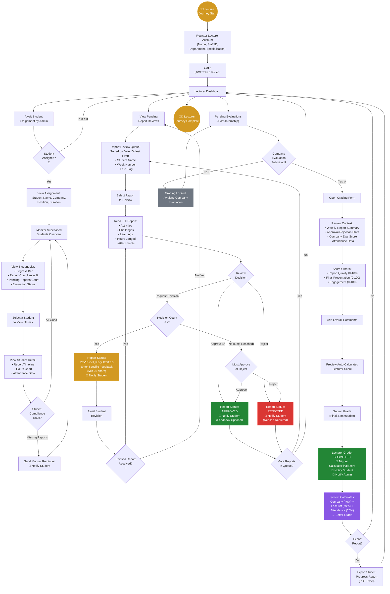
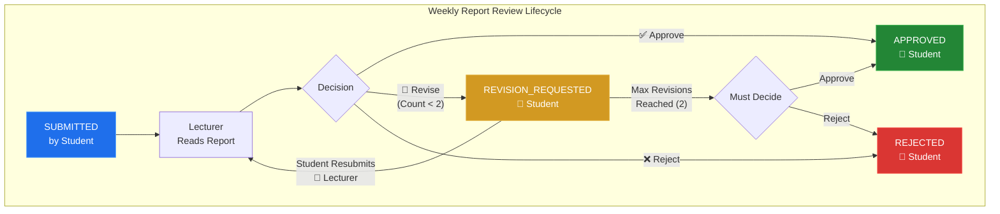
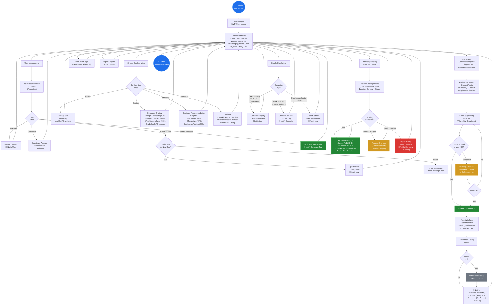
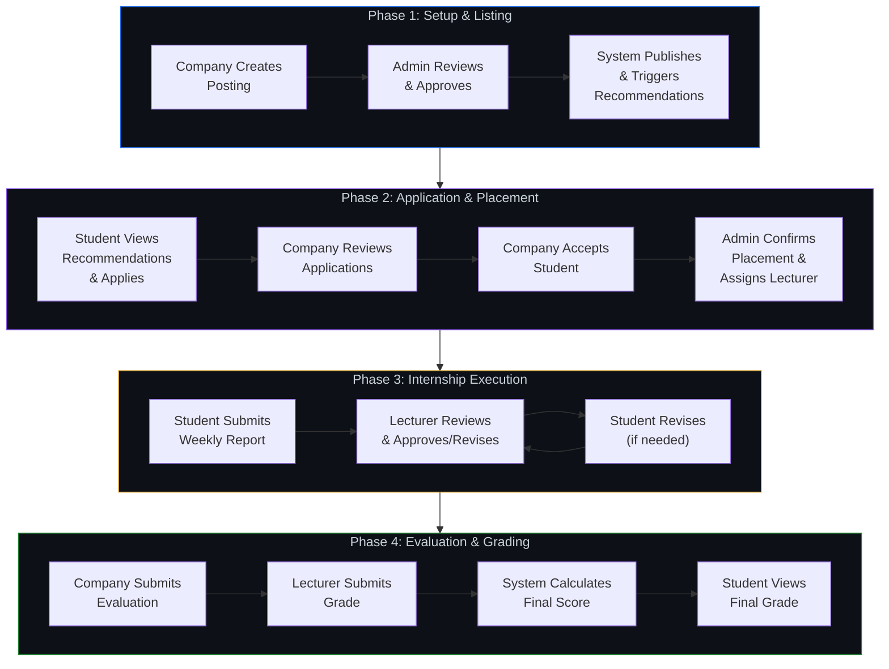
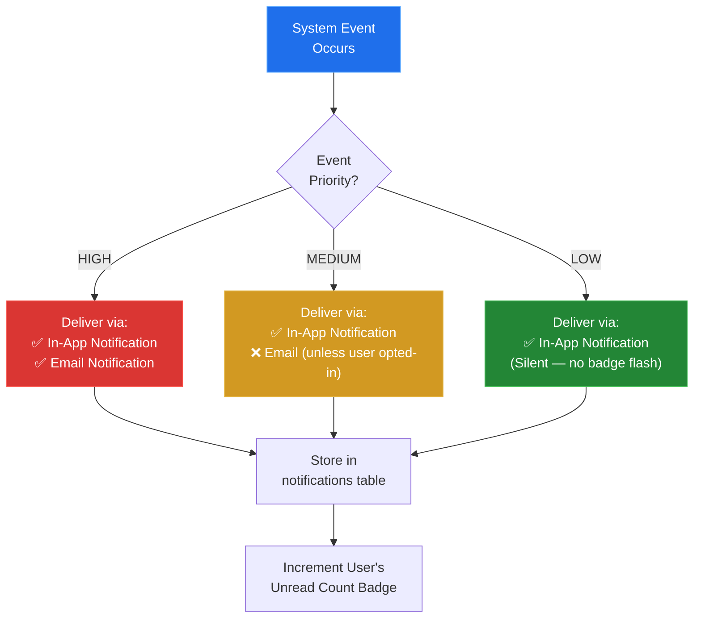
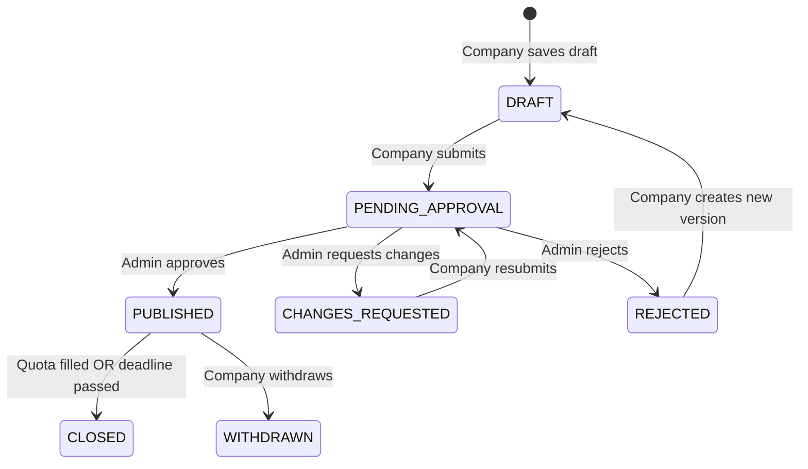
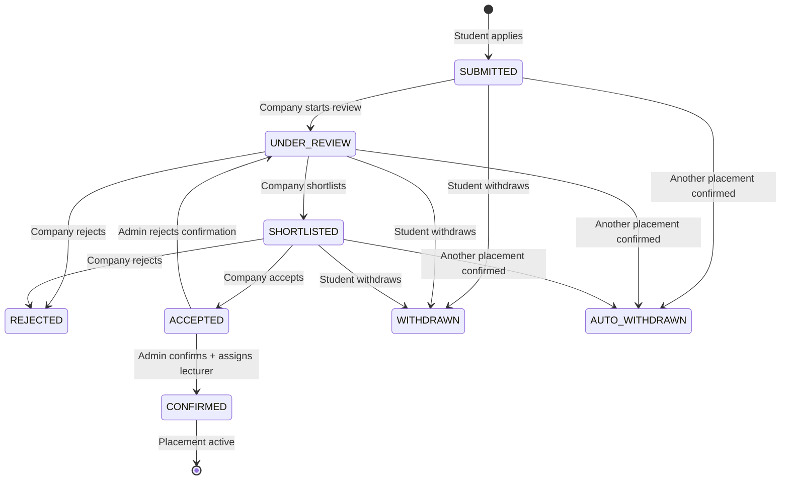
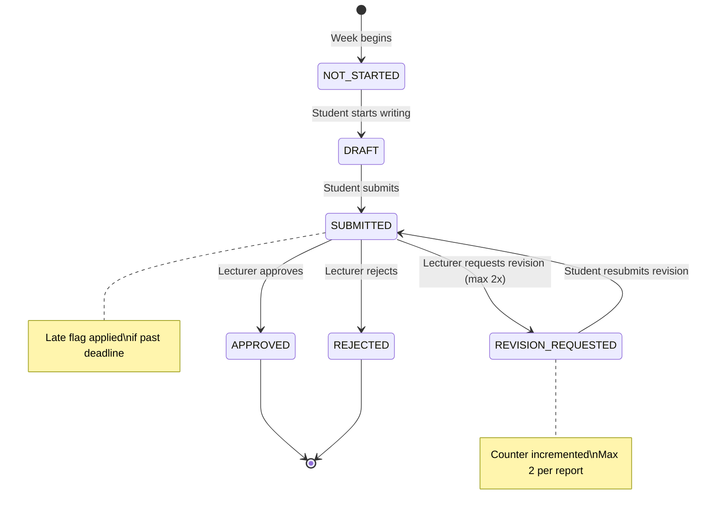

# PHASE 3: BUSINESS PROCESS MODELING

## Smart University Internship Management System (SUIMS)

> **Document Version:** 1.0  
> **Date:** June 5, 2026  
> **Phase Dependency:** Phase 1 (System Analysis) → Phase 2 (Use Case Analysis)  
> **Notation:** BPMN-aligned flowcharts rendered in Mermaid.js  
> **Convention:** 🔔 = Notification trigger, 🛑 = Blocking condition, ✅ = Approval gate

---

## 3.1 Student Complete Journey

This flowchart maps the entire student experience from registration through final grade receipt.

```mermaid
flowchart TD
    START((🎓 Student\nJourney Start)) --> REG["Register Account\n(Name, Email, Student ID,\nDepartment, Password)"]
    REG --> VERIFY_EMAIL{"Email\nVerification"}
    VERIFY_EMAIL -->|Verified| LOGIN["Login\n(JWT Token Issued)"]
    VERIFY_EMAIL -->|Not Verified| RESEND["Resend Verification\nEmail"]
    RESEND --> VERIFY_EMAIL

    LOGIN --> PROFILE["Complete Student Profile\n(GPA, Enrollment Year,\nPhone, Address)"]
    PROFILE --> CV_CHECK{"CV\nComplete?"}
    CV_CHECK -->|No| BUILD_CV["Build / Edit CV"]
    CV_CHECK -->|Yes| DASHBOARD["Student Dashboard"]
    BUILD_CV --> ADD_EDU["Add Education\nEntries"]
    ADD_EDU --> ADD_EXP["Add Work Experience\n(Optional)"]
    ADD_EXP --> ADD_SKILLS["Select Skills from\nTaxonomy (Min 3)"]
    ADD_SKILLS --> UPLOAD_DOCS["Upload Certifications\n(PDF, Max 5MB)"]
    UPLOAD_DOCS --> SAVE_CV["Save CV"]
    SAVE_CV --> CV_VALID{"CV Minimum\nMet?\n(1 Edu + 3 Skills)"}
    CV_VALID -->|No| ADD_SKILLS
    CV_VALID -->|Yes| CV_COMPLETE["CV Status: COMPLETE\n🔔 Recommendation Engine\nTriggered"]
    CV_COMPLETE --> DASHBOARD

    DASHBOARD --> BROWSE["Browse / Search\nInternship Listings"]
    DASHBOARD --> VIEW_REC["View Recommended\nInternships\n(Ranked by Match Score)"]
    VIEW_REC --> BROWSE

    BROWSE --> SELECT_LISTING["View Listing Details\n& Match Score Breakdown"]
    SELECT_LISTING --> APPLY_CHECK{"Eligible\nto Apply?"}
    APPLY_CHECK -->|"CV Incomplete"| BUILD_CV
    APPLY_CHECK -->|"3 Active Apps"| MANAGE_APPS["Withdraw an Existing\nApplication First"]
    APPLY_CHECK -->|"Already Applied"| BROWSE
    APPLY_CHECK -->|"Deadline Passed"| BROWSE
    APPLY_CHECK -->|Eligible| APPLY["Submit Application\n(CV Snapshot + Cover Letter)"]

    MANAGE_APPS --> WITHDRAW["Withdraw Application\n🔔 Notify Company"]
    WITHDRAW --> APPLY_CHECK

    APPLY --> APP_SUBMITTED["Application Status:\nSUBMITTED\n🔔 Notify Company Rep"]

    APP_SUBMITTED --> TRACK["Track Application\non Dashboard"]
    TRACK --> STATUS_UPDATE{"Status\nUpdate\nReceived?"}
    STATUS_UPDATE -->|"UNDER_REVIEW\n🔔"| TRACK
    STATUS_UPDATE -->|"SHORTLISTED\n🔔"| TRACK
    STATUS_UPDATE -->|"REJECTED\n🔔"| REJECTED_END["Application Rejected\n(Can Apply Elsewhere)"]
    STATUS_UPDATE -->|"ACCEPTED\n🔔"| AWAIT_CONFIRM["Awaiting Admin\nConfirmation"]
    REJECTED_END --> BROWSE

    AWAIT_CONFIRM --> CONFIRMED{"Admin\nConfirms?"}
    CONFIRMED -->|"Rejected by Admin"| REJECTED_END
    CONFIRMED -->|"Confirmed ✅\n🔔 All Parties Notified"| INTERNSHIP_ACTIVE["Internship Status: ACTIVE\nOther Applications\nAuto-Withdrawn"]

    INTERNSHIP_ACTIVE --> WEEKLY_CYCLE["Weekly Reporting Cycle\nBegins"]
    WEEKLY_CYCLE --> CHECK_DEADLINE{"Report\nDeadline\nApproaching?"}
    CHECK_DEADLINE -->|"24h Before\n🔔 Reminder"| WRITE_REPORT["Write Weekly Report\n(Activities, Challenges,\nLearnings, Hours)"]
    CHECK_DEADLINE -->|"Not Yet"| WRITE_REPORT
    WRITE_REPORT --> ATTACH["Attach Files\n(Optional, Max 3)"]
    ATTACH --> SUBMIT_DRAFT{"Save as\nDraft or Submit?"}
    SUBMIT_DRAFT -->|Draft| DRAFT_SAVED["Report Saved\nas DRAFT"]
    DRAFT_SAVED --> WRITE_REPORT
    SUBMIT_DRAFT -->|Submit| VALIDATE_RPT{"Validation\nPassed?\n(50+ chars, 1-80 hrs)"}
    VALIDATE_RPT -->|No| WRITE_REPORT
    VALIDATE_RPT -->|Yes| RPT_SUBMITTED["Report Status:\nSUBMITTED\n🔔 Notify Lecturer"]

    RPT_SUBMITTED --> LATE_CHECK{"Past\nDeadline?"}
    LATE_CHECK -->|Yes| LATE_FLAG["Report Flagged\nas LATE"]
    LATE_CHECK -->|No| AWAIT_REVIEW["Awaiting Lecturer\nReview"]
    LATE_FLAG --> AWAIT_REVIEW

    AWAIT_REVIEW --> REVIEW_RESULT{"Lecturer\nDecision\n🔔"}
    REVIEW_RESULT -->|"APPROVED ✅"| RPT_APPROVED["Report Approved"]
    REVIEW_RESULT -->|"REVISION_REQUESTED"| REVISE_RPT["Review Feedback &\nRevise Report"]
    REVIEW_RESULT -->|"REJECTED"| RPT_REJECTED["Report Rejected\n(Final for This Week)"]

    REVISE_RPT --> VALIDATE_RPT
    RPT_APPROVED --> NEXT_WEEK{"More Weeks\nRemaining?"}
    RPT_REJECTED --> NEXT_WEEK
    NEXT_WEEK -->|Yes| WEEKLY_CYCLE
    NEXT_WEEK -->|No| INTERNSHIP_END["Internship Period\nEnds"]

    INTERNSHIP_END --> AWAIT_EVAL["Await Company\nEvaluation"]
    AWAIT_EVAL --> AWAIT_GRADE["Await Lecturer\nGrade"]
    AWAIT_GRADE --> FINAL_SCORE["Final Score Calculated\n🔔 Notification:\nGrade Available"]
    FINAL_SCORE --> VIEW_GRADE["View Final Score\n& Grade Breakdown"]
    VIEW_GRADE --> FINISH((🎓 Student\nJourney Complete))

    style START fill:#8957e5,stroke:#bc8cff,color:#fff
    style FINISH fill:#8957e5,stroke:#bc8cff,color:#fff
    style CV_COMPLETE fill:#238636,stroke:#3fb950,color:#fff
    style APP_SUBMITTED fill:#1f6feb,stroke:#58a6ff,color:#fff
    style INTERNSHIP_ACTIVE fill:#238636,stroke:#3fb950,color:#fff
    style RPT_SUBMITTED fill:#1f6feb,stroke:#58a6ff,color:#fff
    style RPT_APPROVED fill:#238636,stroke:#3fb950,color:#fff
    style REJECTED_END fill:#da3633,stroke:#f85149,color:#fff
    style RPT_REJECTED fill:#da3633,stroke:#f85149,color:#fff
    style LATE_FLAG fill:#d29922,stroke:#e3b341,color:#fff
    style FINAL_SCORE fill:#238636,stroke:#3fb950,color:#fff
```



### 3.1.1 Student Journey — Key Decision Points

| Decision Point | Conditions | Outcome |
|---------------|------------|---------|
| CV Complete? | ≥ 1 Education + ≥ 3 Skills | Unlocks application eligibility |
| Eligible to Apply? | CV complete + < 3 active apps + no duplicate + deadline not passed | Application proceeds |
| Report Validation | Activities ≥ 50 chars + Hours 1–80 | Report accepted for submission |
| Lecturer Decision | Approve / Revise (max 2) / Reject | Report finalized or revision cycle |
| More Weeks Remaining? | Current date vs. internship end date | Continues cycle or ends internship |

---

## 3.2 Company Representative Complete Journey

```mermaid
flowchart TD
    START((🏢 Company\nJourney Start)) --> REG["Register Company\nRepresentative Account\n(Name, Email, Company Name,\nIndustry, Contact)"]
    REG --> AWAIT_VERIFY["Await Company\nProfile Verification\nby Admin"]

    AWAIT_VERIFY --> VERIFIED{"Admin Verifies\nCompany?\n🔔"}
    VERIFIED -->|"Rejected"| UPDATE_PROFILE["Update Company\nProfile & Resubmit"]
    UPDATE_PROFILE --> AWAIT_VERIFY
    VERIFIED -->|"Verified ✅"| COMP_DASH["Company Dashboard"]

    COMP_DASH --> CREATE_POST["Create Internship\nPosting"]
    CREATE_POST --> FILL_DETAILS["Fill Position Details\n(Title, Description,\nDuration, Quota, Location)"]
    FILL_DETAILS --> ADD_SKILLS["Select Required Skills\nfrom Taxonomy\n(Min 1 Tag)"]
    ADD_SKILLS --> SET_DEADLINE["Set Application\nDeadline"]
    SET_DEADLINE --> PREVIEW["Preview Posting"]

    PREVIEW --> SAVE_ACTION{"Save as Draft\nor Submit?"}
    SAVE_ACTION -->|"Draft"| DRAFT["Posting Status:\nDRAFT"]
    DRAFT --> CREATE_POST
    SAVE_ACTION -->|"Submit"| VALIDATE_POST{"Validation\nPassed?"}
    VALIDATE_POST -->|"No (Missing fields,\nbad duration)"| FILL_DETAILS
    VALIDATE_POST -->|"Yes"| PENDING["Posting Status:\nPENDING_APPROVAL\n🔔 Notify Admin"]

    PENDING --> ADMIN_DECISION{"Admin\nDecision\n🔔"}
    ADMIN_DECISION -->|"APPROVED ✅"| PUBLISHED["Posting Status:\nPUBLISHED\n🔔 Recommendation\nEngine Triggered"]
    ADMIN_DECISION -->|"CHANGES_REQUESTED"| EDIT_POST["Edit Posting per\nAdmin Feedback"]
    ADMIN_DECISION -->|"REJECTED"| REJECTED_POST["Posting Rejected\n(Review Reason)"]
    EDIT_POST --> VALIDATE_POST
    REJECTED_POST --> CREATE_POST

    PUBLISHED --> RECEIVE_APPS["Receive Applications\n🔔 Per Application"]

    RECEIVE_APPS --> REVIEW_APP["Review Application\n(CV, Cover Letter,\nMatch Score)"]
    REVIEW_APP --> APP_ACTION{"Application\nAction"}
    APP_ACTION -->|"Mark Under Review"| UNDER_REVIEW["Status: UNDER_REVIEW\n🔔 Notify Student"]
    APP_ACTION -->|"Shortlist"| SHORTLIST["Status: SHORTLISTED\n🔔 Notify Student"]
    APP_ACTION -->|"Reject"| REJECT_APP["Status: REJECTED\n(Enter Reason)\n🔔 Notify Student"]

    UNDER_REVIEW --> APP_ACTION2{"Further\nAction"}
    APP_ACTION2 -->|"Shortlist"| SHORTLIST
    APP_ACTION2 -->|"Reject"| REJECT_APP

    SHORTLIST --> ACCEPT_DECISION{"Accept\nStudent?"}
    ACCEPT_DECISION -->|"Yes"| ACCEPT_APP["Status: ACCEPTED\n🔔 Notify Student\n🔔 Notify Admin\n(Awaiting Confirmation)"]
    ACCEPT_DECISION -->|"No"| REJECT_APP

    ACCEPT_APP --> ADMIN_CONFIRM{"Admin\nConfirms\nPlacement?\n🔔"}
    ADMIN_CONFIRM -->|"Confirmed ✅"| PLACEMENT_ACTIVE["Placement Active\nQuota Decremented"]
    ADMIN_CONFIRM -->|"Rejected"| BACK_TO_SHORTLIST["Student Returns to\nShortlisted Pool"]
    BACK_TO_SHORTLIST --> ACCEPT_DECISION

    REJECT_APP --> MORE_APPS{"More\nApplications?"}
    MORE_APPS -->|"Yes"| REVIEW_APP
    MORE_APPS -->|"No"| WAIT_APPS["Wait for More\nApplications"]
    WAIT_APPS --> RECEIVE_APPS

    PLACEMENT_ACTIVE --> QUOTA_CHECK{"Quota\nFilled?"}
    QUOTA_CHECK -->|"Yes"| LISTING_CLOSED["Listing Status:\nCLOSED"]
    QUOTA_CHECK -->|"No"| RECEIVE_APPS

    LISTING_CLOSED --> INTERNSHIP_PERIOD["Internship Period\n(Monitor Interns)"]
    PLACEMENT_ACTIVE --> INTERNSHIP_PERIOD

    INTERNSHIP_PERIOD --> INTERN_ENDS["Internship End\nDate Reached"]
    INTERN_ENDS --> EVAL_PENDING["Evaluation Required\n🔔 Reminder"]
    EVAL_PENDING --> FILL_EVAL["Complete Evaluation\nRubric\n(7 Criteria, 0-100 Each)"]
    FILL_EVAL --> ADD_COMMENTS["Add Comments:\nStrengths, Improvements,\nHiring Recommendation"]
    ADD_COMMENTS --> SUBMIT_EVAL["Submit Evaluation\n(Final & Immutable)"]
    SUBMIT_EVAL --> EVAL_DONE["Evaluation Status:\nSUBMITTED\n🔔 Notify Lecturer\n🔔 Notify Admin"]
    EVAL_DONE --> FINISH((🏢 Company\nJourney Complete))

    style START fill:#da3633,stroke:#f85149,color:#fff
    style FINISH fill:#da3633,stroke:#f85149,color:#fff
    style PUBLISHED fill:#238636,stroke:#3fb950,color:#fff
    style PENDING fill:#d29922,stroke:#e3b341,color:#fff
    style ACCEPT_APP fill:#1f6feb,stroke:#58a6ff,color:#fff
    style PLACEMENT_ACTIVE fill:#238636,stroke:#3fb950,color:#fff
    style LISTING_CLOSED fill:#6e7681,stroke:#8b949e,color:#fff
    style REJECTED_POST fill:#da3633,stroke:#f85149,color:#fff
    style REJECT_APP fill:#da3633,stroke:#f85149,color:#fff
    style EVAL_DONE fill:#238636,stroke:#3fb950,color:#fff
```



### 3.2.1 Company Journey — Key Decision Points

| Decision Point | Conditions | Outcome |
|---------------|------------|---------|
| Admin Verifies Company? | Company profile complete & legitimate | Unlocks posting capability |
| Admin Approves Posting? | Posting meets policy requirements | Listing becomes visible to students |
| Accept Student? | Student qualifications match needs | Application accepted, awaits Admin confirmation |
| Quota Filled? | Confirmed placements = Posting quota | Listing auto-closed |
| Evaluation Submission | Within 14 days of internship end | Unlocks Lecturer grading |

---

## 3.3 Lecturer / Supervisor Complete Journey



### 3.3.1 Lecturer Report Review — Approval Sub-Process Detail



### 3.3.2 Lecturer Journey — Key Decision Points

| Decision Point | Conditions | Outcome |
|---------------|------------|---------|
| Review Decision | Report quality assessment | Approve / Revise / Reject |
| Revision Count < 2? | Per BR-17 | If exceeded, must approve or reject |
| Company Eval Submitted? | Per BR-20 dependency | Grading form unlocked or locked |
| Submit Grade | All criteria scored (0–100) | Triggers final score calculation |

---

## 3.4 Administrator Complete Journey



### 3.4.1 Administrator Journey — Key Decision Points

| Decision Point | Conditions | Outcome |
|---------------|------------|---------|
| Posting Compliant? | Valid skills, description, duration, verified company | Approve / Request Changes / Reject |
| Lecturer Load ≤ Max? | Current supervision count vs. configurable max (default: 10) | Assign or warn/override |
| Quota = 0? | All positions filled | Auto-close listing |
| Escalation Type | Late evaluation, unlock request, status override | Appropriate admin intervention |

---

## 3.5 Cross-Functional Master Process Flow

This diagram shows how the four roles interact across the complete internship lifecycle.



---

## 3.6 Notification Trigger Registry

This table documents every notification trigger point identified across all business processes.

| ID | Trigger Event | Sender | Recipient(s) | Channel | Priority |
|----|--------------|--------|-------------- |---------|----------|
| **N-01** | Account activated/deactivated by Admin | System | Affected User | In-App + Email | High |
| **N-02** | Company profile verified by Admin | System | Company Rep | In-App + Email | High |
| **N-03** | Internship posting submitted for approval | System | Admin | In-App | Medium |
| **N-04** | Internship posting approved | System | Company Rep | In-App + Email | High |
| **N-05** | Internship posting rejected / changes requested | System | Company Rep | In-App + Email | High |
| **N-06** | Posting published — new recommendations available | System | Matching Students | In-App | Low |
| **N-07** | New application received | System | Company Rep | In-App + Email | Medium |
| **N-08** | Application status changed (Under Review) | System | Student | In-App | Medium |
| **N-09** | Application shortlisted | System | Student | In-App + Email | High |
| **N-10** | Application accepted by Company | System | Student + Admin | In-App + Email | High |
| **N-11** | Application rejected | System | Student | In-App + Email | High |
| **N-12** | Placement confirmed by Admin | System | Student + Lecturer + Company | In-App + Email | High |
| **N-13** | Other pending applications auto-withdrawn | System | Student + Affected Companies | In-App | Medium |
| **N-14** | Lecturer assigned to student | System | Lecturer | In-App + Email | High |
| **N-15** | Weekly report deadline reminder (24h before) | Scheduler | Student | In-App + Email | Medium |
| **N-16** | Weekly report submitted | System | Lecturer | In-App | Medium |
| **N-17** | Weekly report approved | System | Student | In-App | Medium |
| **N-18** | Weekly report revision requested | System | Student | In-App + Email | High |
| **N-19** | Weekly report rejected | System | Student | In-App + Email | High |
| **N-20** | Manual reminder from Lecturer | Lecturer | Student | In-App | Medium |
| **N-21** | Company evaluation submitted | System | Lecturer + Admin | In-App + Email | High |
| **N-22** | Company evaluation overdue (> 14 days) | Scheduler | Admin (Escalation) | In-App + Email | High |
| **N-23** | Lecturer grade submitted | System | Student + Admin | In-App + Email | High |
| **N-24** | Final score calculated / grade available | System | Student | In-App + Email | High |
| **N-25** | Evaluation unlocked by Admin | System | Evaluator (Company/Lecturer) | In-App + Email | High |
| **N-26** | Application withdrawn by Student | System | Company Rep | In-App | Medium |
| **N-27** | Listing auto-closed (quota filled) | System | Company Rep | In-App | Medium |
| **N-28** | Application deadline approaching (48h) | Scheduler | Students with draft apps | In-App | Low |

### 3.6.1 Notification Channel Decision Logic



---

## 3.7 Approval Workflow State Machines

### 3.7.1 Internship Posting Approval States



### 3.7.2 Application Workflow States



### 3.7.3 Weekly Report States



### 3.7.4 Evaluation & Grading States

```mermaid
stateDiagram-v2
    [*] --> INTERNSHIP_COMPLETED : End date reached

    state Company_Evaluation {
        CE_PENDING --> CE_DRAFT : Company starts
        CE_DRAFT --> CE_SUBMITTED : Company submits
    }

    state Lecturer_Grading {
        LG_LOCKED --> LG_UNLOCKED : Company eval submitted
        LG_UNLOCKED --> LG_SUBMITTED : Lecturer submits grade
    }

    state Final_Score {
        FS_PENDING --> FS_CALCULATED : Both evaluations in
    }

    INTERNSHIP_COMPLETED --> CE_PENDING
    CE_SUBMITTED --> LG_LOCKED
    CE_SUBMITTED --> LG_UNLOCKED
    LG_SUBMITTED --> FS_PENDING
    FS_CALCULATED --> [*] : Grade published to student

    note right of LG_LOCKED : Blocked until\ncompany eval done\n(BR-20)
    note right of FS_CALCULATED : Formula:\nCompany(40%) +\nLecturer(40%) +\nAttendance(20%)
```

---

## 3.8 Scheduled Process Flows (Cron / Scheduler)

| Schedule | Process | Trigger | Actions |
|----------|---------|---------|---------|
| **Daily @ 00:00** | Deadline Enforcement | Cron | Check for overdue weekly reports → flag as `LATE` if not submitted by deadline |
| **Daily @ 08:00** | Deadline Reminders | Cron | Check for reports due within 24 hours → send N-15 reminder to students |
| **Daily @ 09:00** | Evaluation Overdue Check | Cron | Check for company evaluations not submitted > 14 days post-internship → send N-22 escalation to Admin |
| **On CV Update** | Recommendation Recalculation | Event | Recalculate match scores for the updated student against all active listings |
| **On Posting Published** | Recommendation Recalculation | Event | Calculate match scores for all eligible students against the new listing |
| **Daily @ 23:59** | Listing Deadline Check | Cron | Close listings whose application deadline has passed → set status to `CLOSED` |
| **Weekly @ Monday 01:00** | Initialize Week Reports | Cron | Create `NOT_STARTED` report slots for the new week for all active internships |

---

## 3.9 Phase 3 — State Summary

> [!IMPORTANT]
> **Critical Decisions Carried Forward to Subsequent Phases:**

- **Four complete journey flowcharts** have been modeled covering every user interaction from registration to completion. These journeys directly inform the **frontend route map** (Phase 11) and **API endpoint design** (Phase 9) — each process step corresponds to at least one API call and one UI view.
- **Four state machines** have been formally defined (Posting: 7 states, Application: 8 states, Report: 6 states, Evaluation: multi-track). These states must be implemented as **ENUM/CHECK constraints** in the Oracle schema (Phase 6) and as **status transition validation** in the Laravel Service layer (Phase 10).
- **28 notification triggers** (N-01 through N-28) are catalogued with channel routing logic (In-App + Email for High priority, In-App only for Medium/Low). This registry governs the **Laravel Events/Listeners architecture** (Phase 10) and the **notifications database table** design (Phase 5–6).
- **7 scheduled processes** are identified requiring the **Laravel Task Scheduler** (Phase 10). These include deadline enforcement, reminder dispatch, overdue escalation, and recommendation recalculation — each requiring a dedicated Artisan command or queued job.

---

✅ **Phase 3 completed.** Reply **CONTINUE** to proceed to Phase 4 (Database Requirements & Recommendation Engine Prep), or provide feedback to revise this phase.
