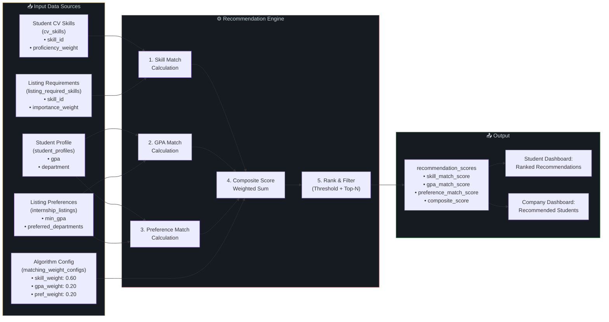
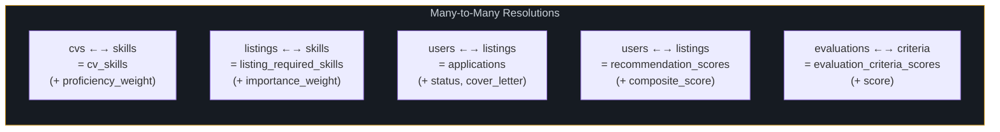

# PHASE 4: DATABASE REQUIREMENTS & RECOMMENDATION ENGINE PREP

## Smart University Internship Management System (SUIMS)

> **Document Version:** 1.0  
> **Date:** June 5, 2026  
> **Phase Dependency:** Phase 1 (Requirements) → Phase 2 (Use Cases) → Phase 3 (Process Models)  
> **Scope:** Entity identification, data dictionary, business data rules, recommendation engine data architecture  
> **Note:** This phase defines WHAT data is needed. SQL implementation is deferred to Phases 6–7.

---

## 4.1 Entity Identification & Module Mapping

### 4.1.1 Entity Catalog

```mermaid
flowchart TD
    subgraph MOD_AUTH["🔐 Authentication & User Management"]
        E01["users"]
        E02["student_profiles"]
        E03["lecturer_profiles"]
        E04["company_profiles"]
        E05["password_resets"]
    end

    subgraph MOD_CV["📄 CV Management"]
        E06["cvs"]
        E07["cv_educations"]
        E08["cv_experiences"]
        E09["cv_documents"]
        E10["cv_versions"]
    end

    subgraph MOD_SKILL["🏷️ Skill Taxonomy"]
        E11["skill_categories"]
        E12["skills"]
        E13["cv_skills"]
    end

    subgraph MOD_LISTING["📋 Internship Listings"]
        E14["internship_listings"]
        E15["listing_required_skills"]
    end

    subgraph MOD_REC["🤖 Recommendation Engine"]
        E16["recommendation_scores"]
        E17["matching_weight_configs"]
    end

    subgraph MOD_APP["📨 Application Workflow"]
        E18["applications"]
        E19["application_status_history"]
    end

    subgraph MOD_INTERN["🏢 Active Internships"]
        E20["internships"]
    end

    subgraph MOD_RPT["📝 Weekly Reporting"]
        E21["weekly_reports"]
        E22["report_attachments"]
        E23["report_reviews"]
    end

    subgraph MOD_EVAL["📊 Evaluation & Grading"]
        E24["company_evaluations"]
        E25["evaluation_criteria_scores"]
        E26["lecturer_grades"]
        E27["final_scores"]
    end

    subgraph MOD_NOTIF["🔔 Notifications"]
        E28["notifications"]
    end

    subgraph MOD_SYS["⚙️ System Configuration"]
        E29["system_configs"]
        E30["grading_scales"]
        E31["evaluation_criteria"]
    end

    subgraph MOD_AUDIT["🔍 Audit"]
        E32["audit_logs"]
    end

    style MOD_AUTH fill:#161b22,stroke:#1f6feb,color:#c9d1d9
    style MOD_CV fill:#161b22,stroke:#8957e5,color:#c9d1d9
    style MOD_SKILL fill:#161b22,stroke:#d29922,color:#c9d1d9
    style MOD_LISTING fill:#161b22,stroke:#da3633,color:#c9d1d9
    style MOD_REC fill:#161b22,stroke:#e3b341,color:#c9d1d9
    style MOD_APP fill:#161b22,stroke:#1f6feb,color:#c9d1d9
    style MOD_INTERN fill:#161b22,stroke:#238636,color:#c9d1d9
    style MOD_RPT fill:#161b22,stroke:#8957e5,color:#c9d1d9
    style MOD_EVAL fill:#161b22,stroke:#da3633,color:#c9d1d9
    style MOD_NOTIF fill:#161b22,stroke:#d29922,color:#c9d1d9
    style MOD_SYS fill:#161b22,stroke:#6e7681,color:#c9d1d9
    style MOD_AUDIT fill:#161b22,stroke:#238636,color:#c9d1d9
```



### 4.1.2 Entity Summary Table

| # | Entity Name | Module | Description | Est. Volume |
|---|------------|--------|-------------|-------------|
| 1 | `users` | Auth | Central user table for all roles with authentication credentials | 10,000+ |
| 2 | `student_profiles` | Auth | Extended profile for students (GPA, department, enrollment year) | 7,000+ |
| 3 | `lecturer_profiles` | Auth | Extended profile for lecturers (staff ID, specializations) | 200+ |
| 4 | `company_profiles` | Auth | Extended profile for companies (industry, address, verification) | 500+ |
| 5 | `password_resets` | Auth | Token-based password reset tracking | Transient |
| 6 | `cvs` | CV | Master CV record per student with status and visibility | 7,000+ |
| 7 | `cv_educations` | CV | Education history entries linked to a CV | 15,000+ |
| 8 | `cv_experiences` | CV | Work/volunteer experience entries linked to a CV | 10,000+ |
| 9 | `cv_documents` | CV | Uploaded certification/transcript files | 20,000+ |
| 10 | `cv_versions` | CV | Snapshot versions of CV state for audit and application linking | 30,000+ |
| 11 | `skill_categories` | Skill | Top-level groupings for skills (e.g., "Programming", "Design") | 20–50 |
| 12 | `skills` | Skill | Individual skill entries within categories (e.g., "Python", "Figma") | 200–500 |
| 13 | `cv_skills` | Skill | Many-to-many: student CV ↔ skills with proficiency level | 50,000+ |
| 14 | `internship_listings` | Listing | Company-posted internship positions | 1,000+ |
| 15 | `listing_required_skills` | Listing | Many-to-many: listing ↔ required skills with importance | 5,000+ |
| 16 | `recommendation_scores` | Rec | Computed match scores: student ↔ listing pairs | 500,000+ |
| 17 | `matching_weight_configs` | Rec | Admin-configurable weights for the matching algorithm | 1 (singleton) |
| 18 | `applications` | App | Student applications to internship listings | 20,000+ |
| 19 | `application_status_history` | App | Audit trail of every status transition for an application | 80,000+ |
| 20 | `internships` | Intern | Active/completed internship records linking student, company, lecturer | 5,000+ |
| 21 | `weekly_reports` | Report | Weekly progress reports submitted by students | 50,000+ |
| 22 | `report_attachments` | Report | Files attached to weekly reports | 30,000+ |
| 23 | `report_reviews` | Report | Lecturer review actions on weekly reports | 60,000+ |
| 24 | `company_evaluations` | Eval | Master evaluation record per intern from company | 5,000+ |
| 25 | `evaluation_criteria_scores` | Eval | Individual criterion scores within a company evaluation | 35,000+ |
| 26 | `lecturer_grades` | Eval | Lecturer grading record per intern | 5,000+ |
| 27 | `final_scores` | Eval | Computed composite score and letter grade | 5,000+ |
| 28 | `notifications` | Notif | All system-generated notifications for users | 500,000+ |
| 29 | `system_configs` | Config | Key-value configuration parameters | 20–50 |
| 30 | `grading_scales` | Config | Grade letter thresholds (A, B+, B, etc.) | 8–10 |
| 31 | `evaluation_criteria` | Config | Predefined evaluation criteria definitions | 7–15 |
| 32 | `audit_logs` | Audit | Cross-cutting audit trail for all state changes | 1,000,000+ |

---

## 4.2 Data Dictionary

### 4.2.1 Entity: `users`

> Central authentication and identity table for all system actors.

| Attribute | Description | Logical Type | Nullable | Constraints / Rules |
|-----------|-------------|-------------|----------|-------------------|
| `user_id` | Unique identifier (PK) | Integer (Auto) | No | Primary Key, Sequence-generated |
| `email` | Login email address | String (150) | No | Unique, Valid email format |
| `password_hash` | bcrypt-hashed password | String (255) | No | Cost factor ≥ 12 |
| `full_name` | User's full display name | String (200) | No | Min 2 characters |
| `role` | System role assignment | Enum String (20) | No | CHECK: `ADMIN`, `STUDENT`, `LECTURER`, `COMPANY` |
| `status` | Account status | Enum String (20) | No | CHECK: `ACTIVE`, `INACTIVE`, `LOCKED`; Default: `INACTIVE` |
| `email_verified_at` | Timestamp of email verification | Timestamp | Yes | Null until verified |
| `failed_login_attempts` | Consecutive failed login counter | Integer | No | Default: 0, Reset on success |
| `locked_until` | Account lock expiry timestamp | Timestamp | Yes | Set on 5th failed attempt (30 min lockout) |
| `last_login_at` | Timestamp of last successful login | Timestamp | Yes | Updated on each login |
| `profile_photo_path` | Path to profile photo | String (500) | Yes | Relative storage path |
| `created_at` | Record creation timestamp | Timestamp | No | Auto-set |
| `updated_at` | Last modification timestamp | Timestamp | No | Auto-set |

---

### 4.2.2 Entity: `student_profiles`

> Extended profile data specific to students. One-to-one with `users` where role = `STUDENT`.

| Attribute | Description | Logical Type | Nullable | Constraints / Rules |
|-----------|-------------|-------------|----------|-------------------|
| `student_profile_id` | Unique identifier (PK) | Integer (Auto) | No | Primary Key |
| `user_id` | FK to `users` | Integer | No | Unique, FK → `users.user_id` |
| `student_id_number` | University student ID | String (30) | No | Unique |
| `department` | Academic department | String (100) | No | — |
| `faculty` | Faculty/School | String (100) | Yes | — |
| `enrollment_year` | Year of enrollment | Integer (4) | No | Range: 2000–current year |
| `expected_graduation` | Expected graduation year | Integer (4) | Yes | Must be ≥ enrollment_year |
| `gpa` | Current cumulative GPA | Decimal (3,2) | No | Range: 0.00–4.00 |
| `phone_number` | Contact phone | String (20) | Yes | — |
| `address` | Mailing address | String (500) | Yes | — |
| `linkedin_url` | LinkedIn profile URL | String (300) | Yes | Valid URL format |
| `bio` | Short personal summary | Text (2000) | Yes | — |
| `created_at` | Record creation timestamp | Timestamp | No | Auto-set |
| `updated_at` | Last modification timestamp | Timestamp | No | Auto-set |

---

### 4.2.3 Entity: `lecturer_profiles`

> Extended profile data specific to lecturers/supervisors.

| Attribute | Description | Logical Type | Nullable | Constraints / Rules |
|-----------|-------------|-------------|----------|-------------------|
| `lecturer_profile_id` | Unique identifier (PK) | Integer (Auto) | No | Primary Key |
| `user_id` | FK to `users` | Integer | No | Unique, FK → `users.user_id` |
| `staff_id_number` | University staff ID | String (30) | No | Unique |
| `department` | Academic department | String (100) | No | — |
| `faculty` | Faculty/School | String (100) | Yes | — |
| `specialization` | Area(s) of expertise | String (500) | Yes | Comma-separated or structured |
| `max_supervision_load` | Max students to supervise simultaneously | Integer | No | Default: 10, Range: 1–30 |
| `phone_number` | Contact phone | String (20) | Yes | — |
| `office_location` | Office/room number | String (100) | Yes | — |
| `created_at` | Record creation timestamp | Timestamp | No | Auto-set |
| `updated_at` | Last modification timestamp | Timestamp | No | Auto-set |

---

### 4.2.4 Entity: `company_profiles`

> Extended profile data specific to company representatives.

| Attribute | Description | Logical Type | Nullable | Constraints / Rules |
|-----------|-------------|-------------|----------|-------------------|
| `company_profile_id` | Unique identifier (PK) | Integer (Auto) | No | Primary Key |
| `user_id` | FK to `users` | Integer | No | Unique, FK → `users.user_id` |
| `company_name` | Registered company name | String (200) | No | — |
| `industry_sector` | Primary industry | String (100) | No | — |
| `company_size` | Organization size tier | Enum String (20) | Yes | CHECK: `STARTUP`, `SMALL`, `MEDIUM`, `LARGE`, `ENTERPRISE` |
| `company_website` | Official website URL | String (300) | Yes | Valid URL format |
| `company_address` | Office address | String (500) | No | — |
| `company_city` | City | String (100) | No | — |
| `company_description` | About the company | Text (4000) | Yes | — |
| `contact_person_name` | HR/contact person | String (200) | Yes | — |
| `contact_phone` | Company contact phone | String (20) | Yes | — |
| `is_verified` | Admin verification flag | Boolean (1/0) | No | Default: 0 (unverified) |
| `verified_at` | Verification timestamp | Timestamp | Yes | Set when admin verifies |
| `verified_by` | Admin user who verified | Integer | Yes | FK → `users.user_id` |
| `company_logo_path` | Path to logo image | String (500) | Yes | — |
| `created_at` | Record creation timestamp | Timestamp | No | Auto-set |
| `updated_at` | Last modification timestamp | Timestamp | No | Auto-set |

---

### 4.2.5 Entity: `password_resets`

| Attribute | Description | Logical Type | Nullable | Constraints / Rules |
|-----------|-------------|-------------|----------|-------------------|
| `reset_id` | Unique identifier (PK) | Integer (Auto) | No | Primary Key |
| `user_id` | FK to `users` | Integer | No | FK → `users.user_id` |
| `token` | Secure reset token | String (255) | No | Hashed, unique |
| `expires_at` | Token expiry (1 hour) | Timestamp | No | — |
| `used_at` | When the token was consumed | Timestamp | Yes | Null until used |
| `created_at` | Record creation timestamp | Timestamp | No | Auto-set |

---

### 4.2.6 Entity: `cvs`

> Master CV record per student. One-to-one with `student_profiles`.

| Attribute | Description | Logical Type | Nullable | Constraints / Rules |
|-----------|-------------|-------------|----------|-------------------|
| `cv_id` | Unique identifier (PK) | Integer (Auto) | No | Primary Key |
| `user_id` | FK to `users` (student) | Integer | No | Unique, FK → `users.user_id` |
| `personal_summary` | Career objective / summary | Text (2000) | Yes | — |
| `status` | CV completeness status | Enum String (20) | No | CHECK: `INCOMPLETE`, `COMPLETE`; Default: `INCOMPLETE` |
| `visibility` | CV visibility to companies | Enum String (20) | No | CHECK: `PUBLIC`, `PRIVATE`; Default: `PRIVATE` |
| `current_version` | Current version number | Integer | No | Default: 1, Incremented on save |
| `created_at` | Record creation timestamp | Timestamp | No | Auto-set |
| `updated_at` | Last modification timestamp | Timestamp | No | Auto-set |

---

### 4.2.7 Entity: `cv_educations`

| Attribute | Description | Logical Type | Nullable | Constraints / Rules |
|-----------|-------------|-------------|----------|-------------------|
| `cv_education_id` | Unique identifier (PK) | Integer (Auto) | No | Primary Key |
| `cv_id` | FK to `cvs` | Integer | No | FK → `cvs.cv_id` |
| `institution_name` | Name of institution | String (200) | No | — |
| `degree` | Degree type | String (100) | No | e.g., "Bachelor of Science" |
| `field_of_study` | Major / field | String (200) | No | — |
| `start_date` | Start date | Date | No | — |
| `end_date` | End date (null if current) | Date | Yes | Must be ≥ start_date if set |
| `gpa` | GPA at this institution | Decimal (3,2) | Yes | Range: 0.00–4.00 |
| `description` | Additional details | Text (1000) | Yes | — |
| `sort_order` | Display order | Integer | No | Default: 0 |
| `created_at` | Record creation timestamp | Timestamp | No | Auto-set |

---

### 4.2.8 Entity: `cv_experiences`

| Attribute | Description | Logical Type | Nullable | Constraints / Rules |
|-----------|-------------|-------------|----------|-------------------|
| `cv_experience_id` | Unique identifier (PK) | Integer (Auto) | No | Primary Key |
| `cv_id` | FK to `cvs` | Integer | No | FK → `cvs.cv_id` |
| `company_name` | Employer name | String (200) | No | — |
| `position_title` | Job title | String (200) | No | — |
| `start_date` | Start date | Date | No | — |
| `end_date` | End date (null if current) | Date | Yes | Must be ≥ start_date if set |
| `description` | Responsibilities / achievements | Text (2000) | Yes | — |
| `sort_order` | Display order | Integer | No | Default: 0 |
| `created_at` | Record creation timestamp | Timestamp | No | Auto-set |

---

### 4.2.9 Entity: `cv_documents`

| Attribute | Description | Logical Type | Nullable | Constraints / Rules |
|-----------|-------------|-------------|----------|-------------------|
| `cv_document_id` | Unique identifier (PK) | Integer (Auto) | No | Primary Key |
| `cv_id` | FK to `cvs` | Integer | No | FK → `cvs.cv_id` |
| `document_label` | User-defined label | String (200) | No | e.g., "Academic Transcript" |
| `file_path` | Storage path | String (500) | No | Relative path |
| `file_name` | Original file name | String (255) | No | — |
| `file_size_bytes` | File size in bytes | Integer | No | Max: 5,242,880 (5 MB) |
| `mime_type` | File MIME type | String (50) | No | Must be `application/pdf` |
| `uploaded_at` | Upload timestamp | Timestamp | No | Auto-set |

---

### 4.2.10 Entity: `cv_versions`

> Immutable snapshot of a CV state at a point in time. Used for application linking.

| Attribute | Description | Logical Type | Nullable | Constraints / Rules |
|-----------|-------------|-------------|----------|-------------------|
| `cv_version_id` | Unique identifier (PK) | Integer (Auto) | No | Primary Key |
| `cv_id` | FK to `cvs` | Integer | No | FK → `cvs.cv_id` |
| `version_number` | Sequential version number | Integer | No | Unique per cv_id |
| `snapshot_data` | JSON snapshot of full CV state | CLOB/JSON | No | Serialized CV content |
| `created_at` | Snapshot creation timestamp | Timestamp | No | Auto-set |

---

### 4.2.11 Entity: `skill_categories`

| Attribute | Description | Logical Type | Nullable | Constraints / Rules |
|-----------|-------------|-------------|----------|-------------------|
| `skill_category_id` | Unique identifier (PK) | Integer (Auto) | No | Primary Key |
| `category_name` | Category display name | String (100) | No | Unique |
| `description` | Category description | String (500) | Yes | — |
| `is_active` | Whether category is active | Boolean (1/0) | No | Default: 1 |
| `sort_order` | Display order | Integer | No | Default: 0 |
| `created_at` | Record creation timestamp | Timestamp | No | Auto-set |

---

### 4.2.12 Entity: `skills`

| Attribute | Description | Logical Type | Nullable | Constraints / Rules |
|-----------|-------------|-------------|----------|-------------------|
| `skill_id` | Unique identifier (PK) | Integer (Auto) | No | Primary Key |
| `skill_category_id` | FK to `skill_categories` | Integer | No | FK → `skill_categories.skill_category_id` |
| `skill_name` | Skill display name | String (100) | No | Unique within category |
| `description` | Skill description | String (500) | Yes | — |
| `is_active` | Whether skill is active | Boolean (1/0) | No | Default: 1 |
| `created_at` | Record creation timestamp | Timestamp | No | Auto-set |

---

### 4.2.13 Entity: `cv_skills` ⭐ (Recommendation Engine Input)

> Many-to-many resolution between student CVs and skills. Each record includes a **proficiency level** — a critical input for the recommendation engine's matching algorithm.

| Attribute | Description | Logical Type | Nullable | Constraints / Rules |
|-----------|-------------|-------------|----------|-------------------|
| `cv_skill_id` | Unique identifier (PK) | Integer (Auto) | No | Primary Key |
| `cv_id` | FK to `cvs` | Integer | No | FK → `cvs.cv_id` |
| `skill_id` | FK to `skills` | Integer | No | FK → `skills.skill_id` |
| `proficiency_level` | Student's self-assessed level | Enum String (20) | No | CHECK: `BEGINNER`, `INTERMEDIATE`, `ADVANCED` |
| `proficiency_weight` | Numeric weight for matching | Decimal (3,2) | No | Derived: BEGINNER=0.33, INTERMEDIATE=0.66, ADVANCED=1.00 |
| `created_at` | Record creation timestamp | Timestamp | No | Auto-set |
| — | **Composite Unique** | — | — | UNIQUE(`cv_id`, `skill_id`) |

---

### 4.2.14 Entity: `internship_listings`

| Attribute | Description | Logical Type | Nullable | Constraints / Rules |
|-----------|-------------|-------------|----------|-------------------|
| `listing_id` | Unique identifier (PK) | Integer (Auto) | No | Primary Key |
| `company_user_id` | FK to `users` (company rep) | Integer | No | FK → `users.user_id` |
| `title` | Position title | String (200) | No | — |
| `description` | Detailed description | Text (4000) | No | — |
| `requirements` | Qualification requirements | Text (4000) | Yes | — |
| `location` | Work location | String (200) | No | — |
| `work_mode` | Work arrangement | Enum String (20) | No | CHECK: `ONSITE`, `REMOTE`, `HYBRID` |
| `duration_weeks` | Internship duration in weeks | Integer | No | Range: 4–24 |
| `quota` | Number of available positions | Integer | No | Range: 1–50 |
| `filled_count` | Number of confirmed placements | Integer | No | Default: 0, ≤ quota |
| `stipend_info` | Stipend/compensation info | String (500) | Yes | Free text |
| `application_deadline` | Last date to apply | Date | No | Must be future date at creation |
| `status` | Listing lifecycle status | Enum String (25) | No | CHECK: `DRAFT`, `PENDING_APPROVAL`, `PUBLISHED`, `CHANGES_REQUESTED`, `REJECTED`, `CLOSED`, `WITHDRAWN` |
| `admin_feedback` | Admin's approval/rejection note | Text (2000) | Yes | Set on reject/change request |
| `approved_by` | Admin who approved | Integer | Yes | FK → `users.user_id` |
| `published_at` | Date listing went live | Timestamp | Yes | Set on approval |
| `min_gpa` | Minimum GPA requirement | Decimal (3,2) | Yes | Range: 0.00–4.00 |
| `preferred_departments` | Preferred student departments | String (500) | Yes | Comma-separated |
| `created_at` | Record creation timestamp | Timestamp | No | Auto-set |
| `updated_at` | Last modification timestamp | Timestamp | No | Auto-set |

---

### 4.2.15 Entity: `listing_required_skills` ⭐ (Recommendation Engine Input)

> Many-to-many resolution between listings and required skills. Each record includes an **importance level** — a critical input for the recommendation engine's weighting.

| Attribute | Description | Logical Type | Nullable | Constraints / Rules |
|-----------|-------------|-------------|----------|-------------------|
| `listing_skill_id` | Unique identifier (PK) | Integer (Auto) | No | Primary Key |
| `listing_id` | FK to `internship_listings` | Integer | No | FK → `internship_listings.listing_id` |
| `skill_id` | FK to `skills` | Integer | No | FK → `skills.skill_id` |
| `importance` | How critical this skill is | Enum String (20) | No | CHECK: `REQUIRED`, `PREFERRED` |
| `importance_weight` | Numeric weight for matching | Decimal (3,2) | No | Derived: REQUIRED=1.00, PREFERRED=0.50 |
| `created_at` | Record creation timestamp | Timestamp | No | Auto-set |
| — | **Composite Unique** | — | — | UNIQUE(`listing_id`, `skill_id`) |

---

### 4.2.16 Entity: `recommendation_scores` ⭐ (Recommendation Engine Output)

> Stores computed match scores between every eligible student-listing pair.

| Attribute | Description | Logical Type | Nullable | Constraints / Rules |
|-----------|-------------|-------------|----------|-------------------|
| `recommendation_id` | Unique identifier (PK) | Integer (Auto) | No | Primary Key |
| `user_id` | FK to `users` (student) | Integer | No | FK → `users.user_id` |
| `listing_id` | FK to `internship_listings` | Integer | No | FK → `internship_listings.listing_id` |
| `skill_match_score` | Skill overlap score (0–100) | Decimal (5,2) | No | Calculated |
| `gpa_match_score` | GPA alignment score (0–100) | Decimal (5,2) | No | Calculated |
| `preference_match_score` | Department/preference score (0–100) | Decimal (5,2) | No | Calculated |
| `composite_score` | Weighted final match score (0–100) | Decimal (5,2) | No | Calculated from above + weights |
| `skill_weight_used` | Weight applied to skill component | Decimal (3,2) | No | Snapshot from config at calc time |
| `gpa_weight_used` | Weight applied to GPA component | Decimal (3,2) | No | Snapshot from config at calc time |
| `preference_weight_used` | Weight applied to preference | Decimal (3,2) | No | Snapshot from config at calc time |
| `matched_skills_count` | Number of skills matched | Integer | No | — |
| `total_required_skills` | Total skills required by listing | Integer | No | — |
| `calculated_at` | When the score was computed | Timestamp | No | Auto-set |
| — | **Composite Unique** | — | — | UNIQUE(`user_id`, `listing_id`) |

---

### 4.2.17 Entity: `matching_weight_configs` ⭐ (Recommendation Engine Config)

> Singleton table storing admin-configurable weights for the recommendation algorithm.

| Attribute | Description | Logical Type | Nullable | Constraints / Rules |
|-----------|-------------|-------------|----------|-------------------|
| `config_id` | Unique identifier (PK) | Integer | No | Primary Key, always = 1 |
| `skill_weight` | Weight for skill matching component | Decimal (3,2) | No | Default: 0.60, Range: 0.00–1.00 |
| `gpa_weight` | Weight for GPA alignment component | Decimal (3,2) | No | Default: 0.20, Range: 0.00–1.00 |
| `preference_weight` | Weight for department/preference match | Decimal (3,2) | No | Default: 0.20, Range: 0.00–1.00 |
| `min_score_threshold` | Minimum score to show as recommendation | Decimal (5,2) | No | Default: 30.00 |
| `max_recommendations` | Max recommendations per student | Integer | No | Default: 10 |
| — | **Check Constraint** | — | — | `skill_weight + gpa_weight + preference_weight = 1.00` |
| `updated_by` | Admin who last updated | Integer | Yes | FK → `users.user_id` |
| `updated_at` | Last modification timestamp | Timestamp | No | Auto-set |

---

### 4.2.18 Entity: `applications`

| Attribute | Description | Logical Type | Nullable | Constraints / Rules |
|-----------|-------------|-------------|----------|-------------------|
| `application_id` | Unique identifier (PK) | Integer (Auto) | No | Primary Key |
| `user_id` | FK to `users` (student) | Integer | No | FK → `users.user_id` |
| `listing_id` | FK to `internship_listings` | Integer | No | FK → `internship_listings.listing_id` |
| `cv_version_id` | FK to `cv_versions` (snapshot) | Integer | No | FK → `cv_versions.cv_version_id` |
| `cover_letter` | Optional cover letter text | Text (2000) | Yes | Max 2000 chars |
| `match_score_at_apply` | Recommendation score at application time | Decimal (5,2) | Yes | Snapshot from recommendation_scores |
| `status` | Application lifecycle status | Enum String (20) | No | CHECK: `SUBMITTED`, `UNDER_REVIEW`, `SHORTLISTED`, `ACCEPTED`, `REJECTED`, `CONFIRMED`, `WITHDRAWN`, `AUTO_WITHDRAWN` |
| `rejection_reason` | Reason for rejection (by company) | Text (1000) | Yes | — |
| `submitted_at` | Application submission timestamp | Timestamp | No | Auto-set |
| `reviewed_at` | When company first reviewed | Timestamp | Yes | — |
| `decided_at` | When final accept/reject happened | Timestamp | Yes | — |
| `confirmed_at` | When admin confirmed placement | Timestamp | Yes | — |
| `created_at` | Record creation timestamp | Timestamp | No | Auto-set |
| `updated_at` | Last modification timestamp | Timestamp | No | Auto-set |
| — | **Composite Unique** | — | — | UNIQUE(`user_id`, `listing_id`) — prevents duplicates |

---

### 4.2.19 Entity: `application_status_history`

| Attribute | Description | Logical Type | Nullable | Constraints / Rules |
|-----------|-------------|-------------|----------|-------------------|
| `history_id` | Unique identifier (PK) | Integer (Auto) | No | Primary Key |
| `application_id` | FK to `applications` | Integer | No | FK → `applications.application_id` |
| `from_status` | Previous status | Enum String (20) | Yes | Null for initial creation |
| `to_status` | New status | Enum String (20) | No | Same enum as applications.status |
| `changed_by` | User who triggered the change | Integer | No | FK → `users.user_id` |
| `change_reason` | Optional note/reason | Text (1000) | Yes | — |
| `changed_at` | Transition timestamp | Timestamp | No | Auto-set |

---

### 4.2.20 Entity: `internships`

> Created when an application is confirmed. Represents an active or completed internship engagement.

| Attribute | Description | Logical Type | Nullable | Constraints / Rules |
|-----------|-------------|-------------|----------|-------------------|
| `internship_id` | Unique identifier (PK) | Integer (Auto) | No | Primary Key |
| `application_id` | FK to `applications` | Integer | No | Unique, FK → `applications.application_id` |
| `student_user_id` | FK to `users` (student) | Integer | No | FK → `users.user_id` |
| `company_user_id` | FK to `users` (company rep) | Integer | No | FK → `users.user_id` |
| `lecturer_user_id` | FK to `users` (supervisor) | Integer | No | FK → `users.user_id` |
| `listing_id` | FK to `internship_listings` | Integer | No | FK → `internship_listings.listing_id` |
| `start_date` | Internship start date | Date | No | — |
| `end_date` | Internship end date | Date | No | Must be > start_date |
| `total_weeks` | Calculated total weeks | Integer | No | Derived from start/end date |
| `status` | Internship status | Enum String (20) | No | CHECK: `ACTIVE`, `COMPLETED`, `TERMINATED` |
| `confirmed_by` | Admin who confirmed | Integer | No | FK → `users.user_id` |
| `report_deadline_day` | Weekday for report deadline | String (10) | No | Default: `SUNDAY` |
| `created_at` | Record creation timestamp | Timestamp | No | Auto-set |
| `updated_at` | Last modification timestamp | Timestamp | No | Auto-set |

---

### 4.2.21 Entity: `weekly_reports`

| Attribute | Description | Logical Type | Nullable | Constraints / Rules |
|-----------|-------------|-------------|----------|-------------------|
| `report_id` | Unique identifier (PK) | Integer (Auto) | No | Primary Key |
| `internship_id` | FK to `internships` | Integer | No | FK → `internships.internship_id` |
| `week_number` | Week sequence number | Integer | No | Range: 1–24 |
| `week_start_date` | Start date of the week | Date | No | Calculated |
| `week_end_date` | End date of the week | Date | No | Calculated |
| `activities` | Activities performed | Text (4000) | Yes | Min 50 chars when submitted |
| `challenges` | Challenges encountered | Text (4000) | Yes | — |
| `learnings` | Key learnings | Text (4000) | Yes | — |
| `hours_logged` | Hours worked this week | Decimal (4,1) | Yes | Range: 1.0–80.0 when submitted |
| `status` | Report lifecycle status | Enum String (25) | No | CHECK: `NOT_STARTED`, `DRAFT`, `SUBMITTED`, `APPROVED`, `REVISION_REQUESTED`, `REJECTED` |
| `is_late` | Whether submitted past deadline | Boolean (1/0) | No | Default: 0 |
| `revision_count` | Times revision was requested | Integer | No | Default: 0, Max: 2 |
| `submitted_at` | First submission timestamp | Timestamp | Yes | — |
| `approved_at` | Approval timestamp | Timestamp | Yes | — |
| `created_at` | Record creation timestamp | Timestamp | No | Auto-set |
| `updated_at` | Last modification timestamp | Timestamp | No | Auto-set |
| — | **Composite Unique** | — | — | UNIQUE(`internship_id`, `week_number`) |

---

### 4.2.22 Entity: `report_attachments`

| Attribute | Description | Logical Type | Nullable | Constraints / Rules |
|-----------|-------------|-------------|----------|-------------------|
| `attachment_id` | Unique identifier (PK) | Integer (Auto) | No | Primary Key |
| `report_id` | FK to `weekly_reports` | Integer | No | FK → `weekly_reports.report_id` |
| `file_path` | Storage path | String (500) | No | — |
| `file_name` | Original file name | String (255) | No | — |
| `file_size_bytes` | File size in bytes | Integer | No | Max: 5,242,880 (5 MB) |
| `mime_type` | File MIME type | String (100) | No | — |
| `uploaded_at` | Upload timestamp | Timestamp | No | Auto-set |

> **Business Rule:** Max 3 attachments per report.

---

### 4.2.23 Entity: `report_reviews`

| Attribute | Description | Logical Type | Nullable | Constraints / Rules |
|-----------|-------------|-------------|----------|-------------------|
| `review_id` | Unique identifier (PK) | Integer (Auto) | No | Primary Key |
| `report_id` | FK to `weekly_reports` | Integer | No | FK → `weekly_reports.report_id` |
| `reviewer_user_id` | FK to `users` (lecturer) | Integer | No | FK → `users.user_id` |
| `decision` | Review decision | Enum String (25) | No | CHECK: `APPROVED`, `REVISION_REQUESTED`, `REJECTED` |
| `comments` | Feedback comments | Text (4000) | No | Min 20 chars for revision/rejection |
| `reviewed_at` | Review timestamp | Timestamp | No | Auto-set |

---

### 4.2.24 Entity: `company_evaluations`

| Attribute | Description | Logical Type | Nullable | Constraints / Rules |
|-----------|-------------|-------------|----------|-------------------|
| `evaluation_id` | Unique identifier (PK) | Integer (Auto) | No | Primary Key |
| `internship_id` | FK to `internships` | Integer | No | Unique, FK → `internships.internship_id` |
| `evaluator_user_id` | FK to `users` (company rep) | Integer | No | FK → `users.user_id` |
| `composite_score` | Weighted average of all criteria | Decimal (5,2) | No | Range: 0.00–100.00, Calculated |
| `strengths` | Written strengths assessment | Text (4000) | Yes | — |
| `improvements` | Areas for improvement | Text (4000) | Yes | — |
| `overall_comments` | General comments | Text (4000) | Yes | — |
| `hiring_recommendation` | Would-hire recommendation | Enum String (20) | No | CHECK: `WOULD_HIRE`, `WOULD_CONSIDER`, `WOULD_NOT_HIRE` |
| `status` | Evaluation status | Enum String (20) | No | CHECK: `DRAFT`, `SUBMITTED`, `LOCKED` |
| `is_late` | Submitted > 14 days after end | Boolean (1/0) | No | Default: 0 |
| `submitted_at` | Submission timestamp | Timestamp | Yes | — |
| `created_at` | Record creation timestamp | Timestamp | No | Auto-set |
| `updated_at` | Last modification timestamp | Timestamp | No | Auto-set |

---

### 4.2.25 Entity: `evaluation_criteria_scores`

| Attribute | Description | Logical Type | Nullable | Constraints / Rules |
|-----------|-------------|-------------|----------|-------------------|
| `criteria_score_id` | Unique identifier (PK) | Integer (Auto) | No | Primary Key |
| `evaluation_id` | FK to `company_evaluations` | Integer | No | FK → `company_evaluations.evaluation_id` |
| `criteria_id` | FK to `evaluation_criteria` | Integer | No | FK → `evaluation_criteria.criteria_id` |
| `score` | Score given for this criterion | Decimal (5,2) | No | Range: 0.00–100.00 |
| — | **Composite Unique** | — | — | UNIQUE(`evaluation_id`, `criteria_id`) |

---

### 4.2.26 Entity: `lecturer_grades`

| Attribute | Description | Logical Type | Nullable | Constraints / Rules |
|-----------|-------------|-------------|----------|-------------------|
| `grade_id` | Unique identifier (PK) | Integer (Auto) | No | Primary Key |
| `internship_id` | FK to `internships` | Integer | No | Unique, FK → `internships.internship_id` |
| `grader_user_id` | FK to `users` (lecturer) | Integer | No | FK → `users.user_id` |
| `report_quality_score` | Weekly report quality assessment | Decimal (5,2) | No | Range: 0.00–100.00 |
| `presentation_score` | Final presentation assessment | Decimal (5,2) | No | Range: 0.00–100.00 |
| `engagement_score` | Overall engagement & professionalism | Decimal (5,2) | No | Range: 0.00–100.00 |
| `composite_score` | Weighted average of 3 criteria | Decimal (5,2) | No | Calculated |
| `overall_comments` | Written feedback | Text (4000) | Yes | — |
| `status` | Grade status | Enum String (20) | No | CHECK: `DRAFT`, `SUBMITTED`, `LOCKED` |
| `submitted_at` | Submission timestamp | Timestamp | Yes | — |
| `created_at` | Record creation timestamp | Timestamp | No | Auto-set |
| `updated_at` | Last modification timestamp | Timestamp | No | Auto-set |

---

### 4.2.27 Entity: `final_scores`

| Attribute | Description | Logical Type | Nullable | Constraints / Rules |
|-----------|-------------|-------------|----------|-------------------|
| `final_score_id` | Unique identifier (PK) | Integer (Auto) | No | Primary Key |
| `internship_id` | FK to `internships` | Integer | No | Unique, FK → `internships.internship_id` |
| `company_eval_score` | Company evaluation composite | Decimal (5,2) | No | From `company_evaluations.composite_score` |
| `lecturer_grade_score` | Lecturer composite grade | Decimal (5,2) | No | From `lecturer_grades.composite_score` |
| `attendance_score` | Attendance/punctuality score | Decimal (5,2) | No | Calculated from report compliance |
| `company_weight` | Weight applied (default 0.40) | Decimal (3,2) | No | Snapshot from config |
| `lecturer_weight` | Weight applied (default 0.40) | Decimal (3,2) | No | Snapshot from config |
| `attendance_weight` | Weight applied (default 0.20) | Decimal (3,2) | No | Snapshot from config |
| `composite_score` | Final weighted composite | Decimal (5,2) | No | Calculated: (CE×CW + LG×LW + AT×AW) |
| `letter_grade` | Assigned letter grade | String (5) | No | e.g., `A`, `B+`, `C` |
| `calculated_at` | Calculation timestamp | Timestamp | No | Auto-set |
| `calculated_by` | System or Admin who triggered | String (50) | No | `SYSTEM` or Admin user reference |

---

### 4.2.28 Entity: `notifications`

| Attribute | Description | Logical Type | Nullable | Constraints / Rules |
|-----------|-------------|-------------|----------|-------------------|
| `notification_id` | Unique identifier (PK) | Integer (Auto) | No | Primary Key |
| `user_id` | FK to `users` (recipient) | Integer | No | FK → `users.user_id` |
| `type` | Notification type code | String (50) | No | e.g., `APPLICATION_STATUS`, `REPORT_REMINDER` |
| `title` | Notification title | String (200) | No | — |
| `message` | Notification body | Text (2000) | No | — |
| `priority` | Notification priority | Enum String (10) | No | CHECK: `HIGH`, `MEDIUM`, `LOW` |
| `channel` | Delivery channel(s) | String (30) | No | `IN_APP`, `EMAIL`, `IN_APP_EMAIL` |
| `reference_type` | Related entity type | String (50) | Yes | e.g., `application`, `weekly_report` |
| `reference_id` | Related entity ID | Integer | Yes | Polymorphic reference |
| `is_read` | Read status | Boolean (1/0) | No | Default: 0 |
| `read_at` | When notification was read | Timestamp | Yes | — |
| `email_sent` | Whether email was dispatched | Boolean (1/0) | No | Default: 0 |
| `email_sent_at` | Email dispatch timestamp | Timestamp | Yes | — |
| `created_at` | Record creation timestamp | Timestamp | No | Auto-set |

---

### 4.2.29 Entity: `system_configs`

| Attribute | Description | Logical Type | Nullable | Constraints / Rules |
|-----------|-------------|-------------|----------|-------------------|
| `config_id` | Unique identifier (PK) | Integer (Auto) | No | Primary Key |
| `config_key` | Configuration key | String (100) | No | Unique |
| `config_value` | Configuration value | String (500) | No | — |
| `config_type` | Data type hint | String (20) | No | `STRING`, `INTEGER`, `DECIMAL`, `BOOLEAN` |
| `description` | What this config controls | String (500) | Yes | — |
| `updated_by` | Last admin who changed it | Integer | Yes | FK → `users.user_id` |
| `updated_at` | Last modification timestamp | Timestamp | No | Auto-set |

---

### 4.2.30 Entity: `grading_scales`

| Attribute | Description | Logical Type | Nullable | Constraints / Rules |
|-----------|-------------|-------------|----------|-------------------|
| `grade_scale_id` | Unique identifier (PK) | Integer (Auto) | No | Primary Key |
| `letter_grade` | Grade letter | String (5) | No | Unique, e.g., `A`, `B+` |
| `min_score` | Minimum score for this grade | Decimal (5,2) | No | — |
| `max_score` | Maximum score for this grade | Decimal (5,2) | No | — |
| `grade_point` | Grade point value | Decimal (3,2) | Yes | e.g., 4.00, 3.50 |
| `sort_order` | Display order | Integer | No | — |

---

### 4.2.31 Entity: `evaluation_criteria`

| Attribute | Description | Logical Type | Nullable | Constraints / Rules |
|-----------|-------------|-------------|----------|-------------------|
| `criteria_id` | Unique identifier (PK) | Integer (Auto) | No | Primary Key |
| `criteria_name` | Criterion name | String (100) | No | e.g., "Technical Competence" |
| `description` | What this criterion evaluates | String (500) | Yes | — |
| `weight` | Weight in composite calculation | Decimal (3,2) | No | All weights must sum to 1.00 |
| `sort_order` | Display order | Integer | No | — |
| `is_active` | Whether criterion is in use | Boolean (1/0) | No | Default: 1 |
| `created_at` | Record creation timestamp | Timestamp | No | Auto-set |

---

### 4.2.32 Entity: `audit_logs`

| Attribute | Description | Logical Type | Nullable | Constraints / Rules |
|-----------|-------------|-------------|----------|-------------------|
| `audit_id` | Unique identifier (PK) | Integer (Auto) | No | Primary Key |
| `table_name` | Affected table | String (100) | No | — |
| `record_id` | Affected record's PK value | Integer | No | — |
| `action` | Type of operation | Enum String (10) | No | CHECK: `INSERT`, `UPDATE`, `DELETE` |
| `old_values` | Previous state (JSON) | CLOB | Yes | Null for INSERT |
| `new_values` | New state (JSON) | CLOB | Yes | Null for DELETE |
| `changed_by` | User who made the change | Integer | Yes | FK → `users.user_id`, Null for system |
| `changed_at` | Change timestamp | Timestamp | No | Auto-set |
| `ip_address` | Source IP address | String (45) | Yes | IPv4/IPv6 |
| `user_agent` | Browser user agent | String (500) | Yes | — |

---

## 4.3 Business Data Rules

### 4.3.1 Referential Integrity Rules

| ID | Rule | Enforcement |
|----|------|-------------|
| DR-01 | A `student_profile` must reference an existing `users` record with `role = STUDENT` | FK + Application logic |
| DR-02 | A `lecturer_profile` must reference an existing `users` record with `role = LECTURER` | FK + Application logic |
| DR-03 | A `company_profile` must reference an existing `users` record with `role = COMPANY` | FK + Application logic |
| DR-04 | A `cv` must belong to exactly one student user | FK + Unique constraint on `user_id` |
| DR-05 | A `cv_skill` must reference both an existing `cv` and an active `skill` | FK constraints |
| DR-06 | An `application` must reference an existing student `user` and a `PUBLISHED` listing | FK + Service validation |
| DR-07 | An `internship` must reference an `CONFIRMED` application | FK + Service validation |
| DR-08 | A `weekly_report` must belong to an existing `internship` | FK constraint |
| DR-09 | A `company_evaluation` must belong to a `COMPLETED` internship | FK + Service validation |
| DR-10 | A `lecturer_grade` can only exist if a `company_evaluation` exists for the same internship | Service validation (BR-20) |

### 4.3.2 Status Transition Rules

| ID | Entity | Valid Transitions | Invalid Transitions |
|----|--------|-------------------|---------------------|
| DR-11 | `internship_listings.status` | DRAFT→PENDING_APPROVAL, PENDING_APPROVAL→PUBLISHED/CHANGES_REQUESTED/REJECTED, CHANGES_REQUESTED→PENDING_APPROVAL, PUBLISHED→CLOSED/WITHDRAWN | Any reverse transition |
| DR-12 | `applications.status` | SUBMITTED→UNDER_REVIEW→SHORTLISTED→ACCEPTED→CONFIRMED, any non-final→WITHDRAWN, any non-final→AUTO_WITHDRAWN, UNDER_REVIEW/SHORTLISTED→REJECTED | Skipping stages (e.g., SUBMITTED→ACCEPTED) |
| DR-13 | `weekly_reports.status` | NOT_STARTED→DRAFT→SUBMITTED→APPROVED/REVISION_REQUESTED/REJECTED, REVISION_REQUESTED→SUBMITTED | APPROVED→any, REJECTED→any |
| DR-14 | `company_evaluations.status` | DRAFT→SUBMITTED→LOCKED | SUBMITTED→DRAFT, LOCKED→any (except Admin unlock) |
| DR-15 | `lecturer_grades.status` | DRAFT→SUBMITTED→LOCKED | Same as above |

### 4.3.3 Computed Field Rules

| ID | Field | Computation |
|----|-------|-------------|
| DR-16 | `cv_skills.proficiency_weight` | BEGINNER=0.33, INTERMEDIATE=0.66, ADVANCED=1.00 |
| DR-17 | `listing_required_skills.importance_weight` | REQUIRED=1.00, PREFERRED=0.50 |
| DR-18 | `recommendation_scores.composite_score` | See Section 4.4 (Recommendation Engine formula) |
| DR-19 | `company_evaluations.composite_score` | Weighted average of `evaluation_criteria_scores.score × evaluation_criteria.weight` |
| DR-20 | `lecturer_grades.composite_score` | (report_quality × 0.40) + (presentation × 0.30) + (engagement × 0.30) — configurable |
| DR-21 | `final_scores.composite_score` | (company_eval × company_weight) + (lecturer_grade × lecturer_weight) + (attendance × attendance_weight) |
| DR-22 | `final_scores.letter_grade` | Lookup `grading_scales` where composite_score BETWEEN min_score AND max_score |
| DR-23 | `final_scores.attendance_score` | (on_time_reports / total_expected_reports) × 100 |

---

## 4.4 Recommendation Engine — Data Architecture ⭐

### 4.4.1 Data Flow Overview



### 4.4.2 Skill Match Score Calculation

The skill match score quantifies how well a student's skill set aligns with a listing's requirements, accounting for both **skill overlap** and **proficiency depth**.

**Data Required:**

| Source Table | Attribute | Role in Calculation |
|-------------|-----------|-------------------|
| `cv_skills` | `skill_id` | Identifies which skills the student has |
| `cv_skills` | `proficiency_weight` | Weights the student's proficiency (0.33 / 0.66 / 1.00) |
| `listing_required_skills` | `skill_id` | Identifies which skills the listing requires |
| `listing_required_skills` | `importance_weight` | Weights the skill's importance (1.00 for Required / 0.50 for Preferred) |

**Formula:**

```
                    Σ (proficiency_weight_i × importance_weight_i)
                   for each skill_i WHERE student HAS skill AND listing REQUIRES skill
Skill_Score = ──────────────────────────────────────────────────────────────────── × 100
                    Σ (importance_weight_j)
                   for each skill_j the listing requires
```

**Example Calculation:**

| Listing Requires | Importance | Student Has? | Student Proficiency | Contribution |
|-----------------|------------|:------------:|--------------------:|-------------:|
| Python | REQUIRED (1.00) | ✅ | ADVANCED (1.00) | 1.00 × 1.00 = 1.00 |
| React | REQUIRED (1.00) | ✅ | INTERMEDIATE (0.66) | 0.66 × 1.00 = 0.66 |
| Docker | PREFERRED (0.50) | ❌ | — | 0.00 |
| SQL | REQUIRED (1.00) | ✅ | BEGINNER (0.33) | 0.33 × 1.00 = 0.33 |
| Git | PREFERRED (0.50) | ✅ | ADVANCED (1.00) | 1.00 × 0.50 = 0.50 |

```
Numerator   = 1.00 + 0.66 + 0.00 + 0.33 + 0.50 = 2.49
Denominator = 1.00 + 1.00 + 0.50 + 1.00 + 0.50 = 4.00
Skill_Score = (2.49 / 4.00) × 100 = 62.25
```

### 4.4.3 GPA Match Score Calculation

The GPA match score measures alignment between a student's academic performance and the listing's minimum GPA requirement.

**Data Required:**

| Source Table | Attribute | Role in Calculation |
|-------------|-----------|-------------------|
| `student_profiles` | `gpa` | Student's cumulative GPA |
| `internship_listings` | `min_gpa` | Listing's minimum GPA (nullable) |

**Formula:**

```
If listing has no min_gpa requirement:
    GPA_Score = 100  (no penalty)

If student.gpa ≥ listing.min_gpa:
    GPA_Score = 100  (full score)

If student.gpa < listing.min_gpa:
    GPA_Score = MAX(0, (student.gpa / listing.min_gpa) × 100)
```

**Example Calculations:**

| Student GPA | Listing min_gpa | GPA_Score |
|:-----------:|:---------------:|:---------:|
| 3.50 | 3.00 | 100.00 |
| 2.80 | 3.00 | 93.33 |
| 2.50 | 3.50 | 71.43 |
| 3.20 | NULL | 100.00 |

### 4.4.4 Preference Match Score Calculation

The preference match score evaluates non-skill alignment factors: department match and other listing preferences.

**Data Required:**

| Source Table | Attribute | Role in Calculation |
|-------------|-----------|-------------------|
| `student_profiles` | `department` | Student's academic department |
| `internship_listings` | `preferred_departments` | Comma-separated preferred departments |
| `internship_listings` | `work_mode` | ONSITE / REMOTE / HYBRID (future: student preference matching) |

**Formula:**

```
Preference_Score = department_match_points

Where:
- department_match_points:
    - If listing has no preferred departments: 100 (no restriction)
    - If student.department IN listing.preferred_departments: 100
    - If student.department NOT IN listing.preferred_departments: 25 (reduced but not zero)
```

> [!NOTE]
> The preference score is intentionally simpler in Phase 1. In future iterations, it can be extended with student work-mode preferences, location preferences, and industry interest matching. The architecture supports this extensibility via the `matching_weight_configs` table.

### 4.4.5 Composite Score Calculation

**Data Required:**

| Source Table | Attribute | Default Value |
|-------------|-----------|:-------------:|
| `matching_weight_configs` | `skill_weight` | 0.60 |
| `matching_weight_configs` | `gpa_weight` | 0.20 |
| `matching_weight_configs` | `preference_weight` | 0.20 |
| `matching_weight_configs` | `min_score_threshold` | 30.00 |
| `matching_weight_configs` | `max_recommendations` | 10 |

**Final Formula:**

```
Composite_Score = (Skill_Score × skill_weight)
               + (GPA_Score × gpa_weight)
               + (Preference_Score × preference_weight)
```

**Complete Example:**

```
Student: GPA 3.50, Department "Computer Science", Skills: Python(ADV), React(INT), SQL(BEG), Git(ADV)
Listing: min_gpa 3.00, Departments: "Computer Science, IT", Skills: Python(REQ), React(REQ), Docker(PREF), SQL(REQ), Git(PREF)

Skill_Score       = 62.25  (from Section 4.4.2 example)
GPA_Score         = 100.00 (3.50 ≥ 3.00)
Preference_Score  = 100.00 (CS matches preferred)

Composite_Score   = (62.25 × 0.60) + (100.00 × 0.20) + (100.00 × 0.20)
                  = 37.35 + 20.00 + 20.00
                  = 77.35

Result: Student scores 77.35% match → Displayed in recommendations (above 30.00 threshold)
```

### 4.4.6 Recommendation Engine — Trigger Events

| Event | Action | Scope |
|-------|--------|-------|
| Student saves CV (skill tags changed) | Recalculate | All active listings for this student |
| New listing published (approved by Admin) | Calculate | All eligible students for this listing |
| Admin updates matching weight config | Recalculate | All student-listing pairs (batch) |
| Listing closed / withdrawn | Remove | Delete recommendation scores for this listing |
| Student placement confirmed | Remove | Delete recommendation scores for this student |

### 4.4.7 Recommendation Output — Storage Design

Each `recommendation_scores` record stores:

1. **Component scores** — `skill_match_score`, `gpa_match_score`, `preference_match_score` — for transparent breakdown on the UI.
2. **Weight snapshots** — `skill_weight_used`, `gpa_weight_used`, `preference_weight_used` — frozen at calculation time so historical scores remain interpretable even if Admin changes weights later.
3. **Metadata** — `matched_skills_count`, `total_required_skills` — for the student UI to show "You match 4 of 5 required skills."

---

## 4.5 Attendance Score Computation — Data Architecture

The attendance score feeds into the final grading composite (20% weight). It is derived from weekly report compliance data.

**Data Required:**

| Source Table | Attribute | Role |
|-------------|-----------|------|
| `weekly_reports` | `status` | Whether report was submitted |
| `weekly_reports` | `is_late` | Whether submission was late |
| `internships` | `total_weeks` | Expected total reports |

**Formula:**

```
on_time_count   = COUNT(weekly_reports WHERE status IN ('APPROVED','SUBMITTED','REVISION_REQUESTED') AND is_late = 0)
late_count      = COUNT(weekly_reports WHERE status IN ('APPROVED','SUBMITTED','REVISION_REQUESTED') AND is_late = 1)
missing_count   = total_weeks - on_time_count - late_count

Attendance_Score = ((on_time_count × 1.0) + (late_count × 0.5) + (missing_count × 0.0)) / total_weeks × 100
```

> Late reports receive half credit. Missing reports receive zero.

---

## 4.6 Entity Relationship Summary (Pre-ERD)

### 4.6.1 Key Relationships

| Parent Entity | Child Entity | Relationship | Cardinality | Resolution |
|--------------|-------------|-------------|-------------|------------|
| `users` | `student_profiles` | One-to-One | 1:0..1 | FK `user_id` UNIQUE |
| `users` | `lecturer_profiles` | One-to-One | 1:0..1 | FK `user_id` UNIQUE |
| `users` | `company_profiles` | One-to-One | 1:0..1 | FK `user_id` UNIQUE |
| `users` | `cvs` | One-to-One | 1:0..1 | FK `user_id` UNIQUE |
| `cvs` | `cv_educations` | One-to-Many | 1:0..N | FK `cv_id` |
| `cvs` | `cv_experiences` | One-to-Many | 1:0..N | FK `cv_id` |
| `cvs` | `cv_documents` | One-to-Many | 1:0..N | FK `cv_id` |
| `cvs` | `cv_versions` | One-to-Many | 1:0..N | FK `cv_id` |
| `skill_categories` | `skills` | One-to-Many | 1:1..N | FK `skill_category_id` |
| `cvs` ↔ `skills` | `cv_skills` | **Many-to-Many** | M:N | Resolution table with `proficiency_weight` |
| `internship_listings` ↔ `skills` | `listing_required_skills` | **Many-to-Many** | M:N | Resolution table with `importance_weight` |
| `users` | `internship_listings` | One-to-Many | 1:0..N | FK `company_user_id` |
| `users` ↔ `internship_listings` | `recommendation_scores` | **Many-to-Many** | M:N | Computed resolution table |
| `users` ↔ `internship_listings` | `applications` | **Many-to-Many** | M:N | Resolution table with status lifecycle |
| `applications` | `application_status_history` | One-to-Many | 1:1..N | FK `application_id` |
| `applications` | `internships` | One-to-One | 1:0..1 | FK `application_id` UNIQUE |
| `internships` | `weekly_reports` | One-to-Many | 1:0..N | FK `internship_id` |
| `weekly_reports` | `report_attachments` | One-to-Many | 1:0..3 | FK `report_id` (max 3 enforced) |
| `weekly_reports` | `report_reviews` | One-to-Many | 1:0..3 | FK `report_id` (max 3: 1 initial + 2 revisions) |
| `internships` | `company_evaluations` | One-to-One | 1:0..1 | FK `internship_id` UNIQUE |
| `company_evaluations` | `evaluation_criteria_scores` | One-to-Many | 1:7..N | FK `evaluation_id` |
| `internships` | `lecturer_grades` | One-to-One | 1:0..1 | FK `internship_id` UNIQUE |
| `internships` | `final_scores` | One-to-One | 1:0..1 | FK `internship_id` UNIQUE |
| `users` | `notifications` | One-to-Many | 1:0..N | FK `user_id` |
| `users` | `audit_logs` | One-to-Many | 1:0..N | FK `changed_by` |

### 4.6.2 Many-to-Many Resolution Summary



---

## 4.7 Phase 4 — State Summary

> [!IMPORTANT]
> **Critical Decisions Carried Forward to Subsequent Phases:**

- **32 entities** have been identified and fully documented with data dictionaries. These form the basis for the ERD (Phase 5), Oracle table creation (Phase 6–7), and Laravel Models (Phase 10). Five many-to-many relationships require resolution tables with enriched attributes.
- **Recommendation Engine data architecture** is fully defined with three component scores (Skill Match, GPA Match, Preference Match), admin-configurable weights summing to 1.00, and a clear composite formula. The `recommendation_scores` table stores snapshot weights at calculation time for auditability.
- **Proficiency and Importance weighting system** converts enums to numeric weights (`BEGINNER=0.33`, `INTERMEDIATE=0.66`, `ADVANCED=1.00` for student skills; `REQUIRED=1.00`, `PREFERRED=0.50` for listing requirements). These derived fields must be enforced via database triggers or application-level computation.
- **Attendance score formula** for the final grading composite uses a weighted credit model: on-time reports = full credit, late reports = half credit, missing = zero. This feeds into the `CalculateFinalScore` PL/SQL procedure (Phase 8) as the attendance component (20% weight).

---

✅ **Phase 4 completed.** Reply **CONTINUE** to proceed to Phase 5 (Conceptual & Logical ERD), or provide feedback to revise this phase.
