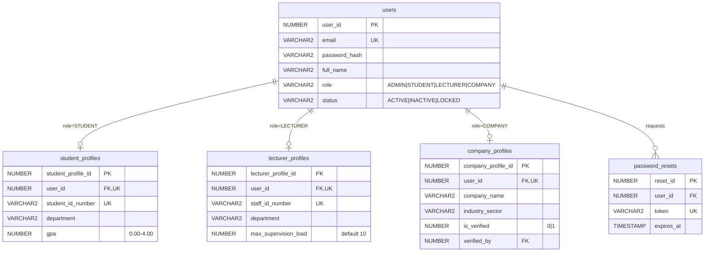
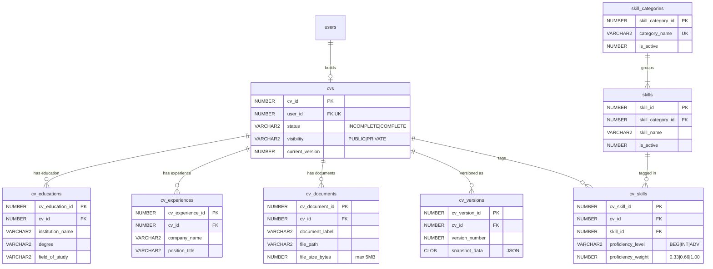
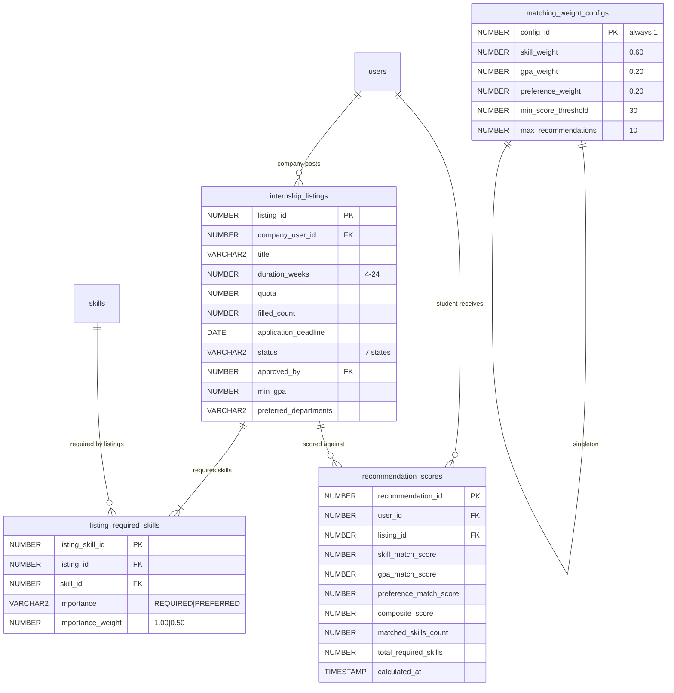
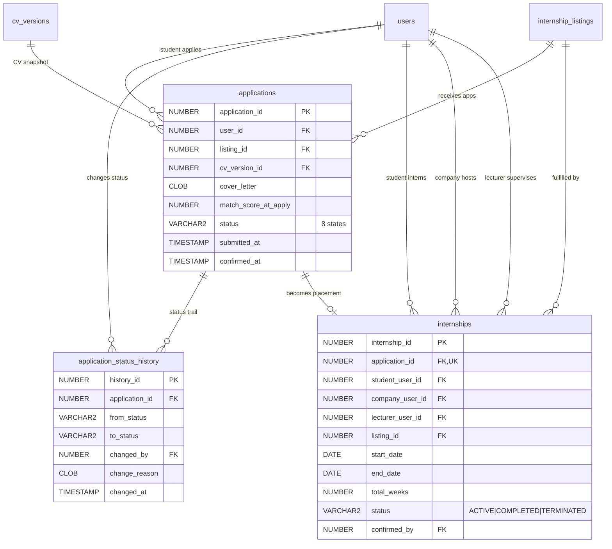
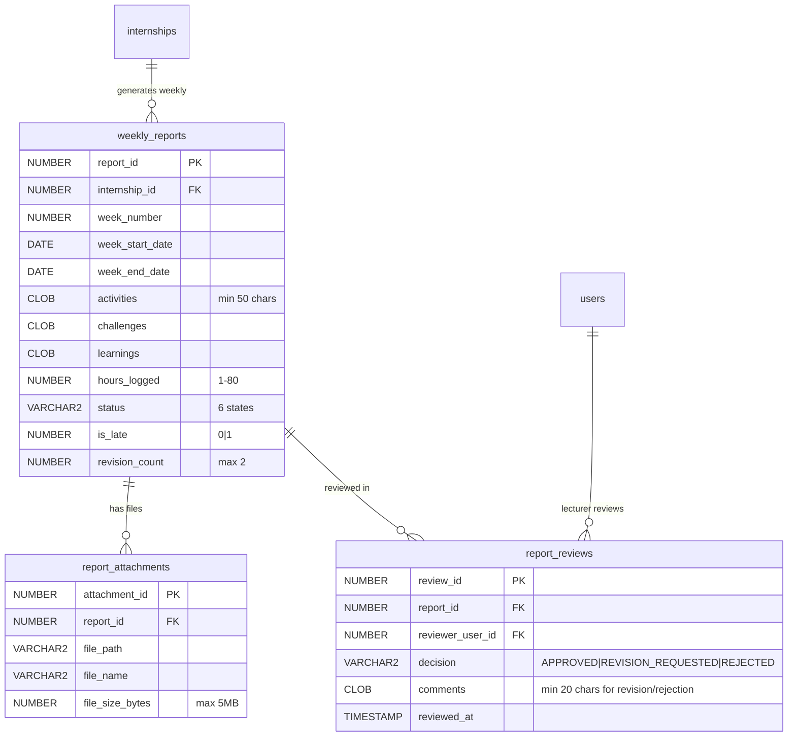
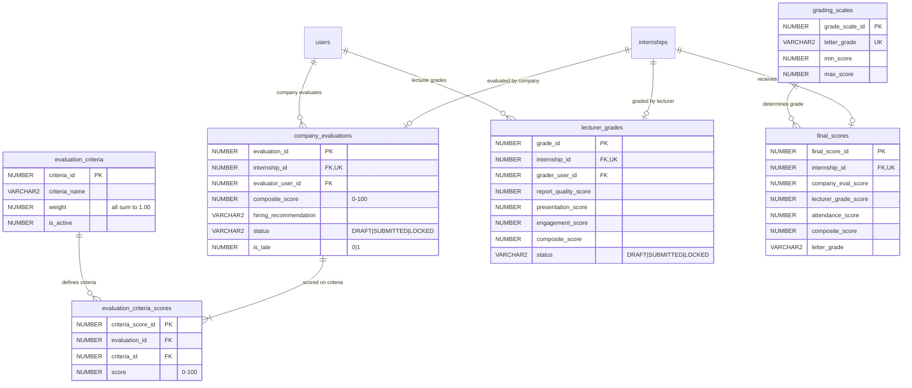
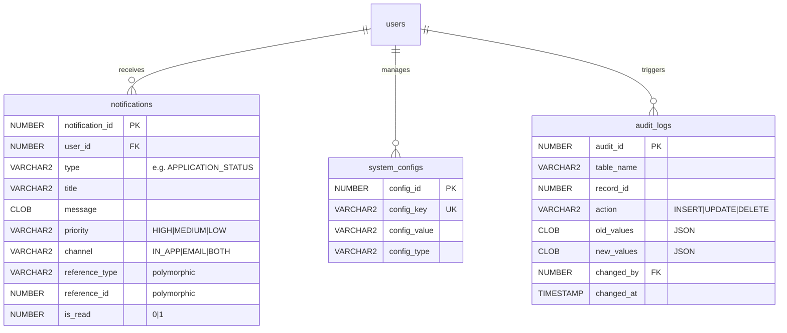
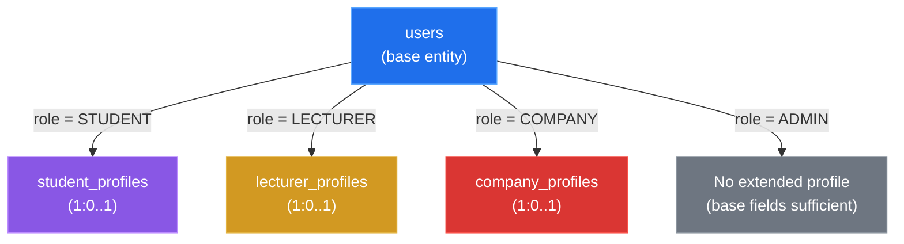
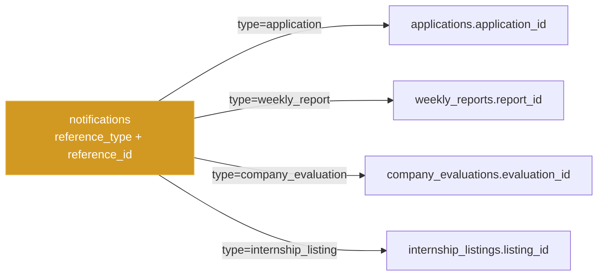

# PHASE 5: CONCEPTUAL & LOGICAL ERD

## Smart University Internship Management System (SUIMS)

> **Document Version:** 1.0  
> **Date:** June 5, 2026  
> **Phase Dependency:** Phase 4 (Database Requirements & Recommendation Engine Prep)  
> **Notation:** Mermaid.js erDiagram with Crow's Foot cardinality  
> **Entity Count:** 32 entities, 27+ relationships

---

## 5.1 Full System ERD — Master View

> [!NOTE]
> Due to the scale of the system (32 entities), the master ERD is presented first for a holistic overview, followed by domain-specific sub-diagrams in Section 5.2 for detailed readability.

```mermaid
erDiagram
    %% =============================================
    %% CORE USER & AUTHENTICATION
    %% =============================================
    users {
        NUMBER user_id PK
        VARCHAR2 email UK
        VARCHAR2 password_hash
        VARCHAR2 full_name
        VARCHAR2 role "ADMIN|STUDENT|LECTURER|COMPANY"
        VARCHAR2 status "ACTIVE|INACTIVE|LOCKED"
        TIMESTAMP email_verified_at
        NUMBER failed_login_attempts
        TIMESTAMP locked_until
        TIMESTAMP last_login_at
        VARCHAR2 profile_photo_path
        TIMESTAMP created_at
        TIMESTAMP updated_at
    }

    student_profiles {
        NUMBER student_profile_id PK
        NUMBER user_id FK, UK
        VARCHAR2 student_id_number UK
        VARCHAR2 department
        VARCHAR2 faculty
        NUMBER enrollment_year
        NUMBER expected_graduation
        NUMBER gpa "0.00-4.00"
        VARCHAR2 phone_number
        VARCHAR2 address
        VARCHAR2 linkedin_url
        CLOB bio
        TIMESTAMP created_at
        TIMESTAMP updated_at
    }

    lecturer_profiles {
        NUMBER lecturer_profile_id PK
        NUMBER user_id FK, UK
        VARCHAR2 staff_id_number UK
        VARCHAR2 department
        VARCHAR2 faculty
        VARCHAR2 specialization
        NUMBER max_supervision_load
        VARCHAR2 phone_number
        VARCHAR2 office_location
        TIMESTAMP created_at
        TIMESTAMP updated_at
    }

    company_profiles {
        NUMBER company_profile_id PK
        NUMBER user_id FK, UK
        VARCHAR2 company_name
        VARCHAR2 industry_sector
        VARCHAR2 company_size
        VARCHAR2 company_website
        VARCHAR2 company_address
        VARCHAR2 company_city
        CLOB company_description
        VARCHAR2 contact_person_name
        VARCHAR2 contact_phone
        NUMBER is_verified "0|1"
        TIMESTAMP verified_at
        NUMBER verified_by FK
        VARCHAR2 company_logo_path
        TIMESTAMP created_at
        TIMESTAMP updated_at
    }

    password_resets {
        NUMBER reset_id PK
        NUMBER user_id FK
        VARCHAR2 token
        TIMESTAMP expires_at
        TIMESTAMP used_at
        TIMESTAMP created_at
    }

    %% =============================================
    %% CV MANAGEMENT
    %% =============================================
    cvs {
        NUMBER cv_id PK
        NUMBER user_id FK, UK
        CLOB personal_summary
        VARCHAR2 status "INCOMPLETE|COMPLETE"
        VARCHAR2 visibility "PUBLIC|PRIVATE"
        NUMBER current_version
        TIMESTAMP created_at
        TIMESTAMP updated_at
    }

    cv_educations {
        NUMBER cv_education_id PK
        NUMBER cv_id FK
        VARCHAR2 institution_name
        VARCHAR2 degree
        VARCHAR2 field_of_study
        DATE start_date
        DATE end_date
        NUMBER gpa
        CLOB description
        NUMBER sort_order
        TIMESTAMP created_at
    }

    cv_experiences {
        NUMBER cv_experience_id PK
        NUMBER cv_id FK
        VARCHAR2 company_name
        VARCHAR2 position_title
        DATE start_date
        DATE end_date
        CLOB description
        NUMBER sort_order
        TIMESTAMP created_at
    }

    cv_documents {
        NUMBER cv_document_id PK
        NUMBER cv_id FK
        VARCHAR2 document_label
        VARCHAR2 file_path
        VARCHAR2 file_name
        NUMBER file_size_bytes
        VARCHAR2 mime_type
        TIMESTAMP uploaded_at
    }

    cv_versions {
        NUMBER cv_version_id PK
        NUMBER cv_id FK
        NUMBER version_number
        CLOB snapshot_data "JSON"
        TIMESTAMP created_at
    }

    %% =============================================
    %% SKILL TAXONOMY
    %% =============================================
    skill_categories {
        NUMBER skill_category_id PK
        VARCHAR2 category_name UK
        VARCHAR2 description
        NUMBER is_active "0|1"
        NUMBER sort_order
        TIMESTAMP created_at
    }

    skills {
        NUMBER skill_id PK
        NUMBER skill_category_id FK
        VARCHAR2 skill_name
        VARCHAR2 description
        NUMBER is_active "0|1"
        TIMESTAMP created_at
    }

    cv_skills {
        NUMBER cv_skill_id PK
        NUMBER cv_id FK
        NUMBER skill_id FK
        VARCHAR2 proficiency_level "BEGINNER|INTERMEDIATE|ADVANCED"
        NUMBER proficiency_weight "0.33|0.66|1.00"
        TIMESTAMP created_at
    }

    %% =============================================
    %% INTERNSHIP LISTINGS
    %% =============================================
    internship_listings {
        NUMBER listing_id PK
        NUMBER company_user_id FK
        VARCHAR2 title
        CLOB description
        CLOB requirements
        VARCHAR2 location
        VARCHAR2 work_mode "ONSITE|REMOTE|HYBRID"
        NUMBER duration_weeks "4-24"
        NUMBER quota
        NUMBER filled_count
        VARCHAR2 stipend_info
        DATE application_deadline
        VARCHAR2 status "DRAFT|PENDING|PUBLISHED|etc"
        CLOB admin_feedback
        NUMBER approved_by FK
        TIMESTAMP published_at
        NUMBER min_gpa
        VARCHAR2 preferred_departments
        TIMESTAMP created_at
        TIMESTAMP updated_at
    }

    listing_required_skills {
        NUMBER listing_skill_id PK
        NUMBER listing_id FK
        NUMBER skill_id FK
        VARCHAR2 importance "REQUIRED|PREFERRED"
        NUMBER importance_weight "1.00|0.50"
        TIMESTAMP created_at
    }

    %% =============================================
    %% RECOMMENDATION ENGINE
    %% =============================================
    recommendation_scores {
        NUMBER recommendation_id PK
        NUMBER user_id FK
        NUMBER listing_id FK
        NUMBER skill_match_score "0-100"
        NUMBER gpa_match_score "0-100"
        NUMBER preference_match_score "0-100"
        NUMBER composite_score "0-100"
        NUMBER skill_weight_used
        NUMBER gpa_weight_used
        NUMBER preference_weight_used
        NUMBER matched_skills_count
        NUMBER total_required_skills
        TIMESTAMP calculated_at
    }

    matching_weight_configs {
        NUMBER config_id PK
        NUMBER skill_weight "default 0.60"
        NUMBER gpa_weight "default 0.20"
        NUMBER preference_weight "default 0.20"
        NUMBER min_score_threshold "default 30"
        NUMBER max_recommendations "default 10"
        NUMBER updated_by FK
        TIMESTAMP updated_at
    }

    %% =============================================
    %% APPLICATION WORKFLOW
    %% =============================================
    applications {
        NUMBER application_id PK
        NUMBER user_id FK
        NUMBER listing_id FK
        NUMBER cv_version_id FK
        CLOB cover_letter
        NUMBER match_score_at_apply
        VARCHAR2 status "SUBMITTED|UNDER_REVIEW|etc"
        CLOB rejection_reason
        TIMESTAMP submitted_at
        TIMESTAMP reviewed_at
        TIMESTAMP decided_at
        TIMESTAMP confirmed_at
        TIMESTAMP created_at
        TIMESTAMP updated_at
    }

    application_status_history {
        NUMBER history_id PK
        NUMBER application_id FK
        VARCHAR2 from_status
        VARCHAR2 to_status
        NUMBER changed_by FK
        CLOB change_reason
        TIMESTAMP changed_at
    }

    %% =============================================
    %% ACTIVE INTERNSHIPS
    %% =============================================
    internships {
        NUMBER internship_id PK
        NUMBER application_id FK, UK
        NUMBER student_user_id FK
        NUMBER company_user_id FK
        NUMBER lecturer_user_id FK
        NUMBER listing_id FK
        DATE start_date
        DATE end_date
        NUMBER total_weeks
        VARCHAR2 status "ACTIVE|COMPLETED|TERMINATED"
        NUMBER confirmed_by FK
        VARCHAR2 report_deadline_day
        TIMESTAMP created_at
        TIMESTAMP updated_at
    }

    %% =============================================
    %% WEEKLY REPORTING
    %% =============================================
    weekly_reports {
        NUMBER report_id PK
        NUMBER internship_id FK
        NUMBER week_number
        DATE week_start_date
        DATE week_end_date
        CLOB activities
        CLOB challenges
        CLOB learnings
        NUMBER hours_logged "1.0-80.0"
        VARCHAR2 status "NOT_STARTED|DRAFT|SUBMITTED|etc"
        NUMBER is_late "0|1"
        NUMBER revision_count "max 2"
        TIMESTAMP submitted_at
        TIMESTAMP approved_at
        TIMESTAMP created_at
        TIMESTAMP updated_at
    }

    report_attachments {
        NUMBER attachment_id PK
        NUMBER report_id FK
        VARCHAR2 file_path
        VARCHAR2 file_name
        NUMBER file_size_bytes
        VARCHAR2 mime_type
        TIMESTAMP uploaded_at
    }

    report_reviews {
        NUMBER review_id PK
        NUMBER report_id FK
        NUMBER reviewer_user_id FK
        VARCHAR2 decision "APPROVED|REVISION_REQUESTED|REJECTED"
        CLOB comments
        TIMESTAMP reviewed_at
    }

    %% =============================================
    %% EVALUATION & GRADING
    %% =============================================
    evaluation_criteria {
        NUMBER criteria_id PK
        VARCHAR2 criteria_name
        VARCHAR2 description
        NUMBER weight
        NUMBER sort_order
        NUMBER is_active "0|1"
        TIMESTAMP created_at
    }

    company_evaluations {
        NUMBER evaluation_id PK
        NUMBER internship_id FK, UK
        NUMBER evaluator_user_id FK
        NUMBER composite_score "0-100"
        CLOB strengths
        CLOB improvements
        CLOB overall_comments
        VARCHAR2 hiring_recommendation
        VARCHAR2 status "DRAFT|SUBMITTED|LOCKED"
        NUMBER is_late "0|1"
        TIMESTAMP submitted_at
        TIMESTAMP created_at
        TIMESTAMP updated_at
    }

    evaluation_criteria_scores {
        NUMBER criteria_score_id PK
        NUMBER evaluation_id FK
        NUMBER criteria_id FK
        NUMBER score "0-100"
    }

    lecturer_grades {
        NUMBER grade_id PK
        NUMBER internship_id FK, UK
        NUMBER grader_user_id FK
        NUMBER report_quality_score "0-100"
        NUMBER presentation_score "0-100"
        NUMBER engagement_score "0-100"
        NUMBER composite_score "0-100"
        CLOB overall_comments
        VARCHAR2 status "DRAFT|SUBMITTED|LOCKED"
        TIMESTAMP submitted_at
        TIMESTAMP created_at
        TIMESTAMP updated_at
    }

    final_scores {
        NUMBER final_score_id PK
        NUMBER internship_id FK, UK
        NUMBER company_eval_score
        NUMBER lecturer_grade_score
        NUMBER attendance_score
        NUMBER company_weight
        NUMBER lecturer_weight
        NUMBER attendance_weight
        NUMBER composite_score
        VARCHAR2 letter_grade
        TIMESTAMP calculated_at
        VARCHAR2 calculated_by
    }

    %% =============================================
    %% NOTIFICATIONS
    %% =============================================
    notifications {
        NUMBER notification_id PK
        NUMBER user_id FK
        VARCHAR2 type
        VARCHAR2 title
        CLOB message
        VARCHAR2 priority "HIGH|MEDIUM|LOW"
        VARCHAR2 channel
        VARCHAR2 reference_type
        NUMBER reference_id
        NUMBER is_read "0|1"
        TIMESTAMP read_at
        NUMBER email_sent "0|1"
        TIMESTAMP email_sent_at
        TIMESTAMP created_at
    }

    %% =============================================
    %% SYSTEM CONFIGURATION
    %% =============================================
    system_configs {
        NUMBER config_id PK
        VARCHAR2 config_key UK
        VARCHAR2 config_value
        VARCHAR2 config_type
        VARCHAR2 description
        NUMBER updated_by FK
        TIMESTAMP updated_at
    }

    grading_scales {
        NUMBER grade_scale_id PK
        VARCHAR2 letter_grade UK
        NUMBER min_score
        NUMBER max_score
        NUMBER grade_point
        NUMBER sort_order
    }

    %% =============================================
    %% AUDIT
    %% =============================================
    audit_logs {
        NUMBER audit_id PK
        VARCHAR2 table_name
        NUMBER record_id
        VARCHAR2 action "INSERT|UPDATE|DELETE"
        CLOB old_values "JSON"
        CLOB new_values "JSON"
        NUMBER changed_by FK
        TIMESTAMP changed_at
        VARCHAR2 ip_address
        VARCHAR2 user_agent
    }

    %% =============================================
    %% RELATIONSHIPS
    %% =============================================

    %% User Profile Relationships (1:0..1)
    users ||--o| student_profiles : "has profile"
    users ||--o| lecturer_profiles : "has profile"
    users ||--o| company_profiles : "has profile"
    users ||--o| cvs : "has CV"

    %% Password Resets
    users ||--o{ password_resets : "requests reset"

    %% CV Sub-entities (1:N)
    cvs ||--o{ cv_educations : "contains"
    cvs ||--o{ cv_experiences : "contains"
    cvs ||--o{ cv_documents : "contains"
    cvs ||--o{ cv_versions : "has versions"

    %% Skill Taxonomy
    skill_categories ||--|{ skills : "groups"

    %% M:N — CV Skills (Resolution)
    cvs ||--o{ cv_skills : "tags skills"
    skills ||--o{ cv_skills : "tagged in CVs"

    %% Company Verification
    users ||--o{ company_profiles : "verifies"

    %% Internship Listings
    users ||--o{ internship_listings : "posts"
    users ||--o{ internship_listings : "approves"

    %% M:N — Listing Required Skills (Resolution)
    internship_listings ||--|{ listing_required_skills : "requires"
    skills ||--o{ listing_required_skills : "required by"

    %% M:N — Recommendation Scores (Resolution)
    users ||--o{ recommendation_scores : "receives scores"
    internship_listings ||--o{ recommendation_scores : "scored for"

    %% Matching Config
    users ||--o| matching_weight_configs : "configures"

    %% Applications (M:N Resolution with lifecycle)
    users ||--o{ applications : "applies"
    internship_listings ||--o{ applications : "receives"
    cv_versions ||--o{ applications : "attached to"
    applications ||--o{ application_status_history : "has history"

    %% Internships
    applications ||--o| internships : "becomes"
    users ||--o{ internships : "interns at"
    users ||--o{ internships : "hosts"
    users ||--o{ internships : "supervises"
    internship_listings ||--o{ internships : "fulfilled by"

    %% Weekly Reports
    internships ||--o{ weekly_reports : "generates"
    weekly_reports ||--o{ report_attachments : "has files"
    weekly_reports ||--o{ report_reviews : "reviewed in"
    users ||--o{ report_reviews : "reviews"

    %% Evaluations
    internships ||--o| company_evaluations : "evaluated by company"
    users ||--o{ company_evaluations : "evaluates"
    company_evaluations ||--|{ evaluation_criteria_scores : "scored on"
    evaluation_criteria ||--o{ evaluation_criteria_scores : "used in"

    %% Lecturer Grades
    internships ||--o| lecturer_grades : "graded by lecturer"
    users ||--o{ lecturer_grades : "grades"

    %% Final Scores
    internships ||--o| final_scores : "receives final"

    %% Notifications
    users ||--o{ notifications : "receives"

    %% System Config
    users ||--o{ system_configs : "manages"

    %% Audit
    users ||--o{ audit_logs : "triggers"
```



---

## 5.2 Domain-Specific Sub-Diagrams

### 5.2.1 User & Authentication Domain



**Relationship Explanation:**

The `users` table serves as the **single authentication entity** for all system roles via a **Table-Per-Type (TPT) inheritance** strategy. Each user has exactly one role, and the corresponding profile table extends the user record with role-specific attributes:

- `users` → `student_profiles`: **1:0..1** (conditional). Only created when `users.role = 'STUDENT'`. The `user_id` in `student_profiles` is both a FK and a UNIQUE constraint, enforcing the one-to-one relationship. This profile holds academic data (GPA, department) critical for the Recommendation Engine.

- `users` → `lecturer_profiles`: **1:0..1** (conditional). Only created when `users.role = 'LECTURER'`. Includes `max_supervision_load` which governs the Admin's lecturer assignment logic during placement confirmation.

- `users` → `company_profiles`: **1:0..1** (conditional). Only created when `users.role = 'COMPANY'`. The `is_verified` flag and `verified_by` FK create a self-referential pattern where an Admin user (referenced via `verified_by → users.user_id`) validates the company.

- `users` → `password_resets`: **1:0..N**. A user can request multiple password resets over time. Old tokens are invalidated by checking `expires_at` and `used_at`.

---

### 5.2.2 CV & Skills Domain



**Relationship Explanation:**

- `users` → `cvs`: **1:0..1**. Each student has at most one CV record. `user_id` in `cvs` is UNIQUE to enforce this. The CV record acts as a master container.

- `cvs` → `cv_educations` / `cv_experiences` / `cv_documents`: **1:0..N** composition relationships. These sub-entities cannot exist without a parent CV. Deleting a CV cascades to these child records.

- `cvs` → `cv_versions`: **1:0..N**. Every save operation creates a new version snapshot (JSON serialization). The `version_number` is sequentially incremented. CV versions are referenced by applications to preserve the CV state at application time.

- **`cvs` ↔ `skills` via `cv_skills`** (Many-to-Many Resolution): This is the **primary input to the Recommendation Engine**. The resolution table `cv_skills` enriches the relationship with:
  - `proficiency_level`: ENUM qualitative assessment by the student
  - `proficiency_weight`: Numeric derived value (BEGINNER=0.33, INTERMEDIATE=0.66, ADVANCED=1.00) used directly in the matching formula
  - Composite UNIQUE(`cv_id`, `skill_id`) prevents a student from tagging the same skill twice

- `skill_categories` → `skills`: **1:1..N**. Every skill must belong to a category. Categories group skills for organized taxonomy browsing (e.g., "Programming Languages" → Python, Java, etc.).

---

### 5.2.3 Listings & Recommendations Domain



**Relationship Explanation:**

- `users` → `internship_listings`: **1:0..N**. A company representative can post multiple listings. `company_user_id` references the company user.

- **`internship_listings` ↔ `skills` via `listing_required_skills`** (Many-to-Many Resolution): The second key input to the Recommendation Engine. The resolution table adds:
  - `importance`: `REQUIRED` (must-have) vs `PREFERRED` (nice-to-have)
  - `importance_weight`: 1.00 or 0.50 respectively — directly multiplied in the skill match formula
  - At least 1 required skill tag is mandatory per listing (BR-09)

- **`users` ↔ `internship_listings` via `recommendation_scores`** (Computed Many-to-Many): Unlike typical resolution tables, this is **system-generated**, not user-created. The engine computes a row for each eligible student-listing pair where the composite score exceeds `min_score_threshold`. Key design decisions:
  - Stores **component scores separately** for UI transparency ("You scored 85% on skills, 100% on GPA, 75% on preferences")
  - Stores **weight snapshots** (`skill_weight_used`, etc.) so historical recommendations remain interpretable after admin changes weights
  - Composite UNIQUE(`user_id`, `listing_id`) ensures one score per pair; recalculation overwrites

- `matching_weight_configs`: **Singleton table** (always 1 row, `config_id = 1`). Contains the three weights that must sum to 1.00. A CHECK constraint enforces `skill_weight + gpa_weight + preference_weight = 1.00`.

---

### 5.2.4 Application & Internship Domain



**Relationship Explanation:**

- **`users` ↔ `internship_listings` via `applications`** (Many-to-Many with Rich Lifecycle): This is the **most complex resolution table** in the system. It resolves the many-to-many between students and listings while carrying:
  - Full status lifecycle (8 states as per the state machine)
  - `cv_version_id` FK: Links to the **immutable CV snapshot** taken at application time, ensuring the company always sees the CV as it was when the student applied
  - `match_score_at_apply`: Frozen recommendation score at application time
  - Composite UNIQUE(`user_id`, `listing_id`) prevents duplicate applications (BR-12)

- `applications` → `application_status_history`: **1:1..N**. Every status transition creates a new history record with the actor who made the change, enabling full auditability. The first record has `from_status = NULL` (initial submission).

- `applications` → `internships`: **1:0..1**. Only `CONFIRMED` applications spawn an internship record. `application_id` in `internships` is UNIQUE — an application can only become one internship.

- `internships` has **three FK references to `users`**: This is a key design pattern:
  - `student_user_id` → the intern (student)
  - `company_user_id` → the hosting company rep
  - `lecturer_user_id` → the assigned academic supervisor
  - `confirmed_by` → the admin who confirmed the placement
  
  These denormalized FKs (which could be derived via joins through `applications` → `listings`) are **intentionally stored for query performance** — dashboard queries for "my supervised students" or "my interns" avoid expensive multi-table joins.

---

### 5.2.5 Weekly Reporting Domain



**Relationship Explanation:**

- `internships` → `weekly_reports`: **1:0..N** (up to `total_weeks` reports). Each internship generates one report slot per week. Composite UNIQUE(`internship_id`, `week_number`) ensures no duplicate weeks.

- `weekly_reports` → `report_attachments`: **1:0..3**. Max 3 attachments per report enforced at the application layer (not as a DB constraint, since Oracle CHECK constraints cannot reference other table rows).

- `weekly_reports` → `report_reviews`: **1:0..3**. A report can have up to 3 review records: 1 initial review + up to 2 revision reviews (per BR-17). Each review record captures the decision and timestamped comments. The chronological sequence of reviews tells the revision story:
  - Review 1: `REVISION_REQUESTED` → revision_count becomes 1
  - Review 2: `REVISION_REQUESTED` → revision_count becomes 2
  - Review 3: Must be `APPROVED` or `REJECTED` (no more revisions allowed)

---

### 5.2.6 Evaluation & Grading Domain



**Relationship Explanation:**

- `internships` → `company_evaluations`: **1:0..1**. Each internship receives at most one company evaluation. `internship_id` is UNIQUE in `company_evaluations`.

- **`company_evaluations` ↔ `evaluation_criteria` via `evaluation_criteria_scores`** (Many-to-Many Resolution): Each evaluation scores against all active criteria. The resolution table carries the `score` (0–100) for each criterion. The `company_evaluations.composite_score` is computed as:
  ```
  Σ(evaluation_criteria_scores.score × evaluation_criteria.weight)
  ```
  Composite UNIQUE(`evaluation_id`, `criteria_id`) ensures one score per criterion per evaluation.

- `internships` → `lecturer_grades`: **1:0..1**. Created only after the company evaluation is submitted (BR-20 dependency enforced at service layer). `internship_id` is UNIQUE.

- `internships` → `final_scores`: **1:0..1**. The **terminal record** in the evaluation chain. Created by the `CalculateFinalScore` PL/SQL procedure when both company evaluation and lecturer grade are submitted. Stores:
  - Component scores and weight snapshots for auditability
  - `letter_grade` looked up from `grading_scales` table

- **Evaluation Dependency Chain** (critical business rule):
  ```
  internship COMPLETED → company_evaluation SUBMITTED → lecturer_grade SUBMITTED → final_score CALCULATED
  ```
  Each step is a prerequisite for the next. This is enforced in the Service layer and the PL/SQL procedure.

---

### 5.2.7 Notifications & System Domain



**Relationship Explanation:**

- `users` → `notifications`: **1:0..N**. Each user can receive thousands of notifications over time. The `reference_type` + `reference_id` pattern implements a **polymorphic reference** — allowing a single notification record to link back to any entity (e.g., `reference_type = 'application'`, `reference_id = 42` links to `applications` where `application_id = 42`). This avoids creating separate notification tables per entity.

- `audit_logs`: Uses a **generic audit pattern** where `table_name` + `record_id` identifies the affected record, and `old_values` / `new_values` store JSON representations of the changed fields. This is populated by PL/SQL triggers (Phase 8) to capture every state-changing operation transparently.

---

## 5.3 Cardinality Summary Matrix

| # | Parent Entity | Child Entity | Cardinality | Key Mechanism | Notes |
|---|--------------|-------------|-------------|---------------|-------|
| 1 | `users` | `student_profiles` | 1:0..1 | FK `user_id` UNIQUE | Conditional on role |
| 2 | `users` | `lecturer_profiles` | 1:0..1 | FK `user_id` UNIQUE | Conditional on role |
| 3 | `users` | `company_profiles` | 1:0..1 | FK `user_id` UNIQUE | Conditional on role |
| 4 | `users` | `cvs` | 1:0..1 | FK `user_id` UNIQUE | Only students |
| 5 | `users` | `password_resets` | 1:0..N | FK `user_id` | Multiple resets |
| 6 | `cvs` | `cv_educations` | 1:0..N | FK `cv_id` | Cascade delete |
| 7 | `cvs` | `cv_experiences` | 1:0..N | FK `cv_id` | Cascade delete |
| 8 | `cvs` | `cv_documents` | 1:0..N | FK `cv_id` | Max 5MB each |
| 9 | `cvs` | `cv_versions` | 1:0..N | FK `cv_id` | Immutable snapshots |
| 10 | `skill_categories` | `skills` | 1:1..N | FK `skill_category_id` | At least 1 skill |
| 11 | `cvs` ↔ `skills` | `cv_skills` | M:N | Composite UK | +proficiency_weight |
| 12 | `users` | `internship_listings` | 1:0..N | FK `company_user_id` | Company posts |
| 13 | `listings` ↔ `skills` | `listing_required_skills` | M:N | Composite UK | +importance_weight |
| 14 | `users` ↔ `listings` | `recommendation_scores` | M:N | Composite UK | System-computed |
| 15 | `users` ↔ `listings` | `applications` | M:N | Composite UK | Rich lifecycle |
| 16 | `applications` | `application_status_history` | 1:1..N | FK `application_id` | Audit trail |
| 17 | `applications` | `internships` | 1:0..1 | FK `application_id` UK | Only confirmed |
| 18 | `internships` | `weekly_reports` | 1:0..N | FK `internship_id` | Up to total_weeks |
| 19 | `weekly_reports` | `report_attachments` | 1:0..3 | FK `report_id` | App-enforced max |
| 20 | `weekly_reports` | `report_reviews` | 1:0..3 | FK `report_id` | 1 initial + 2 revisions |
| 21 | `internships` | `company_evaluations` | 1:0..1 | FK `internship_id` UK | One per internship |
| 22 | `evaluations` ↔ `criteria` | `evaluation_criteria_scores` | M:N | Composite UK | +score |
| 23 | `internships` | `lecturer_grades` | 1:0..1 | FK `internship_id` UK | After company eval |
| 24 | `internships` | `final_scores` | 1:0..1 | FK `internship_id` UK | Terminal record |
| 25 | `users` | `notifications` | 1:0..N | FK `user_id` | High volume |
| 26 | `users` | `audit_logs` | 1:0..N | FK `changed_by` | Cross-cutting |
| 27 | `grading_scales` | `final_scores` | 1:0..N | Lookup (no FK) | Grade determination |

---

## 5.4 Complex Relationship Patterns — Design Rationale

### 5.4.1 Table-Per-Type (TPT) Inheritance for User Profiles



**Rationale:** A single `users` table stores authentication-related fields common to all roles (email, password, status). Role-specific data lives in separate profile tables. This design:
- Avoids NULL-heavy columns (single-table inheritance would have ~20 NULL columns per row)
- Supports clean foreign key references (all FKs point to `users.user_id` regardless of role)
- Enables role-specific validation without complex conditional constraints

### 5.4.2 Dual Many-to-Many on the Same Entities

The `users` ↔ `internship_listings` relationship is resolved by **two separate tables** with different semantics:

| Resolution Table | Created By | Purpose | Lifecycle |
|-----------------|-----------|---------|-----------|
| `recommendation_scores` | System (algorithm) | Computed match scores | Recalculated on trigger events |
| `applications` | User action (student applies) | Formal application with status | Full state machine lifecycle |

This dual-resolution pattern is intentional — recommendations inform application decisions but are independent data. A student might have a high recommendation score but never apply, or apply despite a low score.

### 5.4.3 Polymorphic Reference Pattern (Notifications)



**Rationale:** Instead of creating `application_notifications`, `report_notifications`, etc., the polymorphic pattern uses `reference_type` (string) + `reference_id` (integer) to point to any entity. The tradeoff:
- ✅ Single notification table, simpler queries, unified notification feed
- ❌ No database-level FK enforcement on polymorphic references (enforced at application layer)

This is a well-established pattern used by Laravel's morphable relationships (`Illuminate\Database\Eloquent\Relations\MorphTo`).

---

## 5.5 Phase 5 — State Summary

> [!IMPORTANT]
> **Critical Decisions Carried Forward to Subsequent Phases:**

- **32 entities** have been fully diagrammed with Mermaid erDiagram syntax showing all attributes, PKs, FKs, and cardinality. This ERD is the **direct blueprint** for Phase 6 (Oracle table structures) and Phase 7 (SQL CREATE TABLE scripts).
- **Table-Per-Type inheritance** for user profiles means Phase 7 must create `student_profiles`, `lecturer_profiles`, and `company_profiles` with UNIQUE FK constraints back to `users`. Laravel Models (Phase 10) will use `hasOne`/`belongsTo` relationships.
- **Five many-to-many resolution tables** (`cv_skills`, `listing_required_skills`, `recommendation_scores`, `applications`, `evaluation_criteria_scores`) carry enriched attributes beyond simple FK pairs. These require **composite UNIQUE constraints** and will map to Laravel pivot models with custom attributes.
- **Polymorphic notification pattern** (`reference_type` + `reference_id`) requires Laravel's `MorphTo` relationship and precludes database-level FK enforcement for the reference columns. The `notifications` table is expected to be the highest-volume table (~500K+ rows).
- **Denormalized FKs in `internships`** (`student_user_id`, `company_user_id`, `lecturer_user_id`) are intentional performance optimizations that must be kept in sync via application logic during internship creation.

---

✅ **Phase 5 completed.** Reply **CONTINUE** to proceed to Phase 6 (Oracle Database Design & Indexing), or provide feedback to revise this phase.
